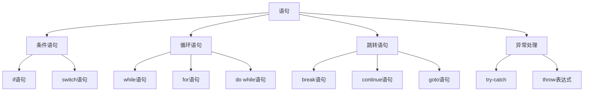

# 📘 第5章 语句 (Statements)

> 来源说明：C++ Primer 第5章 | 本章涵盖：C++中的各种语句，包括条件语句、循环语句、跳转语句和异常处理语句。

---

## 🧠 核心概念总览

*   **条件语句**：根据条件选择执行路径（if, switch）
*   **循环语句**：重复执行代码块（while, for, do while）
*   **跳转语句**：改变程序执行流程（break, continue, goto）
*   **异常处理**：处理程序运行时的异常情况（try, catch, throw）

---
## 🗺️ 本章知识体系



## 📚 核心术语表

| 术语（英 / 中）                           | 定义                                                       |
| ----------------------------------- | -------------------------------------------------------- |
| **block（代码块）**                      | 由花括号包围的零个或多个语句序列，可以在任何需要语句的地方使用                          |
| **break statement（break语句）**        | 终止最近的循环或 switch 语句，控制转移到被终止语句后的第一条语句                     |
| **case label（case标签）**              |  switch 语句中 case 关键字后的常量表达式，同一 switch 中不能有相同值的 case 标签   |
| **catch clause（catch子句）**           | 由 catch 关键字、括号内的异常声明和语句块组成，处理特定类型的异常                     |
| **compound statement（复合语句）**        | block 的同义词                                               |
| **continue statement（continue语句）**  | 终止最近循环的当前迭代，在 while/do 中转移到循环条件，在 for 中转移到步进表达式          |
| **dangling else（悬空 else 问题）**       | 指嵌套 if 语句中 else 与 if 的匹配问题，C++ 中 else 总是与最近的前面未匹配的 if 配对 |
| **default label（default标签）**        |  switch 语句中匹配其他 case 未匹配的值的标签                            |
| **do while statement（do while 语句）** | 类似 while 但条件在循环末尾测试，循环体至少执行一次                            |
| **exception classes（异常类）**          | 标准库定义的一组用于表示错误的类                                         |
| **exception declaration（异常声明）**     |  catch 子句中的声明，指定该 catch 能处理的异常类型                         |
| **exception handler（异常处理器）**        | 处理程序中其他部分抛出的异常的代码，catch 子句的同义词                           |
| **exception safe（异常安全）**            | 描述在抛出异常时行为正确的程序                                          |
| **expression statement（表达式语句）**     | 表达式后跟分号，导致表达式被求值                                         |
| **flow of control（控制流）**            | 程序执行的路径                                                  |
| **for statement（for语句）**            | 迭代语句，通常用于遍历容器或重复计算给定次数                                   |
| **goto statement（goto语句）**          | 导致无条件转移到同一函数内指定标签语句，会使程序流程难以理解                           |
| **if else statement（if else 语句）**   | 根据条件的真假值选择执行 if 或 else 后的代码                              |
| **if statement（if 语句）**             | 根据指定条件的值有条件执行，条件为真时执行 if 体，否则转到 if 后的语句                  |
| **labeled statement（带标签语句）**        | 前面带标签的语句，标签是标识符后跟冒号，标签标识符独立于其他同名标识符                      |
| **null statement（空语句）**             | 空语句，用单个分号表示                                              |
| **raise（抛出）**                       | throw 的同义词，C++ 程序员互换使用“抛出”或“引发”异常                        |
| **range for statement（范围 for 语句）**  | 遍历序列的语句                                                  |
| **switch statement（switch语句）**      | 条件语句，首先计算 switch 关键字后的表达式，控制转移到匹配表达式值的 case 标签           |
| **terminate（终止）**                   | 如果异常未被捕获则调用的库函数，终止程序                                     |
| **throw expression（throw表达式）**      | 中断当前执行路径的表达式，每个 throw 抛出一个对象并将控制转移到能处理该异常类型的最近 catch     |
| **try block（try块）**                 | 由 try 关键字和一个或多个 catch 子句包围的块                             |
| **while statement（while语句）**        | 只要指定条件为真就执行目标语句的迭代语句                                     |


---

## ✅ 知识点详解

### 🔹 知识点1: 条件语句
**定义**：根据条件的真假值选择执行不同的代码路径。

**关键特性**：
- `if`语句：条件为真时执行代码块
- `if-else`语句：二选一执行
- `switch`语句：多分支选择，基于整型值

**代码示例**：
```cpp
// if-else 示例
if (grade >= 60) {
    cout << "Pass" << endl;
} else {
    cout << "Fail" << endl;
}

// switch 示例
switch (color) {
    case 1: cout << "Red"; break;
    case 2: cout << "Green"; break;
    default: cout << "Unknown"; break;
}
```

**常见陷阱**：⚠️ switch语句中忘记break会导致case穿透
**最佳实践**：💡 总是为switch语句提供default case

---

### 🔹 知识点2: 循环语句
**定义**：重复执行代码块直到条件不满足。

**关键特性**：
- `while`循环：先检查条件后执行
- `for`循环：包含初始化、条件和步进表达式
- `do-while`循环：先执行后检查条件，至少执行一次

**代码示例**：
```cpp
// while 循环
int i = 0;
while (i < 10) {
    cout << i << endl;
    i++;
}

// for 循环
for (int i = 0; i < 10; i++) {
    cout << i << endl;
}

// do-while 循环
int j = 0;
do {
    cout << j << endl;
    j++;
} while (j < 10);
```

**常见陷阱**：⚠️ 无限循环（条件永远为真）
**最佳实践**：💡 使用合适的循环类型，避免复杂的循环条件

---

### 🔹 知识点3: 跳转语句
**定义**：改变程序的正常执行流程。

**关键特性**：
- `break`：退出最近循环或switch语句
- `continue`：跳过当前循环迭代的剩余部分
- `goto`：无条件跳转到标签语句（不推荐）

**代码示例**：
```cpp
// break 示例
for (int i = 0; i < 10; i++) {
    if (i == 5) break; // 当i等于5时退出循环
    cout << i << endl;
}

// continue 示例
for (int i = 0; i < 10; i++) {
    if (i % 2 == 0) continue; // 跳过偶数
    cout << i << endl; // 只打印奇数
}
```

**常见陷阱**：⚠️ 滥用goto会导致代码难以理解和维护
**最佳实践**：💡 尽量避免使用goto，使用break和continue要谨慎

---

### 🔹 知识点4: 异常处理
**定义**：处理程序运行时出现的异常情况。

**关键特性**：
- `throw`表达式：抛出异常
- `try`块：包含可能抛出异常的代码
- `catch`子句：处理特定类型的异常

**代码示例**：
```cpp
try {
    int age = -5;
    if (age < 0) {
        throw runtime_error("Age cannot be negative");
    }
} catch (const runtime_error& e) {
    cout << "Error: " << e.what() << endl;
}
```

**常见陷阱**：⚠️ 异常安全难以保证，异常可能导致资源泄漏
**最佳实践**：💡 只在真正异常情况下使用异常，而不是用于正常流程控制

---


## ⚠️ 重点难点突破

### 难点1: switch语句的case穿透
**问题描述**：忘记写break会导致执行流继续到下一个case。
**理解技巧**：将switch视为跳转表，break是显式退出。
**记忆口诀**："case后break，不然一直下"。

### 难点2: 异常安全
**问题描述**：抛出异常时，确保资源正确释放和对象状态一致很困难。
**理解技巧**：使用RAII（资源获取即初始化）模式管理资源。
**记忆口诀**："异常安全靠RAII，资源管理不用愁"。

---

## 💻 代码模式库

### 模式1: 范围for循环
**适用场景**：遍历容器或数组的所有元素。
**代码模板**：
```cpp
for (auto element : container) {
    // 处理每个element
}
```

### 模式2: 异常处理基本结构
**适用场景**：处理可能抛出异常的代码。
**代码模板**：
```cpp
try {
    // 可能抛出异常的代码
} catch (const ExceptionType& e) {
    // 处理异常
}
```

---

## ❓ 常见问题解答

**Q1**: 什么时候使用switch而不是if-else？
**A1**: 当需要基于单个整型值进行多个分支选择时，switch更清晰高效。

**Q2**: break和continue有什么区别？
**A2**: break完全退出循环，continue只跳过当前迭代继续下一轮循环。

---

## 🔑 本章总结

### 核心要点
1. 语句是C++程序的基本执行单元
2. 条件语句和循环语句提供流程控制能力
3. 异常处理机制帮助管理运行时错误

### 技能提升
- 能够选择合适的语句结构实现需求
- 能够编写结构清晰、易于理解的流程控制代码
- 能够使用异常处理提高程序健壮性

### 知识应用
- 用户输入验证和处理
- 数据结构遍历和操作
- 错误处理和恢复机制

---

## 📌 考试速记版

### 必背概念
- **条件语句**：if, switch
- **循环语句**：while, for, do-while
- **跳转语句**：break, continue, goto
- **异常处理**：throw, try, catch

### 必会代码
```cpp
// 标准for循环
for (int i = 0; i < n; i++) {
    // 循环体
}

// 异常处理
try { /* 代码 */ } 
catch (const exception& e) { /* 处理 */ }
```

### 易错点提醒
- ⚠️ switch语句中忘记break
- ⚠️ 循环条件永远为真导致无限循环
- ⚠️ 异常安全考虑不周导致资源泄漏

---
