# 📘 6.1 函数基础 (Function Basics)

> 来源说明：C++ Primer 第6章第1节 | 本节涵盖：函数的基本概念、定义、调用、参数传递、返回类型以及局部对象和函数声明

## 🧠 核心概念总览

*   **函数定义**：由返回类型、函数名、参数列表和函数体组成
*   **函数调用**：通过调用运算符()执行函数，传递实参初始化形参
*   **参数与实参**：形参是函数定义中的变量，实参是调用时传递的值
*   **局部对象**：函数内部定义的对象，包括自动对象和局部静态对象
*   **函数声明**：提前声明函数接口，通常放在头文件中
*   **单独编译**：将程序分成多个源文件分别编译，然后链接成可执行文件

---

## 🗺️ 本节知识体系

```mermaid
graph TD
    A[函数基础] --> B[函数定义与结构]
    A --> C[函数调用机制]
    A --> D[参数与实参]
    A --> E[返回类型]
    A --> F[局部对象]
    A --> G[函数声明]
    A --> H[单独编译]
    
    B --> B1[返回类型]
    B --> B2[函数名]
    B --> B3[参数列表]
    B --> B4[函数体]
    
    C --> C1[调用运算符]
    C --> C2[控制权转移]
    C --> C3[返回值初始化]
    
    D --> D1[形参与实参区别]
    D --> D2[参数初始化]
    D --> D3[类型匹配规则]
    D --> D4[参数数量要求]
    
    E --> E1[有效返回类型]
    E --> E2[void返回类型]
    E --> E3[禁止返回的类型]
    
    F --> F1[自动对象]
    F --> F2[局部静态对象]
    F --> F3[作用域与生命周期]
    
    G --> G1[函数原型]
    G --> G2[声明语法]
    G --> G3[头文件使用]
    
    H --> H1[编译过程]
    H --> H2[链接过程]
    H --> H3[优势与最佳实践]
```



---

## ✅ 函数定义 (Writing a Function)

**定义**：函数是命名的代码块，通过调用执行，可以接受参数并返回结果。

**完整结构**：
```cpp
return_type function_name(parameter_list) {
    // 函数体 - 包含执行语句
    return expression; // 可选，取决于返回类型
}
```

**组成部分详解**：
1. **返回类型**：函数返回值的类型，决定函数调用表达式的类型
2. **函数名**：标识函数的名称，遵循变量命名规则
3. **参数列表**：逗号分隔的参数声明列表，可以为空但不能省略
4. **函数体**：花括号包围的语句序列，实现函数功能

**代码示例**：
```cpp
// 计算阶乘的函数
int fact(int val) {
    int ret = 1; // 局部变量保存结果
    
    // 计算阶乘
    while (val > 1) {
        ret *= val--; // 计算ret * val，然后val减1
    }
    
    return ret; // 返回计算结果
}
```

**函数体特性**：
- 是一个语句块，形成新的作用域
- 可以包含变量声明、表达式语句、控制流语句等
- 通过return语句返回值（非void函数）

---

## ✅ 函数调用 (Calling a Function)

**定义**：通过调用运算符()执行函数，传递实参初始化形参。

**调用过程**：
1. 实参初始化对应的形参
2. 控制权转移到被调用函数
3. 执行被调用函数的函数体
4. 遇到return语句时，控制权和返回值返回给调用者

**代码示例**：
```cpp
int main() {
    int j = fact(5); // 函数调用，实参5初始化形参val
    cout << "5! is " << j << endl;
    return 0;
}
```

**调用细节**：
- 调用表达式 `fact(5)` 的类型是函数的返回类型（int）
- 调用表达式的结果是函数返回的值
- 调用函数会暂停当前函数的执行，开始执行被调用函数

**等价过程**：
```cpp
// 函数调用 fact(5) 等价于以下过程：
int val = 5;        // 用实参初始化形参
int ret = 1;        // 执行函数体
while (val > 1)
    ret *= val--;
int j = ret;        // 用返回值初始化变量
```

---

## ✅ 参数与实参 (Parameters and Arguments)

**定义**：
- **形参**：函数定义中声明的变量
- **实参**：调用函数时传递给函数的值

**关键规则**：
1. **数量匹配**：实参数量必须与形参数量完全一致
2. **类型匹配**：实参类型必须与对应形参类型匹配或可转换
3. **初始化顺序**：第一个实参初始化第一个形参，第二个实参初始化第二个形参，依此类推
4. **求值顺序**：实参的求值顺序未定义（编译器自由决定）

**代码示例**：
```cpp
// 正确调用示例
fact(5);      // 正确：int参数
fact(3.14);   // 正确：double可转换为int（截断为3）

// 错误调用示例
fact("hello");    // 错误：const char*不能转换为int
fact();           // 错误：参数太少
fact(42, 10, 0);  // 错误：参数太多
```

**类型转换规则**：
- 允许标准类型转换（如double到int）
- 不允许不相关的类型转换（如指针到int）
- 转换可能导致值变化（如3.14截断为3）

---

## ✅ 函数参数列表 (Function Parameter List)

**定义**：函数定义中声明的参数集合。

**语法规则**：
- 可以为空但不能省略：`void f1()` 或 `void f2(void)`
- 每个参数必须单独声明类型，即使类型相同
- 参数名不能重复
- 参数名不能与函数内最外层局部变量同名
- 参数名可以省略（但无法使用未命名的参数）

**代码示例**：
```cpp
// 错误示例：未单独声明类型
int f3(int v1, v2) { /* ... */ }    // 错误

// 正确示例：每个参数单独声明类型
int f4(int v1, int v2) { /* ... */ } // 正确

// 省略参数名（不推荐，除非参数确实不使用）
void log_message(int, const char*); // 参数未命名
```

**参数命名最佳实践**：
- 使用有意义的参数名提高代码可读性
- 对于确实不使用的参数，可以省略名称
- 参数名应反映参数的用途和含义

---

## ✅ 返回类型 (Function Return Type)

**定义**：函数返回值的类型，决定函数调用表达式的类型。

**允许的返回类型**：
- 大多数内置类型和用户定义类型
- void类型（表示函数不返回值）
- 指针类型（包括指向数组或函数的指针）
- 引用类型

**禁止的返回类型**：
- 数组类型
- 函数类型

**void返回类型**：
- 函数不返回任何值
- 可以省略return语句，或使用 `return;`
- 调用void函数的表达式只能作为语句使用

**代码示例**：
```cpp
// 返回内置类型
int get_value() { return 42; }

// 返回void类型
void print_hello() { 
    cout << "Hello" << endl;
    return; // 可选
}

// 错误示例：不能返回数组
int[] get_array() { /* ... */ } // 错误

// 正确示例：可以返回指向数组的指针
int (*get_array_ptr())[10] { /* ... */ } // 正确但复杂
```

**返回值的初始化**：
- 函数返回值用于初始化调用表达式的结果
- 返回值类型必须与函数声明的返回类型匹配或可转换

---

## ✅ 局部对象 (Local Objects)

**定义**：函数内部定义的对象，包括参数和局部变量。

### 自动对象 (Automatic Objects)
- 包括普通局部变量和函数参数
- 在控制流经过定义时创建
- 在退出定义所在块时销毁
- 参数用实参初始化
- 局部变量如果有初始化器则用其初始化，否则默认初始化（内置类型值未定义）

### 局部静态对象 (Local Static Objects)
- 使用static关键字声明
- 在第一次执行到定义时初始化
- 在程序结束时销毁，不是函数结束时
- 如果没有显式初始化器，则值初始化（内置类型初始化为0）

**代码示例**：
```cpp
// 自动对象示例
void func(int param) {      // param是自动对象，用实参初始化
    int local_var;          // 自动对象，未初始化（值未定义）
    int initialized = 10;   // 自动对象，用10初始化
} // 所有自动对象在此处销毁

// 局部静态对象示例
size_t count_calls() {
    static size_t ctr = 0;  // 局部静态对象，第一次调用时初始化
    return ++ctr;           // 值在多次调用间保持
}

int main() {
    for (size_t i = 0; i != 10; ++i) {
        cout << count_calls() << endl; // 输出1到10
    }
    return 0;
}
```

**生命周期对比**：
| 类型 | 创建时机 | 销毁时机 | 初始化 |
|------|----------|----------|--------|
| 自动对象 | 控制流经过定义时 | 退出定义所在块时 | 参数用实参初始化，变量用初始化器或默认初始化 |
| 局部静态对象 | 第一次执行到定义时 | 程序结束时 | 用初始化器或值初始化 |

---

## ✅ 函数声明 (Function Declarations)

**定义**：提前声明函数接口而不提供实现，使函数可以在定义前被调用。

**语法**：
```cpp
return_type function_name(parameter_types);
// 或带参数名（可选）
return_type function_name(parameter_type param_name, ...);
```

**函数原型**：函数声明的同义词，包含函数接口的所有信息（返回类型、函数名、参数类型）。

**代码示例**：
```cpp
// 简单声明
int fact(int);

// 带参数名的声明（提高可读性）
void print_range(vector<int>::const_iterator beg, 
                 vector<int>::const_iterator end);

// 省略不使用的参数名
void log_event(int, const char* message); // 第一个参数未命名
```

**声明与定义的区别**：
- 声明：只有函数原型，没有函数体，以分号结束
- 定义：包含函数原型和函数体，实现函数功能

**最佳实践**：
- 函数声明应放在头文件中
- 定义函数的源文件应包含声明它的头文件
- 这样可以确保声明和定义的一致性

---

## ✅ 单独编译 (Separate Compilation)

**定义**：将程序分成多个源文件分别编译，然后链接成可执行文件。

**编译流程**：
1. 将函数声明放在头文件（如Chapter6.h）中
2. 将函数定义放在源文件（如fact.cc）中
3. 将使用函数的代码放在其他源文件（如factMain.cc）中
4. 分别编译每个源文件生成目标文件（.o或.obj）
5. 链接所有目标文件生成可执行文件

**代码组织示例**：
```cpp
// Chapter6.h 头文件（函数声明）
#ifndef CHAPTER6_H
#define CHAPTER6_H

int fact(int); // 函数声明
void print_hello(); // 函数声明

#endif

// fact.cc 源文件（函数定义）
#include "Chapter6.h"
#include <iostream>

int fact(int val) {
    // 函数实现
    int ret = 1;
    while (val > 1) ret *= val--;
    return ret;
}

void print_hello() {
    std::cout << "Hello" << std::endl;
}

// factMain.cc 源文件（使用函数）
#include "Chapter6.h"
#include <iostream>

int main() {
    std::cout << fact(5) << std::endl;
    print_hello();
    return 0;
}
```

**编译命令**：
```bash
# 分别编译
g++ -c factMain.cc  # 生成factMain.o
g++ -c fact.cc      # 生成fact.o

# 链接生成可执行文件
g++ factMain.o fact.o -o main
```

**优势**：
- 只需重新编译修改过的文件，提高编译效率
- 支持代码模块化和重用
- 分离接口和实现，提高代码可维护性

**最佳实践**：
- 使用头文件保护（#ifndef/#define/#endif）防止多重包含
- 确保所有使用函数的源文件包含相应的头文件
- 定期检查声明和定义的一致性

---

## 🔑 核心要点总结

1. **函数定义四要素**：返回类型、函数名、参数列表、函数体
2. **函数调用过程**：实参初始化形参 → 控制权转移 → 执行函数体 → 返回结果
3. **参数规则**：数量必须匹配，类型必须兼容，求值顺序未定义
4. **返回类型限制**：不能返回数组或函数，但可以返回它们的指针
5. **局部对象生命周期**：自动对象随块创建销毁，静态对象持续到程序结束
6. **声明与定义分离**：头文件声明接口，源文件实现功能
7. **单独编译优势**：提高开发效率，支持代码模块化

## 💡 实践建议

- 使用有意义的函数和参数名称提高代码可读性
- 对于未使用的参数，可以省略名称但保留类型
- 利用局部静态变量实现函数调用间的状态保持
- 始终通过头文件声明函数接口，确保一致性
- 使用头文件保护防止多重包含问题

## ⚠️ 注意事项

- 内置类型的局部自动对象如果未初始化，其值未定义
- 实参的求值顺序未定义，不要依赖特定顺序
- 函数不能返回数组或函数，但可以返回它们的指针
- 确保函数声明和定义的一致性，特别是参数类型和返回类型