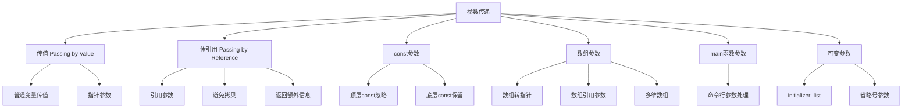

# 📘 6.2 Argument Passing (参数传递)

> 来源说明：C++ Primer 第6章第2节 | 本节涵盖：函数参数传递的机制、传值与传引用、const参数、数组参数等


## 🗺️ 知识体系图



## 🧠 核心概念总览

* [*传值机制*](#pass-by-value)：参数创建为实参的副本，修改不影响原值
* [*指针参数*](#pointer-params)：传递指针值，可通过指针修改指向对象
* [*传引用机制*](#pass-by-reference)：参数作为实参的别名，修改影响原值
* [*引用避免拷贝*](#avoid-copies)：使用const引用避免大对象拷贝
* [*const参数*](#const-params)：顶层const被忽略，底层const影响参数匹配
* [函数参数设计原则](#caution)：尽量使用 `const` 引用
* [*数组参数*](#array-params)：数组自动转为指针，需额外管理大小信息
* [*main函数参数*](#main-params)：处理命令行选项的标准方式
* [*可变参数*](#varying-params)：initializer_list和省略号参数

---

<a id="pass-by-value"></a>
## ✅ 知识点1: 传值机制 (Passing by Value)

**定义**：
*   形参初始化和变量初始化的方式相似
*   当形参为非引用类型时，实参的值被复制到形参，两者是完全独立的对象
*   换句话说，我们在函数类改动形参**不会**影响实参对象


**代码示例**：
```cpp
// 函数内部修改不影响外部变量
void increment(int x) {
    x = x + 1;  // 只修改局部副本
}

int main() {
    int a = 5;
    increment(a);
    cout << a;  // 输出5，a的值未改变
    return 0;
}
```


---

<a id="pointer-params"></a>
## ✅ 知识点2: 指针参数 (Pointer Parameters)

**定义**：指针作为形参时，传递的是指针值的副本，但可以通过指针间接访问和修改指向的对象

**关键特性**：
- 指针本身按值传递（两个独立指针）
- 可以通过指针修改指向的对象
- C风格编程中常用，C++中更推荐使用引用

**代码示例**：
```cpp
// 通过指针修改外部变量
void reset(int *ip) {
    *ip = 0;    // 修改指针指向的对象
    ip = nullptr; // 只修改局部指针副本，不影响外部指针
}

int main() {
    int n = 42;
    int *p = &n;
    reset(p);
    cout << n;  // 输出0，n被修改
    cout << (p == &n); // 输出1，p仍指向n
    return 0;
}
```

**最佳实践**：💡 在C++中，优先使用**引用参数**而非指针参数来访问外部对象

---

<a id="pass-by-reference"></a>
## ✅ 知识点3: 传引用机制 (Passing by Reference)

**定义**：当参数为引用类型时，形参是实参的别名，**对形参的操作直接作用于实参**

**关键特性**：
- 形参是实参的另一个名字（别名）
- 函数内对参数的修改直接影响原始实参
- 避免了不必要的对象拷贝
- 也避免了不必要的地址传递

**代码示例**：
```cpp
// 使用引用修改外部变量
void reset(int &i) {  // i是传入实参的别名
    i = 0;  // 直接修改原始变量
}

int main() {
    int j = 42;
    reset(j);  // 直接传递变量，无需取地址
    cout << j; // 输出0，j被修改
    return 0;
}
```

**最佳实践**：💡 对于需要修改实参的函数，使用引用参数更直观安全

---

<a id="avoid-copies"></a>
## ✅ 知识点4: 使用引用避免拷贝 (Using References to Avoid Copies)

**定义**：对于**大型对象如string**或**不可拷贝的类型如IO**，使用引用参数来避免拷贝开销

**关键特性**：
- 避免大型对象（如string、vector）的拷贝开销
- 允许传递不可拷贝的类型（如IO类型）
- const保证函数内不会意外修改形参和实参

**代码示例**：
```cpp
// 比较字符串长度，避免拷贝
bool isShorter(const string &s1, const string &s2) {
    return s1.size() < s2.size();  // 只读操作，使用const引用
}

int main() {
    string str1 = "hello";
    string str2 = "world";
    cout << isShorter(str1, str2);  // 避免字符串拷贝
    return 0;
}
```

**最佳实践**：💡 不修改实参的引用参数应该声明为const引用

---

<a id="return-additional-info"></a>
## ✅ 知识点5: 引用参数返回额外信息 (Returning Additional Information)

**定义**：通过引用参数让函数"返回"多个值，弥补函数只能返回单个值的限制

**关键特性**：
- 主返回值通过return语句返回
- 额外信息通过引用参数输出
- 常用于需要返回多个结果的场景

**代码示例**：
```cpp
// 返回字符位置和出现次数
string::size_type find_char(const string &s, char c, 
                           string::size_type &occurs) {
    auto ret = s.size();  // 初始化为不可能的位置
    occurs = 0;           // 通过引用参数设置出现次数
    
    for (string::size_type i = 0; i != s.size(); ++i) {
        if (s[i] == c) {
            if (ret == s.size()) {
                ret = i;  // 记录第一次出现位置
            }
            ++occurs;     // 递增出现次数
        }
    }
    return ret;  // 返回位置，次数通过occurs返回
}

int main() {
    string s = "hello world";
    string::size_type count;
    auto pos = find_char(s, 'o', count);
    // pos包含第一个'o'的位置，count包含总出现次数
    return 0;
}
```

---

<a id="const-params"></a>
## ✅ 知识点6: const参数 (const Parameters and Arguments)

**定义**：参数声明中的const限定符，分为顶层const（作用于对象本身）和底层const（作用于指向对象）

**关键特性**：
- 就像变量初始化规则一样， 当我们复制实参去初始化形参时：
    - **顶层const被忽略**：我们可以将const或非const对象传入到有顶层const的形参中
    - **顶层const的形参差异会导致重载失败**: 参数列表必须有实质性差异，**顶层 const 不算差异**，否则会报错
    - **底层const保留**：可以用非常量对象初始化低层 const形参引用，但**不能反过来**；普通引用必须用同类型对象初始化
- const引用可以绑定到临时对象如字面值，**普通引用不能绑定到 const对象， 字面值， 以及需要类型转换的对象**


**代码示例**：
```cpp
// 顶层const被忽略 - 以下两个声明冲突
void fcn(const int i);    // 顶层const, 可以传入const或非const对象
void fcn(int i);          // 错误：重定义，参数类型相同

// 底层const影响匹配
void reset(int &i);       // 只能接受非const int
void print(const int *p); // 可以接受const或非const int*

int main() {
    const int ci = 42;
    int i = 10;
    
    reset(i);     // OK
    // reset(ci); // 错误：不能绑定const到非const引用
    // reset(42); // 错误：不能绑定字面量到非const引用
    
    print(&i);    // OK：非const可以转为const
    print(&ci);   // OK
    return 0;
}
```


---
<a id="caution"></a>
## ✅ 知识点7: 函数参数设计原则：尽量使用 `const` 引用

**定义 / 理论**
当函数不需要修改传入的对象时，应将其参数声明为 `const` 引用，而不是普通引用。
这样：

* 可以传入更多类型的实参（`const` 对象、字面值、需要转换的对象）
* 避免给调用者错误暗示（以为函数可能修改实参）


**教材示例代码 / 过程**

```cpp
// ❌ 错误设计：s 是普通引用
string::size_type find_char(string &s, char c, string::size_type &occurs);
```

调用时会出现问题：

```cpp
find_char("Hello World", 'o', ctr);  // ❌ 编译失败：字面值不能绑定到普通引用
```

更隐蔽的问题：如果我们有另一个函数参数是 `const string&`，就无法调用这个 `find_char`：

```cpp
bool is_sentence(const string &s)
{
    // 如果 s 的末尾有一个 '.'，则认为是句子
    string::size_type ctr = 0;
    return find_char(s, '.', ctr) == s.size() - 1 && ctr == 1;
}

// ❌ 编译失败：s 是 const string&，不能传给要求 string& 的 find_char
```


**正确设计**

```cpp
// ✅ 正确：把 s 定义为 const 引用
string::size_type find_char(const string &s, char c, string::size_type &occurs);
```

优点：

* 允许传入 const string、字面值、类型转换结果
* 不需要修改调用者代码即可在 const 上下文使用
* 明确表达“不会修改实参”的意图


**注意点**

* ⚠️ 普通引用限制了参数的使用范围，容易导致传播性错误（调用者也被迫不能使用 const 对象）
* ⚠️ 不要试图通过修改调用者的参数类型来“匹配”错误的函数签名
* 💡 正确方法是修改函数参数为 `const &`


**最佳实践**

* 当函数不修改参数 → 用 `const Type&`
* 当函数需要修改参数 → 用 `Type&`
* 当函数只需要值拷贝，不关心原对象 → 用值传递（按值传参）

---


<a id="array-params"></a>
## ✅ 知识点8: 数组参数 (Array Parameters)

**定义**：数组作为函数参数时，会自动转换为指向首元素的指针，需要额外处理大小信息

**关键特性**：
- 数组不能按值传递，总是转为指针
- 三种常见的大小管理技术：
  1. 使用结束标记（如C字符串的'\0'）
  2. 传递首尾指针（标准库风格）
  3. 显式传递大小参数

**代码示例**：
```cpp
// 方法1：使用结束标记（C字符串）
void print(const char *cp) {
    if (cp) {
        while (*cp) {           // 直到遇到空字符
            cout << *cp++;
        }
    }
}

// 方法2：传递首尾指针（标准库风格）
void print(const int *beg, const int *end) {
    while (beg != end) {
        cout << *beg++ << " ";
    }
}

// 方法3：显式传递大小
void print(const int ia[], size_t size) {
    for (size_t i = 0; i < size; ++i) {
        cout << ia[i] << " ";
    }
}

int main() {
    int arr[] = {1, 2, 3, 4, 5};
    
    // 使用方法2
    print(begin(arr), end(arr));
    
    // 使用方法3  
    print(arr, sizeof(arr)/sizeof(arr[0]));
    
    return 0;
}
```

---

<a id="array-reference-params"></a>
## ✅ 知识点9: 数组引用参数 (Array Reference Parameters)

**定义**：参数可以声明为数组的引用，此时数组大小成为类型的一部分

**关键特性**：
- 参数类型包含数组大小信息
- 只能传递特定大小的数组
- 在函数体内可以安全使用数组大小

**代码示例**：
```cpp
// 参数是10个int的数组的引用
void print(int (&arr)[10]) {  // 注意括号位置
    for (auto elem : arr) {   // 安全使用范围for，知道大小
        cout << elem << " ";
    }
}

int main() {
    int good[10] = {0,1,2,3,4,5,6,7,8,9};
    int bad[5] = {0,1,2,3,4};
    
    print(good);  // OK
    // print(bad); // 错误：数组大小不匹配
    return 0;
}
```

**注意事项**：⚠️ `int &arr[10]` 表示10个引用的数组，`int (&arr)[10]` 表示10个int的数组的引用

---

<a id="multidimensional-arrays"></a>
## ✅ 知识点10: 多维数组参数 (Multidimensional Array Parameters)

**定义**：多维数组作为参数时，传递的是指向第一维数组的指针

**关键特性**：
- 第一维大小可以省略，其他维度大小必须指定
- 参数实际上是指向数组的指针

**代码示例**：
```cpp
// 多维数组参数声明方式
void print(int (*matrix)[10], int rows);  // 指向10个int数组的指针
// 等价声明
void print(int matrix[][10], int rows);   // 第一维大小被忽略

void print(int matrix[3][10]);           // 第一维大小3被忽略，实际仍为指针
```

---

<a id="main-params"></a>
## ✅ 知识点11: main函数参数 (main: Handling Command-Line Options)

**定义**：main函数可以接受命令行参数，用于程序配置和选项处理

**关键特性**：
- `argc`：参数个数（包括程序名）
- `argv`：参数字符串数组（C风格字符串）
- `argv[0]`：程序名或空字符串
- `argv[argc]`：保证为nullptr

**代码示例**：
```cpp
int main(int argc, char *argv[]) {
    // 程序名：argv[0]
    // 参数从argv[1]到argv[argc-1]
    // argv[argc] == nullptr
    
    for (int i = 0; i < argc; ++i) {
        cout << "argv[" << i << "] = " << argv[i] << endl;
    }
    return 0;
}

// 等价声明
int main(int argc, char **argv) { ... }
```

**使用示例**：
```bash
# 命令行调用
./program -d -o output.txt input.txt
# argc = 5
# argv[0] = "./program"
# argv[1] = "-d"
# argv[2] = "-o" 
# argv[3] = "output.txt"
# argv[4] = "input.txt"
```

---

<a id="varying-params"></a>
## ✅ 知识点12: 可变参数函数 (Functions with Varying Parameters)

**定义**：接受可变数量参数的函数，主要有initializer_list和省略号两种方式

**关键特性**：
- **initializer_list**：同类型可变参数，类型安全
- **省略号参数**：C兼容性，类型不安全

<a id="initializer-list"></a>
### initializer_list参数

**代码示例**：
```cpp
#include <initializer_list>

void error_msg(initializer_list<string> il) {
    for (auto beg = il.begin(); beg != il.end(); ++beg) {
        cout << *beg << " ";
    }
    cout << endl;
}

// 使用
error_msg({"functionX", "expected value", "actual value"});
error_msg({"functionX", "okay"});
```

**initializer_list操作**：
- `il.size()`：元素个数
- `il.begin()`, `il.end()`：迭代器
- 元素是const，不可修改

<a id="ellipsis-params"></a>
### 省略号参数 (Ellipsis Parameters)

**代码示例**：
```cpp
// 只能用于兼容C的类型，不建议在C++中使用
void foo(int count, ...);  // 指定部分类型
void bar(...);             // 完全不指定类型
```

**警告**：⚠️ 省略号参数应该仅用于与C库交互，大多数类类型对象无法正确拷贝

---

## 🔗 知识关联

* **前置知识**：变量初始化、指针和引用、数组、函数基础
* **并行知识**：函数重载、模板函数
* **后续延伸**：函数模板、lambda表达式、智能指针

## ⚠️ 重点难点

### 难点1: const参数的重载解析
顶层const被忽略，因此`void f(const int)`和`void f(int)`被视为相同函数签名，导致重定义错误。

### 难点2: 数组参数的大小管理
数组自动转为指针，函数内无法直接获取大小，必须通过额外机制传递大小信息。

### 难点3: 引用参数的绑定限制
非const引用不能绑定到字面量、需要转换的表达式或const对象，限制了函数调用方式。

## 💻 代码模式

### 模式1: 使用引用参数交换值
```cpp
void swap(int &a, int &b) {
    int temp = a;
    a = b;
    b = temp;
}
```

### 模式2: 通过参数返回多个值
```cpp
bool parse_string(const string &input, int &number, string &text) {
    // 解析成功返回true，通过引用参数返回解析结果
    // 解析失败返回false
}
```

### 模式3: 处理数组的安全函数
```cpp
template<size_t N>
void safe_print(const int (&arr)[N]) {
    for (size_t i = 0; i < N; ++i) {
        cout << arr[i] << " ";
    }
}
```

## 🔑 核心要点总结

1. **传值**：创建副本，修改不影响原值，适合小型数据
2. **传引用**：直接操作原对象，避免拷贝，适合大型对象或需要修改的场景  
3. **const引用**：只读访问的最佳选择，接受更广泛的实参类型
4. **数组参数**：自动转为指针，需要显式管理大小信息
5. **main参数**：标准化的命令行选项处理方式
6. **可变参数**：initializer_list用于同类型安全可变参数

## 📊 掌握程度评估

- [ ] 理解传值和传引用的根本区别
- [ ] 能够正确选择参数传递方式（值/引用/const引用）
- [ ] 掌握数组参数的各种处理技术
- [ ] 理解const参数在重载中的行为
- [ ] 能够编写处理命令行参数的main函数
- [ ] 了解initializer_list的基本用法