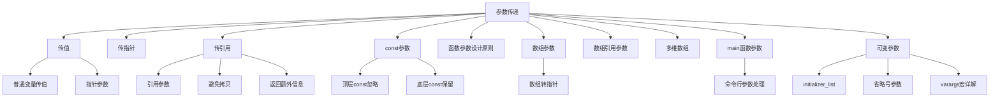

# 📘 6.2 Argument Passing (参数传递)

> 来源说明：C++ Primer 第6章第2节 | 本节涵盖：函数参数传递的机制、传值与传引用、const参数、数组参数等


## 🗺️ 知识体系图



## 🧠 核心概念总览

* [*传值机制*](#pass-by-value)：参数创建为实参的副本，修改不影响原值
* [*指针参数*](#pointer-params)：传递指针值，可通过指针修改指向对象
* [*传引用机制*](#pass-by-reference)：参数作为实参的别名，修改影响原值
* [*引用避免拷贝*](#avoid-copies)：使用const引用避免大对象拷贝
* [*const参数*](#const-params)：顶层const被忽略，底层const影响参数匹配
* [函数参数设计原则](#caution)：尽量使用 `const` 引用
* [*数组参数*](#array-params)：数组自动转为指针，需额外管理大小信息
    * [*传参方式*](#pass-para): 常见三种传参方式
* [*数组引用形参*](#-知识点9-数组引用参数-array-reference-parameters): 若需要在编译期保留数组大小信息
* [*多维数组参数*](#-知识点10-多维数组参数-multidimensional-array-parameters): 一维会退化为指针，指向首个子数组
* [*main函数参数*](#main-params)：处理命令行选项的标准方式
* [*可变参数*](#varying-params)：initializer_list和省略号参数
    * [*initializer_list参数*](#initializer_list参数): 标准库模板类型
    * [*省略号参数*](#省略号参数-ellipsis-parameters): 允许C++程序和C代码交互
    * [*varargs宏详解*](#varargs宏详解): C标准库提供宏来操作可变参数

---

<a id="pass-by-value"></a>
## ✅ 知识点1: 传值机制 (Passing by Value)

**理论**：
*   形参初始化和变量初始化的方式相似
*   当形参为非引用类型时，实参的值被复制到形参，两者是完全独立的对象
*   换句话说，我们在函数类改动形参**不会**影响实参对象


**代码示例**：
```cpp
// 函数内部修改不影响外部变量
void increment(int x) {
    x = x + 1;  // 只修改局部副本
}

int main() {
    int a = 5;
    increment(a);
    cout << a;  // 输出5，a的值未改变
    return 0;
}
```


---

<a id="pointer-params"></a>
## ✅ 知识点2: 指针参数 (Pointer Parameters)

**理论**：指针作为形参时，传递的是指针值的副本，但可以通过指针间接访问和修改指向的对象

**关键特性**：
- 指针本身按值传递（两个独立指针）
- 可以通过指针修改指向的对象
- C风格编程中常用，C++中更推荐使用引用

**代码示例**：
```cpp
// 通过指针修改外部变量
void reset(int *ip) {
    *ip = 0;    // 修改指针指向的对象
    ip = nullptr; // 只修改局部指针副本，不影响外部指针
}

int main() {
    int n = 42;
    int *p = &n;
    reset(p);
    cout << n;  // 输出0，n被修改
    cout << (p == &n); // 输出1，p仍指向n
    return 0;
}
```

**最佳实践**：💡 在C++中，优先使用**引用参数**而非指针参数来访问外部对象

---

<a id="pass-by-reference"></a>
## ✅ 知识点3: 传引用机制 (Passing by Reference)

**理论**：当参数为引用类型时，形参是实参的别名，**对形参的操作直接作用于实参**

**关键特性**：
- 形参是实参的另一个名字（别名）
- 函数内对参数的修改直接影响原始实参
- 避免了不必要的对象拷贝
- 也避免了不必要的地址传递

**代码示例**：
```cpp
// 使用引用修改外部变量
void reset(int &i) {  // i是传入实参的别名
    i = 0;  // 直接修改原始变量
}

int main() {
    int j = 42;
    reset(j);  // 直接传递变量，无需取地址
    cout << j; // 输出0，j被修改
    return 0;
}
```

**最佳实践**：💡 对于需要修改实参的函数，使用引用参数更直观安全

---

<a id="avoid-copies"></a>
## ✅ 知识点4: 使用引用避免拷贝 (Using References to Avoid Copies)

**理论**：对于**大型对象如string**或**不可拷贝的类型如IO**，使用引用参数来避免拷贝开销

**关键特性**：
- 避免大型对象（如string、vector）的拷贝开销
- 允许传递不可拷贝的类型（如IO类型）
- const保证函数内不会意外修改形参和实参

**代码示例**：
```cpp
// 比较字符串长度，避免拷贝
bool isShorter(const string &s1, const string &s2) {
    return s1.size() < s2.size();  // 只读操作，使用const引用
}

int main() {
    string str1 = "hello";
    string str2 = "world";
    cout << isShorter(str1, str2);  // 避免字符串拷贝
    return 0;
}
```

**最佳实践**：💡 不修改实参的引用参数应该声明为const引用

---

<a id="return-additional-info"></a>
## ✅ 知识点5: 引用参数返回额外信息 (Returning Additional Information)

**理论**：通过引用参数让函数"返回"多个值，弥补函数只能返回单个值的限制

**关键特性**：
- 主返回值通过return语句返回
- 额外信息通过引用参数输出
- 常用于需要返回多个结果的场景

**代码示例**：
```cpp
// 返回字符位置和出现次数
string::size_type find_char(const string &s, char c, 
                           string::size_type &occurs) {
    auto ret = s.size();  // 初始化为不可能的位置
    occurs = 0;           // 通过引用参数设置出现次数
    
    for (string::size_type i = 0; i != s.size(); ++i) {
        if (s[i] == c) {
            if (ret == s.size()) {
                ret = i;  // 记录第一次出现位置
            }
            ++occurs;     // 递增出现次数
        }
    }
    return ret;  // 返回位置，次数通过occurs返回
}

int main() {
    string s = "hello world";
    string::size_type count;
    auto pos = find_char(s, 'o', count);
    // pos包含第一个'o'的位置，count包含总出现次数
    return 0;
}
```

---

<a id="const-params"></a>
## ✅ 知识点6: const参数 (const Parameters and Arguments)

**理论**：参数声明中的const限定符，分为顶层const（作用于对象本身）和底层const（作用于指向对象）

**关键特性**：
- 就像变量初始化规则一样， 当我们复制实参去初始化形参时：
    - **顶层const被忽略**：我们可以将const或非const对象传入到有顶层const的形参中
    - **顶层const的形参差异会导致重载失败**: 参数列表必须有实质性差异，**顶层 const 不算差异**，否则会报错
    - **底层const保留**：可以用非常量对象初始化低层 const形参引用，但**不能反过来**；普通引用必须用同类型对象初始化
- const引用可以绑定到临时对象如字面值，**普通引用不能绑定到 const对象， 字面值， 以及需要类型转换的对象**


**代码示例**：
```cpp
// 顶层const被忽略 - 以下两个声明冲突
void fcn(const int i);    // 顶层const, 可以传入const或非const对象
void fcn(int i);          // 错误：重定义，参数类型相同

// 底层const影响匹配
void reset(int &i);       // 只能接受非const int
void print(const int *p); // 可以接受const或非const int*

int main() {
    const int ci = 42;
    int i = 10;
    
    reset(i);     // OK
    // reset(ci); // 错误：不能绑定const到非const引用
    // reset(42); // 错误：不能绑定字面量到非const引用
    
    print(&i);    // OK：非const可以转为const
    print(&ci);   // OK
    return 0;
}
```


---
<a id="caution"></a>
## ✅ 知识点7: 函数参数设计原则：尽量使用 `const` 引用

**理论**
当函数不需要修改传入的对象时，应将其参数声明为 `const` 引用，而不是普通引用。
这样：

* 可以传入更多类型的实参（`const` 对象、字面值、需要转换的对象）
* 避免给调用者错误暗示（以为函数可能修改实参）


**教材示例代码**

```cpp
// ❌ 错误设计：s 是普通引用
string::size_type find_char(string &s, char c, string::size_type &occurs);
```

调用时会出现问题：

```cpp
find_char("Hello World", 'o', ctr);  // ❌ 编译失败：字面值不能绑定到普通引用
```

更隐蔽的问题：如果我们有另一个函数参数是 `const string&`，就无法调用这个 `find_char`：

```cpp
bool is_sentence(const string &s)
{
    // 如果 s 的末尾有一个 '.'，则认为是句子
    string::size_type ctr = 0;
    return find_char(s, '.', ctr) == s.size() - 1 && ctr == 1;
}

// ❌ 编译失败：s 是 const string&，不能传给要求 string& 的 find_char
```


**正确设计**

```cpp
// ✅ 正确：把 s 定义为 const 引用
string::size_type find_char(const string &s, char c, string::size_type &occurs);
```

优点：

* 允许传入 const string、字面值、类型转换结果
* 不需要修改调用者代码即可在 const 上下文使用
* 明确表达“不会修改实参”的意图


**注意点**

* ⚠️ 普通引用限制了参数的使用范围，容易导致传播性错误（调用者也被迫不能使用 const 对象）
* ⚠️ 不要试图通过修改调用者的参数类型来“匹配”错误的函数签名
* 💡 正确方法是修改函数参数为 `const &`


**最佳实践**

* 当函数不修改参数 → 用 `const Type&`
* 当函数需要修改参数 → 用 `Type&`
* 当函数只需要值拷贝，不关心原对象 → 用值传递（按值传参）

---


<a id="array-params"></a>
## ✅ 知识点8: 数组参数 (Array Parameters)

**理论**：

数组作为函数形参时**不能按值传递**，会**退化为指向首元素的指针**，因此函数无法获知数组大小。下列声明等价：

```cpp
void print(const int*);      // 实际类型
void print(const int[]);     // 仅表明是数组
void print(const int[10]);   // 维度仅作文档说明
```

**注意点**

* ⚠️ 调用时 `print(j)` 实际上传入 `j` 的首元素地址，与数组长度无关。**必须由调用者保证不越界访问**
* ⚠️ 因此传递给`const int[10]`形参的实参会**丢失维度信息**，导致实参数只要是`const int*`甚至`int*`就可以


<a id="pass-para"></a>
### 传参方式
**理论**：

常见三种传参方式：

1. **结束标记法**：适用于以 `'\0'` 结尾的 C 字符串，遍历直到遇到哨兵值：

   ```cpp
   void print(const char* cp) {
       if (cp)
           while (*cp) std::cout << *cp++ << '\n';
   }
   ```

   - 优点：不需额外参数，很好适配于**有明显尾标记值**的对象
   - 缺点：不适用于无哨兵的普通数组

2. **首尾指针法（推荐）**：传递 `[beg, end)` 区间指针，STL 风格：

   ```cpp
   void print(const int* beg, const int* end) {
       while (beg != end) std::cout << *beg++ << '\n';
   }
   int a[2]{0,1};
   print(std::begin(a), std::end(a));
   ```

   - 优点：安全且通用
   - 缺点：但调用者必须保证区间正确

3. **显式传大小法**：额外传递 `size` 参数，用下标访问：

   ```cpp
   void print(const int ia[], size_t size) {
       for (size_t i = 0; i != size; ++i) std::cout << ia[i] << '\n';
   }
   print(a, std::end(a) - std::begin(a));
   ```
   - 优点：安全 
   - 缺点：调用方必须保证传入的大小合法


**注意点**

⚠️ 若函数不修改数组，应将形参声明为 `const` 指针，防止意外修改。


---

<a id="array-reference-params"></a>
## ✅ 知识点9: 数组引用参数 (Array Reference Parameters)

**理论**：
- 参数可以声明为数组的引用，**此时数组大小(维度信息)成为类型的一部分**
- 若需要在编译期保留数组大小信息，可以使用**数组引用形参**

**关键特性**：
- 参数类型包含数组大小信息
- 只能传递特定大小的数组
- 在函数体内可以安全使用数组大小
- 因此，若需要在编译期保留数组大小信息，可以使用**数组引用形参**

**代码示例**：
```cpp
// 参数是10个int的数组的引用
void print(int (&arr)[10]) {  // 注意括号位置
    for (auto elem : arr) {   // 安全使用范围for，知道大小
        cout << elem << " ";
    }
}

int main() {
    int good[10] = {0,1,2,3,4,5,6,7,8,9};
    int bad[5] = {0,1,2,3,4};
    
    print(good);  // OK
    // print(bad); // 错误：数组大小不匹配
    return 0;
}
```

**注意事项**：
- ⚠️ `int &arr[10]` 表示10个引用的数组，`int (&arr)[10]` 表示10个int的数组的引用，是**非法**
- ⚠️ **维度信息会限制函数的使用范围**：我们只能传入指定维度的参数进入函数， 其他情况报错

**注意区分**：

```cpp
int *matrix[10];   // 数组，含10个指向int的指针
int (*matrix)[10]; // 指针，指向含10个int的数组
```

调用示例：`int m[3][10]; print(m, 3);` 第一维可省略，编译器自动推断。

**速记**：数组做形参 → 退化成指针 → 大小丢失；要么传哨兵、首尾、显式大小，要么用数组引用保留维度；二维及以上必须指定除第一维外的所有维度。

---

<a id="multidimensional-arrays"></a>
## ✅ 知识点10: 多维数组参数 (Multidimensional Array Parameters)

**理论**：
- C++ 没有真正意义上的“多维数组类型”，所谓多维数组其实是**数组的数组**
- 当多维数组作为函数参数传递时，**第一维会退化为指针，指向首个子数组**
- 但**必须显式指定第二维及后续维度**，否则编译器无法计算行偏移


**关键特性**：
- 第一维大小可以省略，其他维度大小必须指定
- 参数实际上是指向数组的指针
- 由于编译器会直接忽视第一维信息， 我们最好不包括一维信息

**代码示例**：
```cpp
// 多维数组参数声明方式
void print(int (*matrix)[10], int rows);  // 指向10个int数组的指针
// 等价声明
void print(int matrix[][10], int rows);   // 第一维大小被忽略

void print(int matrix[3][10]);           // 第一维大小3被忽略，实际仍为指针
```

**注意**
- ⚠️ 作用于`*matrix`的括号是非常必要的
- ⚠️ `int *matrix[10]` 和 `int (*matrix)[10]` 两者意思不相同
---

<a id="main-params"></a>
## ✅ 知识点11: main函数参数 (main: Handling Command-Line Options)

**定义**：main函数可以接受命令行参数，用于程序配置和选项处理

**关键特性**：
- `argc`：参数个数（包括程序名）
- `argv`：参数字符串数组（指向C风格字符串指针的数组）
- `argv[0]`：程序名或空字符串
- `argv[argc]`：也就是尾后第一个元素保证为**0(nullptr)**

**代码示例**：
```cpp
int main(int argc, char *argv[]) {
    // 程序名：argv[0]
    // 参数从argv[1]到argv[argc-1]
    // argv[argc] == nullptr
    
    for (int i = 0; i < argc; ++i) {
        cout << "argv[" << i << "] = " << argv[i] << endl;
    }
    return 0;
}

// 等价声明
int main(int argc, char **argv) { ... }
```

**使用示例**：
```bash
# 命令行调用
./program -d -o output.txt input.txt
# argc = 5
# argv[0] = "./program"
# argv[1] = "-d"
# argv[2] = "-o" 
# argv[3] = "output.txt"
# argv[4] = "input.txt"
```

**注意**
- ⚠️ 当你想用在`argv`里面的参数时，请从`argv[1]`开始，`argv[0]`不是使用者的输入

---

<a id="varying-params"></a>
## ✅ 知识点12: 可变参数函数 (Functions with Varying Parameters)

**理论**：
-   `initializer_list` 是 C++11 引入的标准库**模板类型**，**初始化时一定要指定类型**
-   它提供了类似数组的访问接口，**元素总是`const`**，不可修改。
- **常用于编写能够接受可变数量实参的函数**

**关键特性**：
- **initializer_list**：同类型可变参数，类型安全
- **省略号参数**：C兼容性，类型不安全

<a id="initializer-list"></a>
### `initializer_list`参数

**理论**：
-   有着类似于`vector`的`begin()`和`end()`的迭代器
-   当我们传实参进入`initializer_list`是， 我们需要在实参外包括**花括号**
-   在定义了`initializer_list`为形参数前提下， 我们同样可以定义其他类型形式参


**代码示例**：
```cpp
#include <initializer_list>

void error_msg(initializer_list<string> il) {
    for (auto beg = il.begin(); beg != il.end(); ++beg) {
        cout << *beg << " ";
    }
    cout << endl;
}

// 使用
error_msg({"functionX", "expected value", "actual value"});
error_msg({"functionX", "okay"});
```

**initializer_list操作**：
-  `initializer_list<T> lst;` 默认初始化，元素为T的空列表
- `initializer_list<int> li2{1,2,3...};` 元素值是初始器的拷贝，且为 const，不能修改
- `lst2(lst); lst2=lst;` 复制或赋值 `initializer_list` 是**浅拷贝**，不复制实际元素，所有副本共享同一底层元素序列
- `il.size()`：元素个数
- `il.begin()`, `il.end()`：迭代器
- 元素是const，不可修改

**注意**
- ⚠️ 浅拷贝 = 复制对象的每个成员值（包括指针值），但不复制指针所指向的数据 → 因此新旧对象共享同一底层数据

<a id="ellipsis-params"></a>
### 省略号参数 (Ellipsis Parameters)

**理论**：
-   省略号参数允许C++程序和C代码交互通过使用名为`varargs`的C库
-   省略号参数不应该用于其他用途

**关键特性**:
- 省略号参数只能出现在参数列表的最后一个

**代码示例**：
```cpp
// 只能用于兼容C的类型，不建议在C++中使用
void foo(int count, ...);  // 指定部分类型
void bar(...);             // 完全不指定类型
```

**警告**：⚠️ 省略号参数应该仅用于与C库交互，**大多数类类型对象无法正确拷贝**

---

<a id="varargs-macros"></a>
### varargs宏详解

**理论**：C标准库提供宏来操作可变参数，定义在 `<cstdarg>`, `stdarg.h`

**varargs宏**：

| 宏 | 功能 | 说明 |
|----|------|------|
| `va_list ap` | 参数列表类型 | 声明变量引用参数列表 |
| `va_start(ap, last_arg)` | 初始化参数列表 | 必须在`va_arg`前调用 |
| `va_arg(ap, type)` | 获取下一个参数 | 每次调用返回下一个参数 |
| `va_end(ap)` | 清理参数列表 | 必须在使用完后调用 |
| `va_copy(dest, src)` | 复制参数列表 | C99/C++11引入 |

**使用流程**：
1. 声明 `va_list` 变量
2. 使用 `va_start` 初始化, `last_arg`指最后一个固定参数
3. 使用 `va_arg` 逐个获取参数, `type`表示获取出来的参数类型
4. 使用 `va_end` 清理

**简单示例**：
```cpp
#include <cstdarg>

int sum(int count, ...) {
    int total = 0;
    va_list args;
    va_start(args, count);
    
    for (int i = 0; i < count; ++i) {
        total += va_arg(args, int);
    }
    
    va_end(args);
    return total;
}

void print_values(const char* format, ...) {
    va_list args;
    va_start(args, format);
    
    while (*format) {
        if (*format == 'd') {
            int i = va_arg(args, int);
            cout << "int: " << i << endl;
        } else if (*format == 'f') {
            double d = va_arg(args, double);
            cout << "double: " << d << endl;
        }
        ++format;
    }
    
    va_end(args);
}
```

**重要注意事项**：
1. 传入 `...` 的参数会被“扩大化”处理**类型提升规则**：
   - 提升发生在调用处
   - `char`、`short` → `int`
   - `float` → `double`
   - 如果你写 `va_arg(ap, char)` 去读实际存成 `int` 的值，属于 未定义行为（可能读到垃圾值，还会把游标移错位）

2. **类型安全缺失**：
   ```cpp
   // 危险：类型不匹配导致未定义行为
   int num = va_arg(args, int);  // 期望int，但可能传递了double
   ```

3. **参数结束处理**：
   - 通过固定数量参数指定
   - 使用特殊标记值

**最佳实践**：
```cpp
// ✅ 优先使用initializer_list
void good_example(initializer_list<int> values);

// ✅ 或者使用可变参数模板
template<typename... Args>
void better_example(Args&&... args);

// ❌ 避免在C++中新建varargs函数
void bad_design(const char* format, ...);
```

---

## 🔑 核心要点总结

1. **传值 vs 传引用**：根据是否需要修改实参和效率考虑选择
2. **const正确性**：优先使用const引用，避免不必要的限制
3. **数组处理**：本质传递指针，需配合大小管理策略
4. **可变参数**：
   - `initializer_list`：类型安全，适用于相同类型参数
   - 省略号参数：类型不安全，仅用于C兼容
5. **参数设计原则**：接口应尽可能通用（接受const引用）

## 📌 考试速记版

| 参数类型 | 语法示例 | 特点 | 适用场景 |
|---------|----------|------|----------|
| 传值 | `void func(int x)` | 独立副本 | 基本类型，不需修改 |
| 传引用 | `void func(int &x)` | 实参别名 | 需要修改实参 |
| const引用 | `void func(const int &x)` | 只读访问 | 大型对象，不需修改 |
| 数组指针 | `void func(int arr[])` | 自动转换 | C风格数组 |
| 数组引用 | `void func(int (&arr)[N])` | 固定大小 | 已知维度的数组 |
| initializer_list | `void func(ilist<string>)` | 同类型const | 可变同类型参数 |
| 省略号参数 | `void func(...)` | 无类型检查 | C兼容性 |

**口诀**：
- 要修改用引用，只读用const
- 数组变指针，大小要管理  
- 可变参数分两种：安全用list，危险用省略