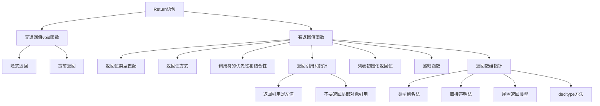

# 📘 6.3 Return Types and the return Statement

> 来源说明：C++ Primer 第6.3节 | 本节涵盖：函数返回类型和return语句的用法、注意事项及最佳实践

---

## 🗺️ 知识体系图



## 🧠 核心概念总览（可点击目录）

* [*无返回值void函数*](#id1)：void函数使用return提前退出，只能返回void表达式
* [*有返回值函数*](#id2)：必须返回与声明类型匹配的值，编译器会检查返回路径
  * [*返回值方式*](#return-how): 调用处返回临时变量
  * [*调用符的优先性和结合性*](#调用符的结合性和优先性):
* [*返回引用和指针*](#id3)：返回引用得到左值，但绝不能返回局部对象的引用
* [*列表初始化返回值*](#id4)：使用花括号列表初始化返回值，支持空列表
* [*main函数返回*](#id5)：main函数可隐式返回0，使用EXIT_SUCCESS/FAILURE表示状态
* [*递归函数*](#id6)：函数调用自身，必须有非递归的终止条件
* [*返回数组指针*](#id7)：函数不能返回数组，但可以返回数组指针或引用

---

<a id="id1"></a>

## ✅ 知识点 1: 无返回值void函数

**理论**

* void函数可以不包含return语句，在最后一条语句后隐式返回
* 使用return语句可在函数中间提前退出，类似于break退出循环
* void函数只能返回void表达式，不能返回其他类型的值

**教材示例代码**

```cpp
void swap(int &v1, int &v2)
{
    // 如果值相同，提前返回
    if (v1 == v2)
        return;  // void函数无值返回
    
    // 执行交换操作
    int tmp = v2;
    v2 = v1;
    v1 = tmp;
    // 最后隐式返回，无需显式return
}
```

**注意点**

* ⚠️ void函数只能返回void表达式，如调用其他void函数
* 💡 使用return提前退出可简化代码逻辑，避免深层嵌套

---

<a id="id2"></a>

## ✅ 知识点 2: 有返回值函数

**理论**

* 非void函数必须返回与声明类型匹配的值，**或可隐式转换的类型**
* 编译器会检查**所有执行路径是否都有合适的return语句**

**教材示例代码**

```cpp
// 错误示例：缺少返回值的函数
bool str_subrange(const string &str1, const string &str2)
{
    if (str1.size() == str2.size())
        return str1 == str2;  // 正确：返回bool
        
    auto size = (str1.size() < str2.size()) ? str1.size() : str2.size();
    
    for (decltype(size) i = 0; i != size; ++i) {
        if (str1[i] != str2[i])
            return;  // 错误1：缺少返回值
    }
    // 错误2：可能没有return语句就结束函数
}
```

**注意点**

* ⚠️ 循环中包含return后，循环后仍需提供return语句
* ⚠️ 缺少return语句可能导致未定义行为
* 💡 **编译器可能无法检测在循环后缺失return的情况**

<a id="return-how"></a>

### 如何返回值

**理论**

* 返回值用于初始化调用处的临时对象，这个**临时对象是函数调用的结果**

**教材示例代码**

```cpp
// 返回复数形式的单词如果ctr大雨1
string make_plural(size_t ctr, const string &word const string &ending)
{
    return (ctr > 1) ? word + ending : word;
}
```

**代码解析**

* 因为函数返回类型为`string`，也就是说函数返回值会被复制到调用处
* 这个函数要么返回`word`的副本，要么返回一个无名的由`word`和`ending`合并而来的`string`临时值

<a id="return--asso--pre"></a>

### 调用符的结合性和优先性

**理论**

* 函数调用运算符 `()` 与成员访问运算符 `.`、`->` 同一优先级，且都**左结合**
* 若函数返回 类类型（对象/引用/指针），可直接**链式访问**其成员或再调用其成员函数
* 先得到函数返回的对象 → 用 `./->` 取成员 → 对该成员再用 `()` 调用

```cpp
auto sz = shorterString(s1, s2).size();
```

**代码解析**

* 先计算 `shorterString(s1, s2)`
* 再取返回对象的成员 `size`
* 最后调用 `size()`

---

<a id="id3"></a>

## ✅ 知识点 3: 返回引用和指针

**理论**

* 返回引用时，**引用只是所引用对象的别名**，不涉及拷贝
* **绝不能返回局部对象的引用或指针**，因为函数结束后局部对象被销毁
* 返回引用得到**左值**，其他返回值类都是**右值**
* 函数返回的引用与普通左值使用方法一样， 尤其是**可出现在赋值语句左侧**

**教材示例代码**

```cpp
// 正确：返回const string引用
const string &shorterString(const string &s1, const string &s2)
{
    return s1.size() <= s2.size() ? s1 : s2;
}

// 错误：返回局部对象引用
const string &manip()
{
    string ret;
    if (!ret.empty())
        return ret;  // 错误：返回局部对象引用
    return "Empty";  // 错误：返回临时对象的引用
}

// 返回引用作为左值使用
char &get_val(string &str, string::size_type ix)
{
    return str[ix];
}

int main()
{
    string s("a value");
    get_val(s, 0) = 'A';  // 正确：修改s[0]为'A'
    return 0;
}
```

**注意点**

* ⚠️ 返回局部对象引用/指针是严重错误，会导致未定义行为
* 💡 检查准则：**返回的引用指向哪个已存在的对象？**
* ⚠️ 返回const引用时不能作为赋值左值

---

<a id="id4"></a>

## ✅ 知识点 4: 列表初始化返回值 (C++11)

**理论**

* C++11支持使用花括号列表初始化返回值
* 函数的 return `{…}` 语法有效。返回时用花括号按返回类型进行列表初始化一个临时对象
  * `return {};` → 返回对象值初始化（如返回 `vector<int>` 则为空向量；返回内置数值则为 0）
  * 非空列表：`return {a, b, c};` → 按返回类型的列表初始化规则构造（如 `vector<string>` 得到含这些元素的向量）。

**教材示例代码**

```cpp
vector<string> process()
{
    if (expected.empty())
        return {};  // 返回空vector
    else if (expected == actual)
        return {"functionX", "okay"};  // 返回2元素vector
    else
        return {"functionX", expected, actual};  // 返回3元素vector
}
```

**代码解析**

* 在这个函数中，要么返回空`vector`，要我们返回由两个或三个元素初始化的`vector`
* **内置类型返回**: **花括号里最多 1 个值**，且不得发生缩窄转换（如 `int` 返回 `{3.14}`）
* **类类型返回**: 如何使用这些初始值由**该类的列表初始化规则决定**（如`vector`构造函数）

**注意点**

* 💡 列表初始化使返回容器对象更简洁
* ⚠️ 内置类型返回列表只能包含一个值

---

<a id="id5"></a>

## ✅ 知识点 5: main函数返回

**理论**

* main函数是**唯一可以不显式返回值的非void函数**
* 控制流到达main末尾时，编译器**隐式插入return 0**
* 返回0表示成功，非0表示失败（机器相关含义）
* 为了让返回值不依赖机器决定表现（machine-independent），头文件`cstdlib`定义乐两个**预处理变量**来标定运行成功或失败

**教材示例代码**

```cpp
#include <cstdlib>

int main()
{
    if (some_failure)
        return EXIT_FAILURE;  // 预定义失败码
    else
        return EXIT_SUCCESS;  // 预定义成功码
}
```

**注意点**

* ⚠️ EXIT_SUCCESS和EXIT_FAILURE是预处理器变量，不要加`std::` 或者 `using`
* 💡 使用标准定义使返回值机器无关

---

<a id="id6"></a>

## ✅ 知识点 6: 递归函数

**理论**

* 递归函数直接或间接调用自身
* 必须有非递归的**终止条件**，否则无限递归耗尽栈空间
* main函数不允许递归调用

**教材示例代码**

```cpp
// 递归计算阶乘
int factorial(int val)
{
    if (val > 1)
        return factorial(val - 1) * val;  // 递归调用
    return 1;  // 终止条件
}
```

**递归调用追踪表**

| 调用 | 计算过程 | 返回值 |
|------|----------|--------|
| factorial(5) | factorial(4) × 5 | 120 |
| factorial(4) | factorial(3) × 4 | 24 |
| factorial(3) | factorial(2) × 3 | 6 |
| factorial(2) | factorial(1) × 2 | 2 |
| factorial(1) | 1 | 1 |

**注意点**

* ⚠️ 必须有明确的终止条件避免无限递归
* 💡 递归适合分治策略和数学递推关系

---

<a id="id7"></a>

## ✅ 知识点 7: 返回数组指针

**理论**

* 函数**不能返回数组**，因为数组不能被拷贝
* 但函数可以返回**指向数组的指针**或**数组的引用**
* 有四种声明方法，各有优缺点

### 类型别名法（推荐）

```cpp
typedef int arrT[10];  // 定义10个int数组的类型别名
using arrT = int[10];  // 定义10个int数组的类型别名
arrT* func(int i);     // 返回指向arrT的指针
```

**代码解析**
- 我们定义了一个指向10个元素的int数组类
- 因此函数应该返回一个指向十个int元素的数组的指针

### 直接声明法（复杂）

```cpp
int arr[10];  //arr是一个10个int元素的数组
int *p1[10]; //p1是一个有10个指向int的指针为元素的数组
int (*p2)[10] = &arr; //p2是指向十个int元素的数组
int (*func(int i))[10];  // 返回指向10个int数组的指针
```
**代码解析**：从内向外读
- `func(int)` - 接受int参数的函数
- `(*func(int))` - 返回结果可解引用  
- `(*func(int))[10]` - 解引用得到10元素数组
- `int (*func(int))[10]` - 数组元素为int

### 尾置返回类型（C++11，清晰）

```cpp
auto func(int i) -> int(*)[10];  // 返回类型在参数后
```
**代码解析**
- 返回类型在参数列表后，用`->`隔开
- 为了表明这个返回类型是在参数列表后面，我们使用`auto`关键字来替代原本返回类型出现的地方

### decltype法（基于现有数组）

```cpp
int odd[] = {1,3,5,7,9};
decltype(odd) *arrPtr(int i) {  // 必须手动加*
    return (i % 2) ? &odd : &even;
}
```

**注意点**
* ⚠️ `decltype(数组)`得到数组类型，**必须手动加`*`得到指针**表示函数返回一个指针
* 💡 **类型别名法**和**尾置返回类型**更清晰易读
* ⚠️ 括号必须正确，否则意义完全不同

### 数组指针 vs 普通指针 - 核心区别

**`int*` (普通指针)**
- ❌ **不知道维度** - 只知道指向某个int元素

**`int(*)[5]` (数组指针)**  
- ✅ **知道维度** - 知道指向的是完整的5元素数组

💡 **一句话总结**
**普通指针只知道位置，数组指针知道位置+结构**


---

## 🔑 核心要点总结

1. **void函数**：可隐式返回或提前退出，只能返回void表达式
2. **返回值类型**：必须匹配函数声明类型，所有路径都要有return
3. **返回引用**：得到左值可赋值，绝不能返回局部对象引用
4. **列表初始化**：使用{}简化容器对象返回
5. **main函数**：唯一可隐式返回0的非void函数
6. **递归函数**：必须有终止条件，main不能递归
7. **数组指针**：函数不能返回数组，但可返回数组指针

## 📌 考试速记版

| 返回类型 | 允许操作 | 禁止操作 |
|----------|----------|----------|
| void | 提前return; 返回void表达式 | 返回非void值 |
| 非void类型 | 返回匹配类型的值 | 缺少return语句 |
| 引用类型 | 作为左值赋值 | 返回局部对象引用 |
| const引用 | 避免不必要的拷贝 | 不能作为赋值左值 |

**数组指针声明方法对比：**
| 方法 | 语法 | 特点 |
|------|------|------|
| 类型别名 | `using arrT = int[10]; arrT* func(int);` | 简洁清晰 |
| 尾置返回 | `auto func(int) -> int(*)[10]` | 现代易读 |
| 直接声明 | `int (*func(int))[10]` | 复杂但基础 |
| decltype | `decltype(arr) *func(int)` | 基于现有类型 |

**口诀**：void可空返，非void必带值，引用勿返局部，递归须有终止，数组不能返，指针来帮忙