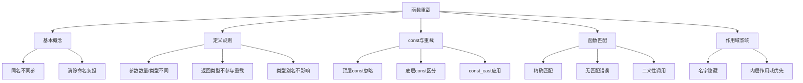

# 📘 6.4 重载函数 (Overloaded Functions)

> 来源说明：C++ Primer 第6.4节 | 本节涵盖：理解同名函数如何通过不同参数列表实现不同功能

---

## 🗺️ 知识体系图



## 🧠 核心概念总览（可点击目录）

* [*重载函数基础*](#id1)：同名函数通过不同参数列表实现不同功能
* [*重载函数定义规则*](#id2)：参数数量或类型必须不同，返回类型不参与重载
* [*const参数与重载*](#id3)：顶层const被忽略，底层const可区分重载
* [*函数匹配机制*](#id4)：编译器根据实参选择最佳匹配函数
* [*作用域与重载*](#id5)：内层作用域会隐藏外层同名函数

---

<a id="id1"></a>
## ✅ 知识点 1: 重载函数基础

**理论**
* **重载函数**：在**同一作用域内**，**名字相同但参数列表不同的函数**
* **核心价值**：消除为相似操作发明不同名字的需要，提高代码可读性
* **编译器识别**：通过传递的实参类型自动推断调用哪个函数

**教材示例代码**
```cpp
// 三个重载的print函数
void print(const char *cp);           // 打印C风格字符串
void print(const int *beg, const int *end); // 打印整数范围
void print(const int ia[], size_t size);    // 打印整数数组

// 调用示例
int j[2] = {0, 1};
print("Hello World");        // 调用 print(const char*)
print(j, end(j) - begin(j)); // 调用 print(const int*, size_t)
print(begin(j), end(j));     // 调用 print(const int*, const int*)
```

**注意点**
* ⚠️ `main`函数不能被重载
* 💡 重载函数应该执行相似的操作，避免语义混淆
* 🔄 函数重载是编译时多态的一种形式

---

<a id="id2"></a>
## ✅ 知识点 2: 重载函数定义规则

**理论**
* **区分依据**：函数必须在参数**数量**或参数**类型**上不同
* **返回类型**：**仅返回类型不同不能构成重载**，会导致编译错误
* **参数名字**：参数名字不影响重载，只起文档作用
* **类型别名**：使用typedef或using定义的类型别名**不创建新类型**，不会起到修改类型，函数重载的作用

**教材示例代码**
```cpp
// 合法重载 - 参数类型不同
Record lookup(const Account&);  // 通过Account查找
Record lookup(const Phone&);    // 通过Phone查找
Record lookup(const Name&);     // 通过Name查找

// 错误示例 - 仅返回类型不同
Record lookup(const Account&); 
bool lookup(const Account&);    // 错误：重复声明

// 类型别名不影响重载
typedef Phone Telno;
Record lookup(const Phone&);    // 与下面声明相同函数
Record lookup(const Telno&);    // Telno是Phone的别名
```

**注意点**
* ⚠️ 参数名字在重载决策中被完全忽略
* 💡 类型别名只是已有类型的另一个名字，不创建新类型
* 🔄 函数签名 = 函数名 + 参数类型列表（不包括返回类型）

---

<a id="id3"></a>
## ✅ 知识点 3: const参数与重载

**理论**
* **顶层const无法重载**：作用于对象本身的const，在重载中被忽略
* **底层const可以重载**：指向const或者非const对象的指针或引用，可以区分重载
* **const转换**：非const可以转换为const，但反过来需要显式转换`const_cast`
* **`const_cast`用于重载**：通过`const_cast`显示转换可以用于重载

**教材示例代码**
```cpp
// 顶层const被忽略 - 以下声明相同函数
Record lookup(Phone);
Record lookup(const Phone);        // 重复声明

Record lookup(Phone*);
Record lookup(Phone* const);       // 重复声明

// 底层const可区分重载 - 以下都是不同函数
Record lookup(Account&);           // 参数：Account引用
Record lookup(const Account&);     // 参数：const Account引用

Record lookup(Account*);           // 参数：Account指针  
Record lookup(const Account*);     // 参数：const Account指针

// const_cast在重载中的应用
const string &shorterString(const string &s1, const string &s2) {
    return s1.size() <= s2.size() ? s1 : s2;
}

string &shorterString(string &s1, string &s2) {
    // 调用const版本，然后移除const
    auto &r = shorterString(const_cast<const string&>(s1),
                           const_cast<const string&>(s2));
    return const_cast<string&>(r);
}
```

**注意点**
* ⚠️ 顶层const参数与非常量参数无法区分
* 💡 当传递非const对象时，**编译器优先选择非const版本**
* 🔄 `const_cast`常用于基于const版本**实现非const重载函数**
* ⚠️ 尽管重载让我避免去发明新函数名字，但是我们应该只重载**做相同操作的函数**
    * 例如 `moveHome()`, `moveAbs()`这些不要写成一个`move()`来重载

---

<a id="id4"></a>
## ✅ 知识点 4: 函数匹配机制

**理论**
* **函数匹配**(Function matching/Overload resolution)：
    - 当有一组同名重载函数时，编译器会把一次调用与其中最合适的函数关联
    - 通过拿**实参列表**去和各重载的**形参列表**比较找到最相近的来关联
    - 一些参数数量相同，但是涉及转换不容易判断使用哪一个函数
* **三种结果**：
  - 找到最佳匹配 → 调用该函数
  - 无匹配 → 编译错误
  -  ambiguous调用 → 多个匹配但无最佳 → 编译错误（ambiguous call）

**教材示例代码**
```cpp
// 重载函数集
void print(const string&);
void print(double);
void print(int);

// 调用解析
print("Value: ");   // 调用 print(const string&) - 精确匹配
print(42);          // 调用 print(int) - 精确匹配  
print(3.14);        // 调用 print(double) - 精确匹配
```

**注意点**
* ⚠️ 涉及类型转换的匹配可能产生二义性
* 💡 **精确匹配总是优于需要转换的匹配**
* 🔄 函数匹配过程在编译时完成

---

<a id="id5"></a>
## ✅ 知识点 5: 作用域与重载

**理论**
* **名字隐藏**：内层作用域声明的名字会隐藏外层作用域的同名名字
* **名字查找顺序**：先查找当前作用域，找到后停止，不考虑外层作用域
* **重要规则**：名字查找发生在类型检查之前

**教材示例代码**
```cpp
string read();                    // 外层：函数声明
void print(const string&);        // 外层：函数声明
void print(double);               // 外层：重载函数

void fooBar(int ival) {
    bool read = false;            // 内层：隐藏外层的read函数
    string s = read();            // 错误：read现在是bool变量
    
    void print(int);              // 内层：隐藏所有外层print函数
    print("Value: ");             // 错误：print(const string&)被隐藏
    print(ival);                  // 正确：调用print(int)
    print(3.14);                  // 正确：调用print(int)，print(double)被隐藏
}
```
**代码解析**
* 编译器处理对`read`的调用时，它会找到对`read`本地定义,也就是一个`bool`变量
* 由于是变量，故调用非法
* 同样的原因，编译器会去寻找`print`的声明
* 一旦找到本地声明，外部所有相同名字的声明都会被忽略
* 也就是说，编译器会假定我们在使用内部的声明
* 在这个例子中，内部的`print(int)`屏蔽了外部所有的`print`函数

**注意点**
* ⚠️ **在内层作用域声明函数通常会隐藏外层的重载函数**
* 💡 重载不跨越不同作用域
* 🔄 如果所有重载版本都在同一作用域，则所有版本都参与重载解析
* 💡 在C++名称查找**先于**类型检查
* ⚠️ **在块内只能声明不能定义函数**


---


## 🔑 核心要点总结

1. **重载本质**：同名函数通过参数列表区分，提高接口一致性
2. **区分依据**：参数数量或类型必须不同，返回类型不参与
3. **const规则**：顶层const被忽略，底层const可区分重载
4. **匹配过程**：编译器根据实参类型选择最佳匹配函数
5. **作用域影响**：重载不跨越作用域，内层声明隐藏外层所有版本

## 📌 考试速记版

* **重载条件**：同名 + 不同参（数量/类型）
* **const规则**：顶层忽略，底层区分
* **返回类型**：不参与重载决策
* **作用域**：内层隐藏外层，不跨作用域重载
* **匹配结果**：最佳匹配 / 无匹配 / 二义性错误

**口诀**：同名不同参，const看底层，返回不算数，作用域分明

这样的笔记结构更加简洁，重点突出，便于复习和快速回顾。你觉得这个版本怎么样？