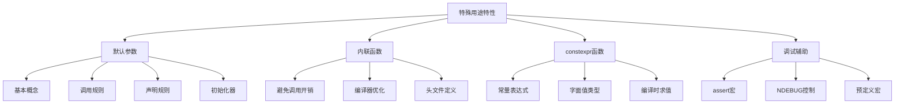

# 📘 6.5 特殊用途语言特性 (Features for Specialized Uses)

> 来源说明：C++ Primer 第6.5节 | 本节涵盖：默认参数、内联函数、constexpr函数和调试辅助工具

---

## 🗺️ 知识体系图



## 🧠 核心概念总览

* [*默认参数基础*](#id1)：函数参数可以指定默认值，调用时可省略
* [*默认参数调用规则*](#id2)：参数按位置解析，只能省略尾部参数
* [*默认参数声明规则*](#id3)：默认参数只能指定一次，可后续添加
* [*默认参数初始化器*](#id4)：默认参数可以是表达式，但不能是局部变量
* [*内联函数 (inline function)*](#id5)：通过inline关键字避免函数调用开销
* [*constexpr函数*](#id6)：用于常量表达式的函数，编译时求值
* [*assert预处理宏*](#id7)：assert宏和预定义调试宏
* [*NDEBUG控制与预定义宏*](#id8)：NDEBUG控制与预定义宏

---


<a id="id1"></a>
## ✅ 知识点 1: 默认参数基础

**理论**
* **默认参数**：在函数声明中为参数提供默认值
* **调用灵活性**：可以省略有默认值的参数
* **参数顺序**：默认参数必须从右向左连续出现


**教材示例代码**
```cpp
typedef string::size_type sz;

// 为所有参数提供默认值
string screen(sz ht = 24, sz wid = 80, char background = ' ');
```

**注意点**
* ⚠️ **如果参数有默认值，其后所有参数都必须有默认值**
* 💡 默认参数通常应在头文件的函数声明中指定
* 🔄 提高函数调用的灵活性和代码可读性

---

<a id="id2"></a>
## ✅ 知识点 2: 默认参数调用规则

**理论**
* **位置解析**：调用时参数按位置与函数参数匹配
* **默认实参只能补“最右侧”缺省**：想改后面的默认值，必须也提供前面所有参数
* **类型转换**：传递的参数会进行隐式类型转换


**教材示例代码**
```cpp
string window;
window = screen();              // 等价于 screen(24, 80, ' ')
window = screen(66);            // 等价于 screen(66, 80, ' ')  
window = screen(66, 256);       // 等价于 screen(66, 256, ' ')
window = screen(66, 256, '#');  // 等价于 screen(66, 256, '#')

// 错误示例
window = screen( , , '?');      // 错误：语法不允许

// 合法但可能不符合预期
window = screen('?');           // 调用 screen(63, 80, ' ')
```
**代码解析**
* 在`window = screen('?');`中：
    * 传一个 `char` 时，会隐式转成**第一个形参**的类型（如 `string::size_type`，无符号整数）
    * 例如 `'?'` 的十六进制是 `0x3F`（十进制 63），因此会把 **63** 传给 `height`

**注意点**
* ⚠️ **不能跳过中间参数只提供后面参数**
* 💡 把**最不可能使用默认值**的参数放前面，**最可能使用默认值**的放最后，这样调用更自然避免歧义
* 🔄 字符参数会隐式转换为整数类型，可能产生意外结果

---

<a id="id3"></a>
## ✅ 知识点3: 默认参数声明规则


**理论**
* 函数可以多次声明，但默认参数在**给定作用域中只能指定一次**
* **不能修改已经声明的默认值**，后续声明只能为之前没有默认值的参数添加默认值
* 添加默认值时，**其右侧所有参数必须已有默认值**


**代码示例**
```cpp
// 初始声明
string screen(sz, sz, char = ' ');

// 错误：不能重新声明默认值
string screen(sz, sz, char = '*');  // 错误

// 正确：添加新的默认参数
string screen(sz = 24, sz = 80, char);  // 正确
```

**最佳实践**
* 💡 把**默认实参**写在**函数的声明**里，并把这份**声明放到合适的头文件**中。


---

<a id="id4"></a>
## ✅ 知识点5: 默认参数初始化器


**理论**
* 默认参数可以是任何表达式，只要类型可转换
* **不能使用局部变量**作为默认参数
* 默认参数在**函数调用时**求值
* 用于默认参数的变量和函数名字解析在**函数声明作用域**中进行


**代码示例**
```cpp
// 全局变量可用于默认参数
sz wd = 80;
char def = ' ';
sz ht();
string screen(sz = ht(), sz = wd, char = def);

void f2() {
    def = '*';           // 修改默认参数的值
    sz wd = 100;         // 隐藏外部wd，但不影响默认参数
    window = screen();   // 调用 screen(ht(), 80, '*')
}
```

---

<a id="id5"></a>
## ✅ 知识点6: 内联函数 (inline function)

**理论**
* **内联展开**：编译器将函数调用替换为函数体代码
* **性能优化**：避免函数调用的寄存器保存、参数复制等开销
* **适用场景**：小型、频繁调用、直线型函数

**教材示例代码**
```cpp
// 普通函数版本
const string& shorterString(const string &s1, const string &s2) {
    return s1.size() <= s2.size() ? s1 : s2;
}

// 内联函数版本
inline const string&
shorterString(const string &s1, const string &s2) {
    return s1.size() <= s2.size() ? s1 : s2;
}

// 调用可能被展开为：
cout << (s1.size() < s2.size() ? s1 : s2) << endl;
```


**注意点**
* ⚠️ `inline`只是对编译器的建议请求，**编译器可能忽略**
* 💡 内联函数通常定义在头文件中，因为编译器需要函数体进行展开
* 🔄 **递归函数或大型函数**（如75行）通常不会被内联

---

<a id="id6"></a>
## ✅ 知识点7: constexpr函数

**理论**
* **常量表达式函数**：可用于常量表达式的函数
* **编译时求值**：在编译时计算函数结果，并且函数体里在**运行态**不能有任何动作
* **严格限制**：**返回类型和参数**必须是**字面值类型**，并且函数体最多最少都**只能包含一个`return`**
* **`constexpr`内联性**：为了有能力展开函数并得到结构在编译时，`constexpr`函数是隐性`inline`
* **灵活性**：`constexpr` 函数也被允许返回**非常量值**，取决于参数，这有可能造成潜在错误


**教材示例代码**
```cpp
// 简单的constexpr函数
constexpr int new_sz() { return 42; }
constexpr int foo = new_sz();  // foo是常量表达式

// 带参数的constexpr函数
constexpr size_t scale(size_t cnt) { 
    return new_sz() * cnt; 
}

// 使用示例
int arr[scale(2)];    // 正确：scale(2)是常量表达式
int i = 2;
int a2[scale(i)];     // 错误：scale(i)不是常量表达式
```
**代码解析**
* 编译器在编译态验证是否`new_sz`函数是否返回了一个常量表达式
    * 如果验证为是的话，编译器会用结果来代替对`contexpr`函数的调用
* 如果`constexpr`函数`scale`的参数接受的是一个常量如字面值2，那么函数返回的也会是一个常量
    * 否则返回的就不是常量， 比如接受了int对象为实参
    * 这个时候如果我们将这个函数用于了需要常量的地方就会报错如下标操作


**注意点**
* ⚠️  编译器要在编译阶段看到函数体才能展开调用，因此 **`inline` 和 `constexpr` 函数需将完整定义放在头文件中**，以便各编译单元共享并执行优化或常量计算

---
<a id="id7"></a>
## ✅ 知识点 8: assert预处理宏

**理论**
* **`assert` 是一个预处理宏（preprocessor macro）**，定义在 `<cassert>` 头文件中：
    ```cpp 
    assert(expr);
    ```
    * 如果 `expr` 为假 `(0)` → 输出错误信息并终止程序
    * 如果 `expr` 为真 `(非0)` → 什么都不做
    * 由于是预处理宏，不归编译器管， 不用写`std::`


**教材示例代码**
```cpp
#include <cassert>

// 使用assert进行调试检查
assert(word.size() > threshold);
```

**代码解析**
* `assert` 常用于检查那些 “绝不应该发生” 的情况
* 它不是为了处理正常的程序逻辑错误，而是帮助开发者在调试阶段验证:
    * “我的程序是否真的按我预期那样工作？”

**注意点**
* ⚠️ `assert` 是预处理宏，不要使用 `using` 声明
* ⚠️ 由于是预处理宏命令，宏命令名字一定要**全局唯一**
* 💡 建议：不管是否使用 `cassert` 头文件，都不要自己定义 `assert` 宏
* 🔄 很多头文件包含了 `cassert` 头文件，可能间接引入

---

<a id="id8"></a>
## ✅ 知识点 9: NDEBUG控制与预定义宏

**理论**
* **NDEBUG控制**：`assert` 是否生效由 `NDEBUG` 控制
    * 如果你定义了`#define NDEBUG` 或者编译时用 `-D NDEBUG`
    * 那么所有 `assert(expr)` 都会被忽略，相当于不存在
    * 开发阶段启用断言调试，发布阶段关闭断言提高效率
* **条件调试代码**：使用 `#ifndef NDEBUG` 控制条件来促发调试代码的执行
    * 如果 `NDEBUG` 没有被定义，在 `#ifnef`和`#endif`之间的代码就会被执行
    * 如果 `NDEBUG` 被定义， 那么这一块代码这会被忽略
* **代码调试使用的预处理宏和变量**：
    * `__FILE__`：当前源文件名的**字符串字面量**
    * `__LINE__`：当前源码行号的**整数常量**
    * `__DATE__`：本次编译的**日期**字符串
    * `__TIME__`：本次编译的**时间**字符串
    * `__func__`：当前函数名，编译器提供的**局部静态 `const char[]`**（不是宏）


**教材示例代码**
```cpp
// 使用NDEBUG控制调试代码
void print(const int ia[], size_t size) {
#ifndef NDEBUG
    // __func__是编译器定义的局部静态变量，存储函数名
    cerr << __func__ << ": array size is " << size << endl;
#endif
    // ...
}

// 使用预定义宏生成详细错误信息
if (word.size() < threshold) {
    cerr << "Error: " << __FILE__
         << " : in function " << __func__ 
         << " at line " << __LINE__ << endl
         << " Compiled on " << __DATE__
         << " at " << __TIME__ << endl
         << " Word read was \"" << word
         << "\": Length too short" << endl;
}

// 编译时定义NDEBUG（命令行方式）
// $ CC -D NDEBUG main.C
```

**代码解析**
* 编译器会给每个函数定义`__func__`
* 这是一个局部静态数组，元素为`const char`, 里面装的是**函数名字**

**注意点**
* ⚠️ 默认情况下 `NDEBUG` 未定义，`assert` 执行运行时检查
* 💡 预定义宏包括：`__func__`, `__FILE__`, `__LINE__`, `__TIME__`, `__DATE__`
* 🔄 发布版本应定义 `NDEBUG` 来移除调试开销
* 💡 `assert` 应该只用于验证"不可能发生"的条件，不要替代正常的错误检查

---


## 🔑 核心要点总结

1. **默认参数**：提高函数调用灵活性，必须从右向左连续提供，只能省略尾部参数
2. **内联函数**：避免小函数调用开销，编译器可能忽略inline请求，定义在头文件中
3. **constexpr函数**：编译时求值，用于常量表达式上下文，参数决定是否常量表达式
4. **调试工具**：assert用于运行时检查，NDEBUG控制开关，预定义宏提供上下文信息

## 📌 考试速记版

* **默认参数**：右向左连续，调用时只能省略尾部，声明时只能指定一次
* **内联函数**：小函数性能优化，编译器可忽略，头文件定义
* **constexpr**：编译时求值，字面值类型，参数决定常量性
* **assert**：条件检查，NDEBUG控制开关，不用于正常错误处理
* **预定义宏**：`__func__`, `__FILE__`, `__LINE__`, `__TIME__`, `__DATE__`

**口诀**：默认参数从右始，内联优化小函数，constexpr编译求值，assert调试NDEBUG控