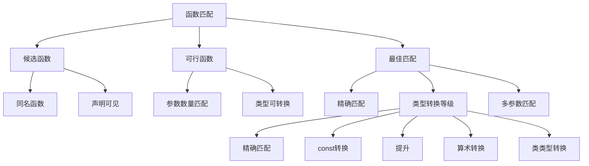

# 📘 6.6 函数匹配 (Function Matching)

> 来源说明：C++ Primer 6.6 | 本节涵盖：重载函数匹配规则和参数类型转换

---

## 🗺️ 知识体系图



## 🧠 核心概念总览

* [*函数匹配概述*](#id1)：重载函数调用时的匹配过程
* [*候选函数*](#id2)：同名且声明可见的函数集合
* [*可行函数*](#id3)：参数数量和类型匹配的函数
  * [*参数数量匹配*](#id4)：考虑默认参数的影响
  * [*类型转换匹配*](#id5)：参数类型可转换到形参类型
* [*最佳匹配*](#id6)：选择最合适的重载函数
  * [*精确匹配优先*](#id7)：不需要类型转换的匹配最优
  * [*多参数匹配规则*](#id8)：综合考虑所有参数的匹配质量
* [*参数类型转换等级*](#id9)：类型转换的优先级体系
  * [*精确匹配*](#id10)：类型完全相同
  * [*const转换*](#id11)：添加或移除const限定
  * [*提升*](#id12)：小整数类型提升
  * [*算术转换*](#id13)：算术类型间的转换
  * [*类类型转换*](#id14)：用户定义的转换
* [提升与算术转换的注意事项*](#id15)：内置类型转换的陷阱
* [*const参数匹配*](#id16)：const对引用和指针参数的影响

---

<a id="id1"></a>
## ✅ 知识点1: 函数匹配概述

**理论**
* 在重载函数调用时，编译器需要确定调用哪个具体的函数版本
* 当重载函数参数数量相同且参数类型存在转换关系时，匹配过程变得复杂
* 匹配过程分为三个步骤：候选函数 → 可行函数 → 最佳匹配

**教材示例代码**
```cpp
void f();  
void f(int);  
void f(int, int);  
void f(double, double = 3.14);  

f(5.6); // 调用 void f(double, double)
```

**注意点**
* ⚠️ 参数数量相同且类型相关的重载函数最容易产生匹配歧义
* 💡 编译器通过系统化的匹配过程解决重载决议问题

---

<a id="id2"></a>
## ✅ 知识点2: 候选函数

**理论**
* 候选函数是与被调用函数同名的函数集合
* 候选函数必须在调用点可见（即声明在调用之前）
* 候选函数集包含所有可能被调用的重载版本

**教材示例代码**
```cpp
void f();  
void f(int);  
void f(int, int);  
void f(double, double = 3.14);  
// 对于调用 f(5.6)，四个f函数都是候选函数
```

**注意点**
* ⚠️ 候选函数只考虑函数名和声明可见性，不考虑参数匹配
* 🔄 命名空间和作用域会影响候选函数的查找

---

<a id="id3"></a>
## ✅ 知识点3: 可行函数

**理论**
* 从候选函数中筛选出可以实际调用的函数
* 可行函数必须满足两个条件：参数数量匹配、参数类型可转换

**教材示例代码**
```cpp
void f();  
void f(int);  
void f(int, int);  
void f(double, double = 3.14);  

f(5.6); // 可行函数：f(int) 和 f(double, double)
```

**注意点**
* ⚠️ 参数数量不匹配的函数会被直接排除
* 💡 默认参数会影响参数数量的计算

---

<a id="id4"></a>
### ✅ 知识点3.1: 参数数量匹配

**理论**
* 函数调用时提供的实参数量必须与函数形参数量匹配
* 默认参数可以让函数在调用时使用更少的实参
* 参数数量不匹配的函数会被排除在可行函数之外

**教材示例代码**
```cpp
void f(int);          // 1个参数
void f(double, double = 3.14); // 有默认参数，可接受1或2个参数

f(5.6); // 两个函数都满足参数数量要求
```

**注意点**
* ⚠️ 当函数有默认参数时，调用可能看起来比实际参数少
* 💡 默认参数让函数调用更加灵活，但也可能增加重载决议的复杂性

---

<a id="id5"></a>
### ✅ 知识点3.2: 类型转换匹配

**理论**
* 实参类型不需要与形参类型完全一致，只要可以转换即可
* 类型转换包括内置类型转换和用户定义的类型转换
* 每个实参都必须能够转换到对应形参的类型

**教材示例代码**
```cpp
void f(int);          // double到int需要转换
void f(double, double); // double到double是精确匹配

f(5.6); // 两个函数都是可行函数
```

**注意点**
* ⚠️ 如果没有任何可行函数，编译器会报"no matching function"错误
* 🔄 类型转换的可行性决定了函数是否进入可行函数集

---

<a id="id6"></a>
## ✅ 知识点4: 最佳匹配

**理论**
* 从可行函数中选择最合适的函数版本
* 基本原则：参数类型与形参类型越接近，匹配越好
* 精确匹配优于需要类型转换的匹配

**教材示例代码**
```cpp
void f(int);          // 需要double到int的转换  
void f(double, double); // double到double是精确匹配

f(5.6); // 选择f(double, double)，因为精确匹配更好
```

**注意点**
* ⚠️ 最佳匹配可能不存在，导致调用歧义
* 💡 编译器会自动为缺失的默认参数提供值

---

<a id="id7"></a>
### ✅ 知识点4.1: 精确匹配优先

**理论**
* 精确匹配：实参类型与形参类型完全一致
* 需要类型转换的匹配：实参需要转换为形参类型
* 精确匹配总是优于需要转换的匹配

**教材示例代码**
```cpp
void f(int);          // 需要转换
void f(double, double); // 精确匹配

f(5.6); // 选择精确匹配的f(double, double)
```

**注意点**
* ⚠️ 精确匹配不仅包括类型完全相同，还包括一些特殊情况
* 💡 精确匹配是重载决议中的最高优先级

---

<a id="id8"></a>
### ✅ 知识点4.2: 多参数匹配规则

**理论**
* 当函数有多个参数时，需要综合考虑所有参数的匹配质量
* 最佳匹配函数必须满足：每个参数的匹配都不差于其他函数，且至少有一个参数的匹配更好
* 如果多个函数在不同参数上各有优势，则调用歧义

**教材示例代码**
```cpp
void f(int, int);     // 第一个参数精确匹配，第二个需要转换
void f(double, double); // 第一个需要转换，第二个参数精确匹配

f(42, 2.56); // 歧义调用：两个函数在不同参数上各有优势
```

**注意点**
* ⚠️ 多参数匹配可能出现"平局"情况，导致编译器无法选择
* 💡 避免使用强制转换来解决重载歧义，这通常表明参数设计不佳

---

<a id="id9"></a>
## ✅ 知识点5: 参数类型转换等级

**理论**
* 编译器对类型转换进行分级，用于确定匹配质量
* 转换等级从高到低排列，高等级转换优先
* 转换等级体系帮助编译器在复杂情况下做出选择

**注意点**
* ⚠️ 理解转换等级对于预测重载决议结果至关重要
* 🔄 转换等级是编译器内部的重载决议机制

---

<a id="id10"></a>
### ✅ 知识点5.1: 精确匹配

**理论**
* 最高等级的匹配，包括以下情况：
  - 实参类型与形参类型完全相同
  - 数组或函数类型转换为对应指针类型
  - 添加或移除顶层const

**教材示例代码**
```cpp
void f(int);    
void f(const int); // 顶层const差异，仍为精确匹配

int arr[10];
void f(int*);
f(arr); // 数组到指针转换，精确匹配
```

**注意点**
* ⚠️ 顶层const的添加或移除不影响精确匹配的性质
* 💡 数组到指针、函数到指针的转换被视为精确匹配

---

<a id="id11"></a>
### ✅ 知识点5.2: const转换

**理论**
* 第二等级的匹配
* 主要用于引用和指针参数的const转换
* 非const到const的转换是安全的，因此优先级较高

**教材示例代码**
```cpp
void f(int&);
void f(const int&);

int x = 10;
f(x); // 调用f(int&)，精确匹配优于const转换
```

**注意点**
* ⚠️ const转换只影响引用和指针类型，不影响值类型
* 🔄 const转换保证了类型安全的同时提供了灵活性

---

<a id="id12"></a>
### ✅ 知识点5.3: 提升

**理论**
* 第三等级的匹配
* 小整数类型（char、short等）提升为int或更大的整数类型
* 提升是安全的，不会丢失信息

**教材示例代码**
```cpp
void ff(int);
void ff(short);

ff('a'); // char提升为int，调用ff(int)
```

**注意点**
* ⚠️ 小整数类型总是提升，即使看起来与short更匹配
* 💡 提升保证了算术运算的一致性和效率

---

<a id="id13"></a>
### ✅ 知识点5.4: 算术转换

**理论**
* 第四等级的匹配
* 包括各种算术类型之间的转换（int到double、float到double等）
* 所有算术转换被视为同一等级

**教材示例代码**
```cpp
void manip(long);
void manip(float);

manip(3.14); // 错误：double到long和float都是算术转换，等级相同，歧义
```

**注意点**
* ⚠️ 算术转换之间没有优先级差异，容易导致调用歧义
* 💡 设计重载函数时应避免参数类型过于接近

---

<a id="id14"></a>
### ✅ 知识点5.5: 类类型转换

**理论**
* 最低等级的匹配
* 用户定义的类类型转换
* 包括转换构造函数和类型转换运算符

**注意点**
* ⚠️ 类类型转换优先级最低，只有在没有其他匹配时才考虑
* 🔄 类类型转换提供了自定义类型系统的灵活性

---

<a id="id15"></a>
## ✅ 知识点6: 提升与算术转换的注意事项

**理论**
* 小整数类型总是优先提升到int，而不是匹配更"接近"的short
* 所有算术转换被视为同一等级，没有优先级差异
* 这些特性可能导致与直觉不符的重载决议结果

**教材示例代码**
```cpp
void ff(int);    // 小整数类型会提升到int
void ff(short);  // 即使值很小，也不会直接匹配short

ff('a');        // 调用ff(int)，因为char提升到int
```

**注意点**
* ⚠️ 内置类型的提升和转换规则可能产生令人惊讶的结果
* 💡 良好设计的系统应该避免参数类型过于接近的重载函数

---

<a id="id16"></a>
## ✅ 知识点7: const参数匹配

**理论**
* 当重载函数区别仅在于引用或指针的constness时：
  - const实参只能匹配const形参
  - 非const实参优先匹配非const形参（精确匹配）
  - 非const实参也可以匹配const形参（需要const转换）

**教材示例代码**
```cpp
Record lookup(Account&);        // 非const引用
Record lookup(const Account&);  // const引用

const Account a;
Account b;

lookup(a);  // 调用lookup(const Account&) - 唯一可行函数
lookup(b);  // 调用lookup(Account&) - 精确匹配优于const转换
```

**注意点**
* ⚠️ const对象不能传递给非const引用参数
* 💡 const重载提供了对常量和非常量对象的差异化处理
* 🔄 指针参数的const匹配规则与引用类似

---

## 🔑 核心要点总结

1. **三阶段匹配过程**：候选函数 → 可行函数 → 最佳匹配，系统化解决重载决议
2. **类型转换等级体系**：精确匹配 > const转换 > 提升 > 算术转换 > 类类型转换
3. **精确匹配优先**：不需要类型转换的匹配总是优于需要转换的匹配
4. **多参数综合考虑**：最佳匹配需要在所有参数上都不差，且至少一个参数更好
5. **constness影响匹配**：const实参只能匹配const形参，非const实参优先匹配非const形参
6. **设计原则**：避免需要强制转换的重载函数，这表明参数设计存在问题

## 📌 考试速记版

**转换等级口诀**：精确 → const → 提升 → 算术 → 类

**匹配规则表格**：
| 情况 | 结果 |
|------|------|
| 单参数精确匹配 | 直接选择 |
| 多参数各有优势 | 调用歧义 |
| const vs 非const | 实参constness决定 |
| 小整数参数 | 总是提升到int |

**设计原则**：参数类型差异要明显，避免算术转换歧义