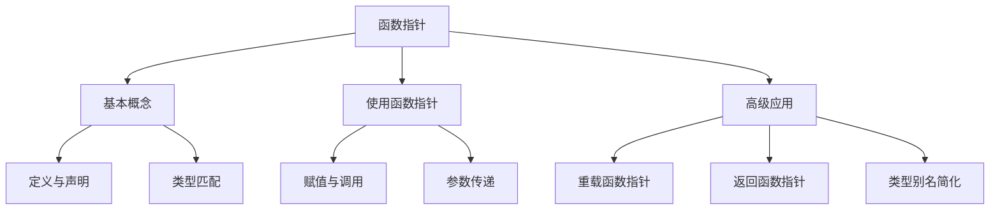

# 📘 6.7 函数指针（Pointers to Functions）

> 来源说明：C++ Primer 6.7 | 本节涵盖：函数指针的定义、声明、使用和高级应用

---

## 🗺️ 知识体系图



## 🧠 核心概念总览

* [*知识点1: 函数指针概念*](#id1)：函数指针的定义和声明方法
    * [*知识点1.1: 函数指针声明语法*](#id2)：正确的函数指针声明语法和注意事项
* [*知识点2: 函数指针的使用*](#id3)：函数指针的赋值和调用方法
    * [*知识点2.1: 类型匹配要求*](#id4)：函数指针类型必须精确匹配
* [*知识点3: 重载函数的指针*](#id5)：处理重载函数的函数指针
* [*知识点4: 函数指针作为参数*](#id6)：将函数指针作为函数参数传递
    * [*知识点4.1: 类型别名简化*](#id7)：使用typedef和decltype简化函数指针类型
* [*知识点5: 返回函数指针*](#id8)：从函数返回函数指针的方法
    * [*知识点5.1: 简化返回声明*](#id9)：使用auto和decltype简化返回类型声明

---

<a id="id1"></a>
## ✅ 知识点1: 函数指针概念

**理论**
* 函数指针是指向函数而非对象的指针
* 函数类型由**返回类型和参数类型共同决定**，函数名**不是**类型的一部分


**注意点**
* 💡 理解函数指针的关键是识别它指向的是"函数类型"而非具体函数

---

<a id="id2"></a>
## ✅ 知识点1.1: 函数指针声明语法

**理论**
* 声明函数指针时，`*pf`必须用括号括起来
* 如果没有括号，声明的是返回指针的函数，而不是函数指针

**教材示例代码**
```cpp
// 正确的函数指针声明
bool (*pf)(const string &, const string &); // pf是函数指针

// 错误的声明：缺少括号
bool *pf(const string &, const string &); // pf是返回bool*的函数
```

**注意点**
* ⚠️ 括号的位置决定声明的含义
* 💡 记忆口诀："指针星号要括号，否则变成返回指针的函数"

---

<a id="id3"></a>
## ✅ 知识点2: 函数指针的使用

**理论**
* 函数名作为值时**自动转换**为函数指针
* 调用函数指针时可以**直接使用**，无需显式解引用
* 地址运算符`&`是可选的

**教材示例代码**
```cpp
// 函数指针赋值
pf = lengthCompare;        // 正确：函数名自动转换
pf = &lengthCompare;       // 正确：显式取地址

// 函数指针调用
bool b1 = pf("hello", "goodbye");       // 直接调用
bool b2 = (*pf)("hello", "goodbye");    // 解引用调用
bool b3 = lengthCompare("hello", "goodbye"); // 原函数调用
```

**注意点**
* 💡 三种调用方式完全等价，编译器会自动处理
* 🔄 函数指针调用与普通函数调用语法几乎相同

---

<a id="id4"></a>
## ✅ 知识点2.1: 类型匹配要求

**理论**
* 函数指针必须与目标函数类型**完全匹配**
* **不能**在不同函数类型的指针之间转换
* 可以赋值为`nullptr`或0表示**不指向任何函数**

**教材示例代码**
```cpp
string::size_type sumLength(const string&, const string&);
bool cstringCompare(const char*, const char*);

pf = 0;                 // 正确：指向空
pf = sumLength;         // 错误：返回类型不匹配
pf = cstringCompare;    // 错误：参数类型不匹配
pf = lengthCompare;     // 正确：类型完全匹配
```

---

<a id="id5"></a>
## ✅ 知识点3: 重载函数的指针

**理论**
* 使用重载函数时，上下文必须明确指定使用哪个版本
* 编译器通过**指针类型**来确定匹配的重载函数
* 指针类型必须与某个重载函数**精确匹配**

**教材示例代码**
```cpp
void ff(int);
void ff(unsigned int);

void (*pf1)(unsigned int) = ff;  // 正确：指向ff(unsigned)
void (*pf2)(int) = ff;           // 错误：没有匹配的ff版本
double (*pf3)(int*) = ff;        // 错误：返回类型不匹配
```

**注意点**
* ⚠️ 重载决议基于**指针类型**，而不是赋值时的函数名

---

<a id="id6"></a>
## ✅ 知识点4: 函数指针作为参数

**理论**
* **不能**直接定义函数类型的参数，但**可以**定义函数指针类型的参数
* 函数类型的参数会**自动转换**为函数指针
* 传递函数实参时会自动转换为指针

**教材示例代码**
```cpp
// 函数类型参数（自动转换为指针）
void useBigger(const string &s1, const string &s2,
               bool pf(const string &, const string &));

// 等价的函数指针参数声明
void useBigger(const string &s1, const string &s2,
               bool (*pf)(const string &, const string &));

// 函数自动转换为指针
useBigger(s1, s2, lengthCompare);
```

**注意点**
* 💡 函数类型参数和函数指针参数在函数声明中等价
* 🔄 传递函数实参时无需取地址，自动转换

---

<a id="id7"></a>
## ✅ 知识点5: 类型别名简化

**理论**
* 使用`typedef`或`using`创建函数类型和函数指针类型的别名
* `decltype`返回**函数类型**，不会自动转换为指针类型
* 需要指针类型时必须**显式添加`*`**

**教材示例代码**
```cpp
// 函数类型别名
typedef bool Func(const string&, const string&);
typedef decltype(lengthCompare) Func2;  // 等价类型

// 函数指针类型别名
typedef bool(*FuncP)(const string&, const string&);
typedef decltype(lengthCompare) *FuncP2; // 等价类型，注意要加*

// 简化函数声明
void useBigger(const string&, const string&, Func);
void useBigger(const string&, const string&, FuncP2);
```

**注意点**
* ⚠️ `decltype`返回函数类型，需要指针时要手动加`*`
* 💡 类型别名大幅提高复杂函数指针代码的可读性

---

<a id="id8"></a>
## ✅ 知识点5: 返回函数指针

**理论**
* **不能直接返回函数类型，但可以返回函数指针**
* 返回类型**不会**自动转换为指针类型，必须显式声明
* 直接声明返回函数指针的语法复杂

**教材示例代码**
```cpp
// 类型别名定义
using F = int(int*, int);      // F是函数类型
using PF = int(*)(int*, int);  // PF是函数指针类型

// 正确的返回函数指针声明
PF f1(int);        // 正确：PF是指针类型
F *f1(int);        // 正确：显式指定返回指针
F f1(int);         // 错误：不能返回函数类型

// 直接声明（复杂）
int (*f1(int))(int*, int);
```
**代码解析**
* 从里往外/从右往左读取这个声明，`f1` 首先有一个`(int)`参数列表， 那么f1首先是一个函数
* `*`表示返回一个指针
* 再读外面，当看到`(int*, int)`我们就知道这个指针指向一个函数
* 左边的int表示了这个指针指向的函数返回一个`int`


**注意点**
* ⚠️ **返回类型**不会像参数那样自动转换
* 💡 从内向外阅读复杂声明：`f1`是函数，返回指针，指针指向函数

---

<a id="id9"></a>
## ✅ 知识点5.1: 简化返回声明

**理论**
* 使用**尾置返回类型**简化返回函数指针的声明
* 使用`auto`和`decltype`组合进一步简化
* `decltype`返回函数类型，需要手动添加`*`表示指针

**教材示例代码**
```cpp
// 尾置返回类型简化
auto f1(int) -> int (*)(int*, int);

// 使用decltype确定返回类型
string::size_type sumLength(const string&, const string&);
string::size_type largerLength(const string&, const string&);

// 根据字符串参数返回不同的函数指针
decltype(sumLength) *getFcn(const string &);
```

**注意点**
* ⚠️ `decltype(函数名)`返回函数类型，不是指针类型
* 💡 必须手动添加`*`来获得函数指针类型
* 🔄 尾置返回类型让复杂返回类型的声明更清晰

---

## 🔑 核心要点总结

1. **函数指针本质**：指向函数的指针，类型由返回类型和参数类型决定
2. **声明关键**：`(*pf)`括号必不可少，否则变成返回指针的函数
3. **使用简便**：函数名自动转指针，调用时无需解引用
4. **类型严格**：必须精确匹配返回类型和所有参数类型
5. **简化工具**：类型别名、`decltype`、尾置返回类型处理复杂情况

## 📌 考试速记版

* **声明口诀**："星号括号在一起，函数指针才成立"
* **调用规则**：直接调用不解引用，三种方式都等效
* **类型匹配**：返回参数全匹配，重载版本要对齐
* **简化工具**：typedef、decltype、尾置返回类型

**口诀**：*指针星号要括号，函数传递自动转，返回指针显式标，类型别名简化繁*