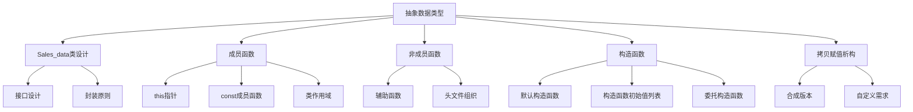

# 📘 7.1 Defining Abstract Data Types (定义抽象数据类型)

> 来源说明：C++ Primer 第7.1节 | 本节涵盖：抽象数据类型的定义、Sales_data类的设计与实现

---

## 🗺️ 知识体系图



## 🧠 核心概念总览

* [*知识点1: 抽象数据类型概念*](#id1)：抽象数据类型的定义与特点
* [*知识点2: Sales_data类接口设计案例*](#id2)：类接口的设计原则和具体函数
    * [*知识点2.1: 编程角色概念*](#id3)：不同编程角色的区分与职责
* [*知识点3: 使用Sales_data类案例*](#id4)：如何使用类接口的示例代码
* [*知识点4: 定义成员函数*](#id5)：类的具体定义和成员函数声明
    * [*知识点4.1: this指针*](#id7)：this指针的作用和使用
    * [*知识点4.2: const成员函数*](#id8)：const成员函数的定义和意义
    * [*知识点4.3: 类作用域和成员函数*](#id9)：类作用域的特性
    * [*知识点4.4: 在类外定义成员函数*](#id10)：类外定义成员函数的语法
    * [*知识点4.5: 返回this对象的函数*](#id11)：返回对象引用的成员函数
* [*知识点5: 定义非成员类相关函数*](#id12)：辅助函数的定义和使用
    * [*知识点5.1: 定义read和print函数*](#id13)：IO函数的实现
    * [*知识点5.2: 定义add函数*](#id14)：加法函数的实现
* [*知识点6: 构造函数*](#id15)：构造函数的基本概念
    * [*知识点6.1: 合成默认构造函数*](#id16)：编译器生成的默认构造函数
    * [*知识点6.2: 需要自定义默认构造函数的类*](#id17)：不能依赖合成构造函数的情况
    * [*知识点6.3: 定义Sales_data构造函数*](#id18)：Sales_data构造函数的实现
    * [*知识点6.4: =default的含义*](#id19)：显式要求默认构造函数
    * [*知识点6.5: 构造函数初始值列表*](#id20)：初始化数据成员的方式
    * [*知识点6.6: 在类外定义构造函数*](#id21)：类外定义构造函数的语法
* [*知识点7: 拷贝、赋值和析构*](#id22)：对象的拷贝控制
    * [*知识点7.1: 合成版本的拷贝控制*](#id23)：编译器生成的拷贝控制函数
    * [*知识点7.2: 不能依赖合成版本的类*](#id24)：需要自定义拷贝控制的情况

---

<a id="id1"></a>
## ✅ 知识点1: 抽象数据类型概念

**理论**
* 抽象数据类型(ADT)通过接口提供操作，隐藏数据成员的具体实现
* `Sales_item`类就是抽象数据类型的例子，用户只能通过接口操作对象
* 原始的`Sales_data`类不是抽象数据类型，因为它暴露了数据成员

**教材示例代码**
```cpp
// Sales_item是抽象数据类型，我们不知道其内部数据成员
Sales_item item;
item.isbn();  // 只能通过接口操作

// 原始的Sales_data不是抽象数据类型
Sales_data data;
data.bookNo;  // 可以直接访问数据成员
```

**注意点**
* ⚠️ 抽象数据类型的核心思想是**封装**和**信息隐藏**
* 💡 通过定义操作接口，可以控制对数据的访问和修改
* 🔄 从非抽象类型到抽象类型的转变需要定义操作并封装数据成员

---

<a id="id2"></a>
## ✅ 知识点2: `Sales_data`类接口设计案例

**理论**
* 由于第14章前无法定义运算符，使用普通命名函数替代
* **加法函数**(如`+`)和**IO函数**(如`>>`)不作为成员函数，而是作为普通函数

**教材示例代码**
```cpp
// Sales_data的接口设计：
// 成员函数：
std::string isbn() const;           // 返回ISBN
Sales_data& combine(const Sales_data&); // 复合赋值

// 非成员函数：
Sales_data add(const Sales_data&, const Sales_data&); // 加法
std::istream& read(std::istream&, Sales_data&);       // 读取
std::ostream& print(std::ostream&, const Sales_data&);// 打印
```

**注意点**
* ⚠️ **复合赋值函数**(如`+=`)设计为成员函数，而加法和IO设计为非成员函数

---

<a id="id3"></a>
## ✅ 知识点2.1: 编程角色概念

**理论**
* 编程中有不同层次的“用户”：

    * **应用程序的用户** 是运行程序的人（如商店经理）；
    * **类的用户** 是使用该类的程序员。

**注意点**
* ⚠️ 类设计者应从“类的用户（程序员）”角度出发，让接口直观、易用，实现高效、可靠。
* 💡 即使设计者和使用者是同一个人，也要区分角色——设计类时关注**易用性**，使用类时不关心**实现细节**。
---

<a id="id4"></a>
## ✅ 知识点3: 使用`Sales_data`类案例

**理论**
* 程序逻辑：累计相同ISBN的交易，遇到新ISBN时输出前一个ISBN的累计结果
* 以下代码展示如何使用`Sales_data`的接口函数重写书店程序

**教材示例代码**
```cpp
Sales_data total;           // 保存运行总和
if (read(cin, total)) {     // 读取第一笔交易
    Sales_data trans;       // 保存下一笔交易数据
    while (read(cin, trans)) { // 读取剩余交易
        if (total.isbn() == trans.isbn()) { // 检查ISBN
            total.combine(trans);           // 更新运行结果
        } else {
            print(cout, total) << endl;     // 打印结果
            total = trans;                  // 处理下一本书
        }
    }
    print(cout, total) << endl;             // 打印最后一笔交易
} else {
    cerr << "No data?!" << endl;            // 没有输入
}
```

**注意点**
* ⚠️ `read`函数设计为：返回流引用，可以在条件中检查读取是否成功
* 💡 `print`函数设计为：返回流引用，可以链式输出

---

<a id="id5"></a>
## ✅ 知识点4: 定义成员函数

**理论**
* **成员函数**：必须在**类内声明**，可在类内或类外**定义**
* **非成员函数**（如 `add`、`read`、`print`）：虽然是属于类接口的一部分，但必须在**类外声明和定义**
* `avg_price`是内部实现函数，不是公共接口的一部分

**教材示例代码**
```cpp
struct Sales_data {
    // 成员操作
    std::string isbn() const { return bookNo; }
    Sales_data& combine(const Sales_data&); //可以在外面定义
    double avg_price() const;
    
    // 数据成员与§2.6.1相同
    std::string bookNo;
    unsigned units_sold = 0;
    double revenue = 0.0;
};

// 非成员Sales_data接口函数声明
Sales_data add(const Sales_data&, const Sales_data&);
std::ostream& print(std::ostream&, const Sales_data&);
std::istream& read(std::istream&, Sales_data&);
```

**注意点**
* ⚠️ 在类内定义(只能是写在类里面)的成员函数**默认是inline的**
* 💡 `avg_price`虽然不作为公共接口，但对其他成员函数的实现很重要
* 🔄 数据成员使用in-class初始器提供默认值

---


<a id="id7"></a>
## ✅ 知识点4.1: `this`指针

**理论**
* 成员函数通过<b>额外的隐式参数`this`</b>访问调用对象
    * 函数被调用时，参数`this`自动被初始化调用成员函数的**对象的地址**
* 在成员函数内部，可以直接使用**类成员**，实际上是通过`this->member`访问
    * 任何在类中的调用， 被认为是通过`this`进行了隐式引用

**教材示例代码**
```cpp
// 编译器将调用翻译为：
total.isbn()  // 用户代码
Sales_data::isbn(&total)  // 编译器生成的伪代码

// 在成员函数内：
std::string isbn() const { 
    return bookNo;        // 隐式使用this->bookNo
    return this->bookNo;  // 显式使用，效果相同
}
```

**注意点**
* ⚠️ `this`是隐式定义的，**不能**显式定义名为this的参数或变量
* 💡 `this`是一个`const`指针，**不能**改变其指向的地址
* 🔄 在成员函数内部，对类成员的直接访问都隐含通过this指针

---

<a id="id8"></a>
## ✅ 知识点4.2: `const`成员函数

**理论**
* 默认情况下：
    * `this`的类型是`ClassType *const`（**指向非常量的常量指针**）
    * 也就是说 `this`**不能**和常量对象绑定
    * 因此普通成员函数**不能**被 const 对象调用
* 当成员函数在参数列表后加`const`关键字后:
    * `this`变为`const ClassType *const`（**指向常量的常量指针**）
    * `const`成员函数**不能**修改调用对象的数据成员
    * 因此通过 this 访问到的所有数据成员都被当作**常量`const`对待**

**教材示例代码**
```cpp
std::string isbn() const { return bookNo; }

// 伪代码展示const成员函数的this指针类型
std::string Sales_data::isbn(const Sales_data *const this) {
    return this->bookNo;
}
```

**注意点**
* ⚠️ `const`对象、`const`引用或`const`指针**只能**调用`const`成员函数


---

<a id="id9"></a>
## ✅ 知识点4.3: 类作用域和成员函数

**理论**
* **类本身**构成一个作用域
    * 成员函数的定义在类作用域内，因此可以直接使用本类的数据成员
* 编译器分两步处理类：**先处理成员声明，再处理成员函数体**
    * 因此，即使数据成员在函数声明**之后**定义，函数仍然可以使用它

**注意点**
* ⚠️ 成员函数可以使用类中任何成员，无论成员声明的位置
* 🔄 类的成员声明在类作用域内是同时可见的

---

<a id="id10"></a>
## ✅ 知识点4.4: 在类外定义成员函数

**理论**
* 函数定义必须与类内声明**匹配**，包括const限定符
* 在类外定义成员函数时，**必须使用作用域运算符**指明所属类
* 一旦编译器看到了这种函数名，它就会自动将解释到所在类的作用域范围内

**教材示例代码**
```cpp
double Sales_data::avg_price() const { //使用作用域符
    if (units_sold)
        return revenue / units_sold;
    else
        return 0;
}
```
**代码解析**
* 在函数体内，对`revenue`和`units_sold`的引用隐含指向当前对象的成员

**注意点**
* ⚠️ 函数名`Sales_data::avg_price`表示定义`Sales_data`类的`avg_price`成员


---

<a id="id11"></a>
## ✅ 知识点4.5: 返回this对象的函数

**理论**
* 内置赋值运算符如`+=`返回**左操作数的左值**，我们也可以使用`this`去实现此功能
    * 通过**解引用`*this`**返回调用对象，来返回**左值**
    * 同时，返回对象引用`*this`，可以实现**链式调用**: `a.combine(b).combine(c)`
    

**教材示例代码**
```cpp
Sales_data& Sales_data::combine(const Sales_data &rhs) {
    units_sold += rhs.units_sold;  // 将rhs的成员加到this对象
    revenue += rhs.revenue;
    return *this;  // 返回调用该函数的对象
}

// 使用示例
total.combine(trans);  // 更新运行总和
```

**注意点**
* ⚠️ 成员函数中，`*this`表示调用函数的**整个对象**


---

<a id="id12"></a>
## ✅ 知识点5: 定义非成员类相关函数

**理论**
* 类作者常定义辅助函数作为类接口的一部分，但不是类的成员
* 这些函数通常声明在**与类相同的头文件中**
* 用户只需包含一个头文件即可使用整个类接口

**注意点**
* ⚠️ 非成员函数作为类接口的一部分，应与类在**同一个头文件中声明**
* 💡 这种组织方式提供了清晰的接口分离：改变状态的操作为成员，不改变状态的操作为非成员
* 🔄 函数声明与定义通常分离，声明在头文件，定义在源文件

---

<a id="id13"></a>
## ✅ 知识点5.1: 定义`read`和`print`函数

**理论**
* `read`函数从给定流读取数据到给定对象
* `print`函数将给定对象的内容打印到给定流
* `IO`类对象**不能**拷贝，必须通过**引用传递**

**教材示例代码**
```cpp
// 输入交易包含ISBN、销售数量和销售价格
std::istream& read(std::istream &is, Sales_data &item) {
    double price = 0;
    is >> item.bookNo >> item.units_sold >> price;
    item.revenue = price * item.units_sold;
    return is;
}

std::ostream& print(std::ostream &os, const Sales_data &item) {
    os << item.isbn() << " " << item.units_sold << " "
       << item.revenue << " " << item.avg_price();
    return os;
}
```

**注意点**
* ⚠️ `read`和`print`函数修改流状态，因此使用普通引用而非**const**引用
* 💡 `print`函数不输出换行，将代码控制格式化权交给用户


---

<a id="id14"></a>
## ✅ 知识点5.2: 定义`add`函数

**理论**
* `add`函数接受两个`Sales_data`对象，返回它们的和
* 通过拷贝第一个参数初始化结果，然后使用`combine`添加第二个参数

**教材示例代码**
```cpp
Sales_data add(const Sales_data &lhs, const Sales_data &rhs) {
    Sales_data sum = lhs;  // 从lhs拷贝数据成员到sum
    sum.combine(rhs);      // 将rhs的数据成员加到sum
    return sum;
}
```

**注意点**
* ⚠️ 默认情况下，拷贝类对象会**拷贝所有数据成员**
* 💡 使用`combine`函数避免了重复的加法逻辑


---

<a id="id15"></a>
## ✅ 知识点6: 构造函数

**理论**
* 构造函数控制类对象的初始化
* 构造函数与类同名，没有返回类型
* 构造函数可以有参数列表和函数体
* 类可以有多个构造函数（重载）
* 构造函数不能声明为const

**注意点**
* ⚠️ 构造函数在创建类类型对象时自动运行
* 💡 const对象的"常量性"在构造函数完成后才获得，因此构造函数可以在const对象构造期间写入
* 🔄 构造函数在对象创建时确保对象处于有效状态

---

<a id="id16"></a>
### ✅ 知识点6.1: 合成默认构造函数

**理论**
* 默认构造函数是无参构造函数
* 如果类没有定义任何构造函数，编译器会隐式生成默认构造函数
* 合成默认构造函数按以下规则初始化数据成员：
  - 有in-class初始器的，使用该值初始化
  - 否则，默认初始化该成员

**教材示例代码**
```cpp
Sales_data total;    // 使用合成默认构造函数
Sales_data trans;    // 使用合成默认构造函数
```

**注意点**
* ⚠️ 只有相当简单的类可以依赖合成默认构造函数
* 💡 Sales_data能使用合成构造函数是因为提供了units_sold和revenue的in-class初始器
* 🔄 对于bookNo成员，合成构造函数使用默认初始化（空字符串）

---

<a id="id17"></a>
### ✅ 知识点6.2: 需要自定义默认构造函数的类

**理论**
* 三种情况需要自定义默认构造函数：
  1. 类定义了其他构造函数时，编译器不会自动生成默认构造函数
  2. 合成默认构造函数对某些类执行错误操作
  3. 编译器无法合成某些类的默认构造函数

**注意点**
* ⚠️ 如果类需要控制一种情况的初始化，很可能需要控制所有情况的初始化
* 💡 包含内置类型或复合类型成员的类通常需要自定义默认构造函数或使用in-class初始器
* 🔄 有类类型成员且该类没有默认构造函数时，编译器无法合成默认构造函数

---

<a id="id18"></a>
### ✅ 知识点6.3: 定义Sales_data构造函数

**理论**
* Sales_data定义四个构造函数：
  - 默认构造函数
  - 从istream读取交易的构造函数
  - 接受ISBN、数量和价格的构造函数
  - 只接受ISBN的构造函数（使用默认值）

**教材示例代码**
```cpp
struct Sales_data {
    // 新增的构造函数
    Sales_data() = default;
    Sales_data(const std::string &s) : bookNo(s) { }
    Sales_data(const std::string &s, unsigned n, double p) :
               bookNo(s), units_sold(n), revenue(p*n) { }
    Sales_data(std::istream &);
    
    // 其他成员如前
    std::string isbn() const { return bookNo; }
    Sales_data& combine(const Sales_data&);
    double avg_price() const;
    std::string bookNo;
    unsigned units_sold = 0;
    double revenue = 0.0;
};
```

**注意点**
* ⚠️ 由于定义了其他构造函数，必须显式要求默认构造函数
* 💡 单参数构造函数使用构造函数初始值列表初始化bookNo，其他成员使用in-class初始器
* 🔄 三参数构造函数显式初始化所有成员，包括计算revenue

---

<a id="id19"></a>
### ✅ 知识点6.4: =default的含义

**理论**
* =default要求编译器生成默认构造函数
* 可以出现在类内声明或类外定义
* 在类内出现时，构造函数是inline的；在类外出现时，默认不是inline

**教材示例代码**
```cpp
Sales_data() = default;  // 类内，inline默认构造函数
```

**注意点**
* ⚠️ =default只在想要默认行为但需要提供其他构造函数时使用
* 💡 Sales_data能使用=default是因为提供了内置类型成员的in-class初始器
* 🔄 如果不支持in-class初始器，应该使用构造函数初始值列表初始化每个成员

---

<a id="id20"></a>
### ✅ 知识点6.5: 构造函数初始值列表

**理论**
* 构造函数初始值列表在参数列表后、函数体前，以冒号开始
* 成员名后跟括号中的初始值
* 多个成员初始化用逗号分隔

**教材示例代码**
```cpp
Sales_data(const std::string &s) : bookNo(s) { }
Sales_data(const std::string &s, unsigned n, double p) :
           bookNo(s), units_sold(n), revenue(p*n) { }
```

**注意点**
* ⚠️ 未在初始值列表中出现的成员使用in-class初始器（如果有）或默认初始化
* 💡 构造函数通常不应覆盖in-class初始器，除非要使用不同的值
* 🔄 如果编译器不支持in-class初始器，每个构造函数都应显式初始化每个内置类型成员

---

<a id="id21"></a>
### ✅ 知识点6.6: 在类外定义构造函数

**理论**
* 在类外定义构造函数时，必须指定所属类
* 构造函数没有返回类型
* 即使构造函数初始值列表为空，成员仍会在构造函数体执行前初始化

**教材示例代码**
```cpp
Sales_data::Sales_data(std::istream &is) {
    read(is, *this);  // 从is读取交易到this对象
}
```

**注意点**
* ⚠️ 这个构造函数的初始值列表为空，但成员仍通过in-class初始器初始化
* 💡 使用*this将整个对象传递给read函数
* 🔄 构造函数体执行时，数据成员已经初始化（通过初始值列表或in-class初始器）

---

<a id="id22"></a>
## ✅ 知识点7: 拷贝、赋值和析构

**理论**
* 类还控制对象的拷贝、赋值和析构
* 对象在多种情况下被拷贝：初始化变量、传值参数、返回值
* 对象在赋值时被赋值
* 对象在离开作用域时被销毁

**注意点**
* ⚠️ 如果不定义这些操作，编译器会合成它们
* 💡 合成版本通过拷贝、赋值或销毁每个成员来执行操作
* 🔄 对于简单类，合成版本通常足够

---

<a id="id23"></a>
### ✅ 知识点7.1: 合成版本的拷贝控制

**理论**
* 编译器合成的拷贝、赋值和析构函数对每个成员执行相应操作
* 对于Sales_data，合成赋值操作相当于逐个成员赋值

**教材示例代码**
```cpp
total = trans;  // 使用合成赋值操作

// 等价于：
total.bookNo = trans.bookNo;
total.units_sold = trans.units_sold;
total.revenue = trans.revenue;
```

**注意点**
* ⚠️ 第13章会展示如何自定义这些操作
* 💡 对于管理类外资源的类，合成版本通常不正确
* 🔄 使用vector或string管理资源的类可以依赖合成版本

---

<a id="id24"></a>
### ✅ 知识点7.2: 不能依赖合成版本的类

**理论**
* 管理类外资源（如动态内存）的类通常不能依赖合成版本
* 使用vector或string管理存储的类可以避免自定义这些操作的复杂性
* 有vector或string成员的类，合成版本能正确工作

**注意点**
* ⚠️ 在学会第13章的内容前，类分配的资源应直接存储为类的数据成员
* 💡 vector和string类会负责其元素的拷贝、赋值和销毁
* 🔄 合成版本会调用成员对象的相应操作，因此能正确处理vector和string成员

---

## 🔑 核心要点总结

1. **抽象数据类型**通过接口隐藏实现细节，提供更好的封装
2. **成员函数**通过this指针访问调用对象，const成员函数保证不修改对象状态
3. **构造函数**控制对象初始化，=default可要求编译器生成默认版本
4. **构造函数初始值列表**是初始化数据成员的首选方式
5. **非成员函数**可作为类接口的一部分，应与类在同一个头文件中声明
6. **合成操作**对于简单类足够，但管理资源的类需要自定义拷贝控制
7. **良好类设计**的关键是提供直观易用的接口和足够高效的实现

## 📌 考试速记版

**口诀**：接口隐藏实现，this指向自身，const保证不变，构造负责初始化，合成处理简单情况

**关键规则对比表**：
| 函数类型 | 定义位置 | this类型 | 可修改对象 |
|---------|----------|----------|------------|
| 普通成员函数 | 类内/类外 | ClassType *const | 是 |
| const成员函数 | 类内/类外 | const ClassType *const | 否 |

**构造函数要点**：
- 与类同名，无返回类型
- 可重载，参数不同即可
- 不能声明为const
- 默认构造函数无参数
- =default要求编译器生成默认版本