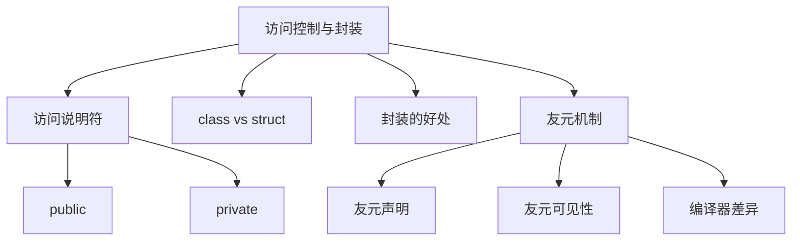

# 📘 7.2 访问控制与封装 (Access Control and Encapsulation)

> 来源说明：C++ Primer 7.2 | 本节涵盖：类的访问控制机制、封装概念及友元函数

---

## 🗺️ 知识体系图



## 🧠 核心概念总览

* [*知识点1: 访问说明符*](#id1)：public和private访问控制
* [*知识点2: class与struct的区别*](#id2)：默认访问级别的差异
* [*知识点3: 封装的优势*](#id3)：数据保护和实现灵活性
* [*知识点4: 友元机制*](#id4)：允许非成员函数访问私有成员
* [*知识点5: 友元声明规范*](#id5)：友元的声明和使用规则

---

<a id="id1"></a>
## ✅ 知识点1: 访问说明符

**理论**
* **public说明符**：定义类的接口，所有程序部分都可访问
* **private说明符**：封装类的实现，仅类成员函数可访问
* 同一个访问说明符可以出现次数无限制，可多次出现在类定义中，便于逻辑分组
* 每个访问说明符影响其后成员，直到下一个说明符或类结束

**教材示例代码**
```cpp
class Sales_data {
public:    // 公共接口
    Sales_data() = default;
    Sales_data(const std::string &s, unsigned n, double p):
        bookNo(s), units_sold(n), revenue(p*n) {}
    std::string isbn() const { return bookNo; }
    Sales_data &combine(const Sales_data&);
    
private:   // 私有实现
    double avg_price() const
    { return units_sold ? revenue/units_sold : 0; }
    std::string bookNo;
    unsigned units_sold = 0;
    double revenue = 0.0;
};
```

**注意点**
* ⚠️ 公共成员定义接口，私有成员封装实现细节


---

<a id="id2"></a>
## ✅ 知识点2: `class`与`struct`的区别

**理论**
* **唯一区别**：默认访问级别不同
* **struct**：第一个访问说明符前的成员默认为`public`
* **class**：第一个访问说明符前的成员默认为`private`
* 编程风格约定：全公共成员用`struct`，有私有成员用`class`

**教材示例代码**
```cpp
// 使用struct - 默认public
struct PublicData {
    int x;        // 默认为public
    int y;        // 默认为public
};

// 使用class - 默认private  
class PrivateData {
    int x;        // 默认为private
    int y;        // 默认为private
public:
    // 公共接口...
};
```

**注意点**
* ⚠️ 按照约定选择关键字，提高代码可读性
---

<a id="id3"></a>
## ✅ 知识点3: 封装(encapsulation)的优势

**理论**
* **防止意外破坏**：用户代码**无法**直接修改对象内部状态
* **实现灵活性**：类的内部实现可以改变而**不影响**用户代码，用户代码只在接口改变时才需要修改
* **错误定位**：封装将变化的**影响范围最小化**，bug搜索范围局限于类实现代码
* **维护便利**：只需检查类代码来评估更改影响

**注意点**
* ⚠️ 类定义改变时，使用该类的源文件必须重新编译

---

<a id="id4"></a>
## ✅ 知识点4: 友元机制 (friend)

**理论**
* **友元定义**：允许**其他类或非成员函数**访问类的非公有成员
* **声明位置**：只能在类定义**内部**，使用`friend`关键字
* **访问权限**：友元**不受**其声明位置的访问控制(`public`/`private`)影响
* **最佳实践**：将友元声明集中放在类开头或结尾

**教材示例代码**
```cpp
class Sales_data {
    // 友元声明 - 允许非成员函数访问私有成员
    friend Sales_data add(const Sales_data&, const Sales_data&);
    friend std::istream &read(std::istream&, Sales_data&);
    friend std::ostream &print(std::ostream&, const Sales_data&);
    
public:
    // 公共接口...
private:
    std::string bookNo;
    unsigned units_sold = 0;
    double revenue = 0.0;
};

// 友元函数定义
Sales_data add(const Sales_data&, const Sales_data&);
std::istream &read(std::istream&, Sales_data&);
std::ostream &print(std::ostream&, const Sales_data&);
```

**注意点**
* ⚠️ 友元不是类的成员，不受访问控制约束
* 💡 友元声明只指定访问权限，不是常规函数声明
* 🔄 友元破坏了封装，应谨慎使用

---

<a id="id5"></a>
## ✅ 知识点5: 友元声明规范

**理论**
* **分离声明**：友元声明**仅**提供访问权限，如果想让使用者可以调用这个友元函数需要在**类外单独声明(或实现)函数**
* **头文件位置**：友元函数应在类**同一头文件**中声明
* **编译器差异**：部分编译器不强制要求外部声明，但为可移植性应提供

**注意点**
* ⚠️ 必须提供友元函数的独立声明才能被用户代码调用
* 💡 即使编译器允许，也应提供外部声明以**确保可移植性**
* 🔄 遵循"声明与实现分离"的原则

---

## 🔑 核心要点总结
1. **访问控制**：`public`定义接口，`private`封装实现，保护数据完整性
2. **关键字选择**：`class`和`struct`唯一区别是默认访问级别，按约定使用
3. **封装价值**：提供数据保护、实现灵活性和简化维护
4. **友元机制**：打破封装的特权访问，需要谨慎使用和规范声明
5. **编译依赖**：类定义改变要求重新编译所有使用该类的源文件

## 📌 考试速记版

**访问控制对比表**
| 说明符 | 可访问范围 | 主要用途 |
|--------|------------|----------|
| `public` | 所有代码 | 定义类接口 |
| `private` | 仅类成员函数 | 封装实现细节 |

**`class` vs `struct`**
- **相同点**：功能完全等价
- **不同点**：默认访问级别（class-private, struct-public）

**友元要点**
- ✅ 声明在类内部，使用friend关键字
- ✅ 需要在类外单独声明函数
- ✅ 不受访问控制区域影响
- ❌ 破坏封装，谨慎使用

**口诀**：*"公接口，私实现，class私来struct公；友元特权破封装，内外声明都要全"*