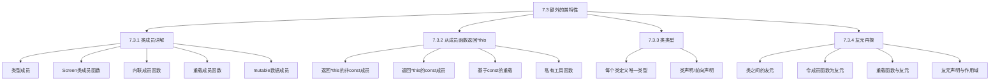

# 📘 7.3 Additional Class Features (额外的类特性)

> 来源说明：C++ Primer 7.3 | 本节涵盖：类类型成员、内联成员函数、mutable成员、返回*this、类类型、友元关系等高级特性

---

## 🗺️ 知识体系图



## 🧠 核心概念总览

* [*知识点1: 类型成员*](#id1)：在类内定义类型别名
* [*知识点2: Screen类成员函数*](#id2)：构造函数和功能成员
* [*知识点3: 内联成员函数*](#id3)：自动内联和显式内联
* [*知识点4: 重载成员函数*](#id4)：成员函数的重载规则
* [*知识点5: mutable数据成员*](#id5)：可在const成员函数中修改的成员
* [*知识点6: 返回*this的非const成员*](#id6)：支持链式调用的设计
* [*知识点7: 返回*this的const成员*](#id7)：const成员函数的返回类型
* [*知识点8: 基于const的重载*](#id8)：根据对象constness重载
* [*知识点9: 私有工具函数*](#id9)：代码复用的设计技巧
* [*知识点10: 类类型唯一性*](#id10)：每个类定义唯一类型
* [*知识点11: 类声明与定义*](#id11)：前向声明与不完全类型
* [*知识点12: 类之间的友元*](#id12)：整个类作为友元
* [*知识点13: 成员函数作为友元*](#id13)：特定成员函数作为友元
* [*知识点14: 重载函数与友元*](#id14)：友元关系与重载函数
* [*知识点15: 友元声明与作用域*](#id15)：友元的声明规则

---

<a id="id1"></a>
## ✅ 知识点1: 类型成员

**理论**
* 类可以定义自己的局部类型名称，称为类型成员 (type member)
* 类型成员受**相同**的访问控制，可以是`public`或`private`
* 类型成员必须在**类定义开始时**声明，因为它们需要在使用前定义

**教材示例代码**
```cpp
class Screen {
public:
    // 使用typedef定义类型成员
    typedef std::string::size_type pos;
    // 或者使用类型别名
    using pos = std::string::size_type;
    
private:
    pos cursor = 0;
    pos height = 0, width = 0;
    std::string contents;
};
```
**代码解析**
* 假设`Screen`类里存储一个字符串（比如屏幕上的字符），它的行列坐标都用 `std::string::size_type`来表示:
    ```cpp 
    void move(std::string::size_type r, std::string::size_type c);
    ```
* 那么你其实暴露了内部实现细节—也就是说：你的类是用`std::string`来保存屏幕内容的
* 如果将它写成
    ```cpp
    void move(pos r, pos c);
    ```
* 并且在类里面定义
    ```cpp
    using pos = std::string::size_type;
    ```
* 那么类的使用者只知道: 这个类里有一个类型叫 `Screen::pos`，我用这个类型来表示位置就行


**注意点**
* ⚠️ 将类型成员设为`public`可以隐藏实现细节，提高封装性
* 💡 使用类型别名(`using`)比`typedef`更现代和灵活


---

<a id="id2"></a>
## ✅ 知识点2: Screen类成员函数

**理论**
* 需要显式声明默认构造函数，因为提供了其他构造函数
* 构造函数使用成员初始化列表初始化数据成员
* 成员函数提供对屏幕内容的操作功能

**教材示例代码**
```cpp
class Screen {
public:
    typedef std::string::size_type pos;
    
    // 显式要求编译器合成默认构造函数
    Screen() = default;
    
    // 三参数构造函数，初始化高度、宽度和内容字符
    Screen(pos ht, pos wd, char c): height(ht), width(wd),
        contents(ht * wd, c) {}
    
    // 获取光标处字符
    char get() const { return contents[cursor]; }
    
    // 获取指定位置字符
    inline char get(pos ht, pos wd) const;
    
    // 移动光标
    Screen &move(pos r, pos c);
    
private:
    pos cursor = 0;
    pos height = 0, width = 0;
    std::string contents;
};
```

**注意点**
* ⚠️ 如果类有自定义构造函数，编译器不会自动生成默认构造函数
* 💡 使用`= default`显式要求编译器合成默认构造函数
* 🔄 成员初始化列表比在构造函数体内赋值更高效

---

<a id="id3"></a>
## ✅ 知识点3: 内联成员函数

**理论**
* 在类内定义的成员函数自动是inline的
* 可以在类外定义成员函数时显式指定inline
* inline函数应该定义在头文件中

**教材示例代码**
```cpp
// 在类外定义inline成员函数
inline Screen &Screen::move(pos r, pos c) {
    pos row = r * width;    // 计算行位置
    cursor = row + c;       // 移动光标到该行的列位置
    return *this;           // 返回此对象的左值
}

// 在类内声明为inline的函数，在类外定义
char Screen::get(pos r, pos c) const {
    pos row = r * width;    // 计算行位置
    return contents[row + c]; // 返回给定列的字符
}
```

**注意点**
* ⚠️ inline只是对编译器的建议，编译器可能忽略
* 💡 小型、频繁调用的函数适合声明为inline
* 🔄 inline成员函数应该与类定义在同一个头文件中

---

<a id="id4"></a>
## ✅ 知识点4: 重载成员函数

**理论**
* 成员函数可以像普通函数一样重载
* 重载决议基于参数数量和类型
* 调用成员函数时，编译器根据参数匹配最合适的版本

**教材示例代码**
```cpp
class Screen {
public:
    char get() const;                    // 版本1：获取光标处字符
    char get(pos r, pos c) const;        // 版本2：获取指定位置字符
};

// 使用示例
Screen myScreen;
char ch = myScreen.get();        // 调用Screen::get()
ch = myScreen.get(0, 0);         // 调用Screen::get(pos, pos)
```

**注意点**
* ⚠️ 重载函数必须在参数数量或类型上有所不同
* 💡 重载使接口更加直观和易用
* 🔄 成员函数的重载决议规则与非成员函数相同

---

<a id="id5"></a>
## ✅ 知识点5: mutable数据成员

**理论**
* mutable数据成员永远不会是const，即使在const对象中
* const成员函数可以修改mutable成员
* 用于需要记录状态但不影响对象逻辑constness的情况

**教材示例代码**
```cpp
class Screen {
public:
    void some_member() const;
    
private:
    mutable size_t access_ctr;  // 即使在const对象中也可修改
    // 其他成员...
};

void Screen::some_member() const {
    ++access_ctr;  // 允许修改mutable成员，即使是在const成员函数中
    // 其他工作...
}
```

**注意点**
* ⚠️ mutable应该谨慎使用，只在真正需要时使用
* 💡 适合用于访问计数、缓存、调试信息等场景
* 🔄 mutable不影响对象的二进制constness，只影响逻辑constness

---

<a id="id6"></a>
## ✅ 知识点6: 返回*this的非const成员

**理论**
* 成员函数返回*this可以支持链式调用
* 返回类型应该是引用类型，避免不必要的拷贝
* 这种设计模式称为"流畅接口"(Fluent Interface)

**教材示例代码**
```cpp
class Screen {
public:
    Screen &move(pos r, pos c);
    Screen &set(char c);
    Screen &set(pos r, pos c, char ch);
};

// 链式调用示例
myScreen.move(4, 0).set('#');  // 移动到(4,0)位置并设置字符

// 如果返回Screen而不是Screen&，等效于：
Screen temp = myScreen.move(4, 0);  // 返回值被拷贝
temp.set('#');  // 修改的是临时副本，不是原对象
```

**注意点**
* ⚠️ 返回非引用类型会破坏链式调用的预期行为
* 💡 返回*this支持方法链，使代码更简洁
* 🔄 这种模式在构建器模式中很常见

---

<a id="id7"></a>
## ✅ 知识点7: 返回*this的const成员

**理论**
* const成员函数中的this是指向const的指针
* 返回*this的类型应该是const引用
* 返回const引用会限制后续的非const操作

**教材示例代码**
```cpp
class Screen {
public:
    // const版本返回const引用
    const Screen &display(std::ostream &os) const;
    
    // 非const版本返回非const引用
    Screen &display(std::ostream &os);
};

// 问题示例：如果display返回const引用
Screen myScreen;
// myScreen.display(cout).set('*');  // 错误！不能在const对象上调用set
```

**注意点**
* ⚠️ const成员函数返回*this应该是const引用
* 💡 返回类型必须与成员函数的constness一致
* 🔄 这种限制保护了const对象的完整性

---

<a id="id8"></a>
## ✅ 知识点8: 基于const的重载

**理论**
* 可以根据成员函数是否为const来重载
* const对象只能调用const版本
* 非const对象可以调用两个版本，但非const版本是更好匹配

**教材示例代码**
```cpp
class Screen {
public:
    // 基于const的重载
    Screen &display(std::ostream &os) {
        do_display(os); 
        return *this; 
    }
    
    const Screen &display(std::ostream &os) const {
        do_display(os); 
        return *this; 
    }
    
private:
    void do_display(std::ostream &os) const { 
        os << contents; 
    }
};

// 使用示例
Screen myScreen(5, 3);
const Screen blank(5, 3);
myScreen.set('#').display(cout);  // 调用非const版本
blank.display(cout);              // 调用const版本
```

**注意点**
* ⚠️ 基于const的重载必须有不同的参数类型（隐含的this指针类型不同）
* 💡 私有工具函数do_display避免了代码重复
* 🔄 非const版本调用do_display时，this指针会隐式转换为指向const

---

<a id="id9"></a>
## ✅ 知识点9: 私有工具函数

**理论**
* 将公共功能提取到私有工具函数中
* 减少代码重复，提高可维护性
* 工具函数通常声明为inline，没有运行时开销

**教材示例代码**
```cpp
class Screen {
private:
    // 执行实际显示工作的函数
    void do_display(std::ostream &os) const { 
        os << contents; 
    }
};
```

**注意点**
* ⚠️ 工具函数应该是私有的，不暴露给外部
* 💡 好处包括：代码复用、易于维护、方便调试
* 🔄 定义在类内的工具函数自动是inline的

---

<a id="id10"></a>
## ✅ 知识点10: 类类型唯一性

**理论**
* 每个类定义唯一的类型，即使成员完全相同
* 可以使用类名直接作为类型名，或使用class/struct关键字
* 两种引用类类型的方式是等价的

**教材示例代码**
```cpp
struct First {
    int memi;
    int getMem();
};

struct Second {
    int memi;
    int getMem();
};

First obj1;
Second obj2 = obj1;  // 错误：obj1和obj2类型不同

// 两种等价的类类型引用方式
Sales_data item1;        // 方式1：直接使用类名
class Sales_data item1;  // 方式2：使用class关键字（C风格）
```

**注意点**
* ⚠️ 即使两个类的成员列表完全相同，它们也是不同的类型
* 💡 每个类的成员都独立于其他类的成员
* 🔄 第二种方式继承自C语言，在C++中仍然有效

---

<a id="id11"></a>
## ✅ 知识点11: 类声明与定义

**理论**
* 类可以前向声明而不定义
* 前向声明的类是不完全类型
* 不完全类型的使用受到限制

**教材示例代码**
```cpp
class Screen;  // Screen类的前向声明

class Link_screen {
    Screen window;           // 错误：Screen未定义
    Link_screen *next;       // 正确：可以定义指向不完全类型的指针
    Link_screen *prev;       // 正确：可以定义指向不完全类型的引用
};
```

**注意点**
* ⚠️ 不完全类型只能用于：定义指针/引用、声明（不定义）函数
* 💡 类在类体完成后才算完全定义
* 🔄 类可以包含指向自身类型的指针/引用成员

---

<a id="id12"></a>
## ✅ 知识点12: 类之间的友元

**理论**
* 一个类可以将另一个类声明为友元
* 友元类的成员函数可以访问该类的所有非公有成员
* 友元关系不是传递的

**教材示例代码**
```cpp
class Screen {
    // Window_mgr的成员可以访问Screen的私有部分
    friend class Window_mgr;
    // ... Screen类的其余部分
};

class Window_mgr {
public:
    using ScreenIndex = std::vector<Screen>::size_type;
    void clear(ScreenIndex);
    
private:
    std::vector<Screen> screens{Screen(24, 80, ' ')};
};

void Window_mgr::clear(ScreenIndex i) {
    Screen &s = screens[i];                    // 要清空的Screen的引用
    s.contents = string(s.height * s.width, ' ');  // 重置内容为空白
}
```

**注意点**
* ⚠️ 友元关系是单向的，Screen友元Window_mgr不意味着Window_mgr也友元Screen
* 💡 友元关系允许受控地打破封装
* 🔄 每个类控制自己的友元关系

---

<a id="id13"></a>
## ✅ 知识点13: 成员函数作为友元

**理论**
* 可以只将另一个类的特定成员函数声明为友元
* 需要仔细组织程序结构来处理声明依赖
* 必须指定成员函数所属的类

**教材示例代码**
```cpp
class Screen {
    // 只允许Window_mgr::clear访问
    friend void Window_mgr::clear(ScreenIndex);
    // ... Screen类的其余部分
};
```

**注意点**
* ⚠️ 必须按正确顺序组织代码：先定义Window_mgr，再定义Screen，最后定义clear
* 💡 比将整个类设为友元更精确地控制访问
* 🔄 需要前向声明和仔细的代码组织

---

<a id="id14"></a>
## ✅ 知识点14: 重载函数与友元

**理论**
* 重载函数是不同的函数，需要分别声明为友元
* 类必须明确声明希望设为友元的每个重载版本
* 友元关系不自动应用于重载集合中的所有函数

**教材示例代码**
```cpp
// 重载的storeOn函数
extern std::ostream& storeOn(std::ostream &, Screen &);
extern BitMap& storeOn(BitMap &, Screen &);

class Screen {
    // 只将ostream版本的storeOn设为友元
    friend std::ostream& storeOn(std::ostream &, Screen &);
    // ...
};
```

**注意点**
* ⚠️ 友元声明必须精确匹配要设为友元的函数签名
* 💡 可以只选择特定重载版本作为友元
* 🔄 BitMap版本的storeOn没有特殊访问权限

---

<a id="id15"></a>
## ✅ 知识点15: 友元声明与作用域

**理论**
* 友元声明引入的名字隐式成为外围作用域的成员
* 但友元函数本身并没有在作用域中声明
* 必须在类外另外提供友元函数的声明

**教材示例代码**
```cpp
struct X {
    friend void f() { /* 友元函数可以在类体内定义 */ }
    X() { f(); }  // 错误：f没有声明
    void g();
    void h();
};

void X::g() { return f(); }  // 错误：f尚未声明
void f();                    // 声明在X中定义的函数
void X::h() { return f(); }  // 正确：f的声明现在在作用域中
```

**注意点**
* ⚠️ 友元声明影响访问权限，但不是普通的声明
* 💡 即使只在友元授予类中调用友元函数，也需要外部声明
* 🔄 一些编译器不强制实施友元的查找规则

---

## 🔑 核心要点总结

1. **类型成员**：类可以定义自己的类型别名，提高封装性和可维护性
2. **内联与重载**：成员函数支持内联和重载，规则与普通函数类似但需要考虑this指针
3. **mutable成员**：允许在const成员函数中修改特定数据成员
4. **返回*this**：支持链式调用，但要注意const正确性
5. **基于const的重载**：根据对象的constness选择不同的成员函数版本
6. **友元关系**：提供受控的访问突破，可以是整个类或特定成员函数
7. **类类型系统**：每个类定义唯一类型，支持前向声明和不完全类型

## 📌 考试速记版

**口诀**：类型前、内联快、mutable改、this链、const载、友元控、类独型

**关键对比表格**：
| 特性 | 非const成员函数 | const成员函数 |
|------|----------------|---------------|
| 修改对象 | ✅ 允许 | ❌ 不允许 |
| 返回*this类型 | T& | const T& |
| 调用对象 | 非const对象 | const和非const对象 |
| mutable成员 | ✅ 可修改 | ✅ 可修改 |

**重要规则**：
- 类型成员必须先声明后使用
- 返回*this应返回引用类型
- const成员函数返回*this应是const引用
- 友元关系需要精确的函数签名匹配
- 不完全类型只能用于指针/引用和函数声明