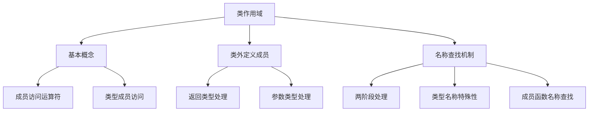

# 📘 7.4 类作用域 (Class Scope)

> 来源说明：C++ Primer 第7.4节 | 本节涵盖：类作用域的基本概念、成员访问规则、名称查找机制

---

## 🗺️ 知识体系图



## 🧠 核心概念总览

* [*知识点1: 类作用域基本概念*](#id1)：类定义自己的作用域，成员访问规则
* [*知识点2: 类外定义成员函数*](#id2)：作用域对类外定义的影响
* [*知识点3: 名称查找的处理*](#id3)：类处理的编译阶段
* [*知识点4: 类成员声明中的名称查找*](#id4)：声明与函数体的不同查找规则
* [*知识点5: 类型名称的特殊性*](#id5)：类中类型名称的重定义限制
* [*知识点6: 成员函数定义中的名称查找*](#id6)：成员函数内的名称解析顺序
* [*知识点7: 类作用域后的外围作用域查找*](#id7)：使用作用域运算符访问全局名称
* [*知识点8: 名称在文件中的解析位置*](#id8)：成员定义位置对名称查找的影响

---

<a id="id1"></a>
## ✅ 知识点1: 类作用域基本概念

**理论**
* 每个类都定义自己的作用域
* 在类作用域外，普通成员数据和成员函数**只能通过**对象、引用或指针使用**成员访问运算符**访问
* 类型成员**必须**使用**作用域运算符**从类中访问
* 运算符后面的名称必须是相关类的**成员**

**教材示例代码**
```cpp
Screen::pos ht = 24, wd = 80;  // 使用Screen定义的pos类型
Screen scr(ht, wd, ' ');
Screen *p = &scr;
char c = scr.get();  // 从对象scr获取get成员
c = p->get();        // 从p指向的对象获取get成员
```

**注意点**
* 🔄 成员访问运算符(`->`,`.`)用于对象成员，作用域运算符(`::`)用于类型成员
* 💡 类作用域使得类的成员在外部不可直接访问，必须通过特定方式

---

<a id="id2"></a>
## ✅ 知识点2: 类外定义成员函数

**理论**
* 在类外定义成员函数时必须提供**类名和函数名**
* 在类外部，成员名称是隐藏的
* 在编译外部成员函数时：
    * 一旦看到类名，定义的剩余部分(参数列表和函数体)就在类作用域内，可以直接使用到这个类所有成员


**教材示例代码**
```cpp
// 参数类型在类作用域内，无需限定
void Window_mgr::clear(ScreenIndex i) {
    Screen &s = screens[i];
    s.contents = string(s.height * s.width, ' ');
}

// 返回类型在类作用域外，必须限定
Window_mgr::ScreenIndex Window_mgr::addScreen(const Screen &s) {
    screens.push_back(s);
    return screens.size() - 1;
}
```

**注意点**
* ⚠️ 由于返回类型出现在函数名之前，返回类型在类作用域外看到，必须使用**完全限定名**
* 💡 参数列表和函数体在类作用域内，可以直接使用其他成员

---

<a id="id3"></a>
## ✅ 知识点3: 名称查找的处理

**理论**
* 一般情况下的名字查找规则（name lookup）：
  1. 先在当前作用域（block）中查找该名字，**只考虑使用前已经声明的名字**
  2. 若未找到，**向外层作用域（enclosing scopes）继续查找**
  3. 若仍未找到声明，则编译**报错**
* 在类内定义的成员函数中，名字查找似乎不遵守上面规则
* 但实际上只是看起来不同，因为类的定义过程是分两步进行的：
    1. 第一步：**先处理所有成员声明**（包括数据成员、成员函数声明等）
    2. 第二步：在整个类都被看到后，**才编译成员函数的函数体**

**注意点**
* ⚠️ 成员函数的**定义**会在编译器处理完类中所有**声明**之后再进行
* 🔄 如果函数定义与成员声明同时处理，就需要严格排序成员函数
* 💡 因此两阶段处理提供了更大的灵活性，函数体可以引用后面声明的成员

---

<a id="id4"></a>
## ✅ 知识点4: 类成员声明中的名称查找

**理论**
* 两阶段处理仅适用于成员**函数体中使用的名称**
* **声明中**使用的<b>名称(返回类型和参数类型)</b>必须在使用前看到
* 如果成员声明使用了类中尚还未看到的名称，编译器会跳出类到**这个类被定义**的定义域去查找
    * 声明中的名称查找顺序：**类内 → 外围作用域**
    * 函数体中的名称查找顺序：**类内所有成员 → 外围作用域**

**教材示例代码**
```cpp
typedef double Money;
string bal;
class Account {
public:
    Money balance() { return bal; }  // 使用类内的bal成员
private:
    Money bal;  // 使用外部的Money类型
};
```

**代码解析**
* 编译器当读到`balance`函数声明时， 它会在类内寻找`Money`的声明
* 编译器只会考虑在类中出现在`Money`使用前的声明
* 由于没有找到匹配的成员，编译器会跳到外围作用域，找到`typdef double Money`
* 由于函数体的读取要在整个类被看见后
* 因此在函数体内的`return` 时返回的类中的名为`bal`的成员而不是外围的`String bal`变量

---

<a id="id5"></a>
## ✅ 知识点5: 类型名称的特殊性

**理论**
* 通常内层作用域可以重定义外层作用域的名称
* 但如果类成员使用了外层作用域的**类型名称(type name)**，类**不能**随后重定义该名称
* **类型名称重定义**在类中是错误，即使类型定义相同
* 编译器不一定诊断这种错误, 但这种错误应该避免

**教材示例代码**
```cpp
typedef double Money;
class Account {
public:
    Money balance() { return bal; }  // 使用外层的Money
private:
    typedef double Money;  // 错误：不能重定义Money
    Money bal;
};
```

**注意点**
* ⚠️ 类型定义通常应出现在**类的开头**，这样以来任何使用了这个类型的成员都会在类型已经定义后才看到

---

<a id="id6"></a>
## ✅ 知识点6: 成员函数定义中的名称查找

**理论**
* 成员函数体中名称的解析顺序：
  1. 在成员函数内查找声明，只有在函数体内**使用前**的声明会考虑
  2. 如果没有匹配，在类内查找声明（**所有成员都会考虑**）
  3. 如果没有匹配，编译器就会在定义该函数所在的**外层作用域**中查找在此**定义点之前可见**的名字
* 参数名称会隐藏同名的类成员
* 即使类的成员被隐藏，仍然可以通过在成员名前加上类名限定，或者显式使用 `this` 指针来访问


**教材示例代码**
```cpp
int height;  // 全局变量
class Screen {
public:
    typedef std::string::size_type pos;
    void dummy_fcn(pos height) {
        cursor = width * height;  // 使用参数height，隐藏成员height
    }
private:
    pos cursor = 0;
    pos height = 0, width = 0;
};
```
**代码解析**
* 即使成员被隐藏，仍可通过**this指针或显式使用作用域**限定访问， 如下

**教材示例代码**
```cpp
// 错误实践：成员函数中的局部变量名不应隐藏类的成员名
void Screen::dummy_fcn(pos height) {
    cursor = width * this->height; // 成员变量height
    // 另一种指示类成员的方式是显式使用作用域
    cursor = width * Screen::height; // 成员变量height
}
```
**代码解析**
* 更好的做法是给参数**不同的名称**


**注意点**
* ⚠️ **使用成员名称作为参数名**是糟糕实践
---

<a id="id7"></a>
## ✅ 知识点7: 类作用域后的外围作用域查找

**理论**
* 如果在函数或类作用域中找不到名称，会在**外围作用域查找**
* 类成员会**隐藏**外围作用域的同名对象
* 即使这样，也可以使用**作用域运算符**显式访问全局名称

**教材示例代码**
```cpp
// 糟糕实践：不要隐藏需要的外围作用域名称
void Screen::dummy_fcn(pos height) {
    cursor = width * ::height;  // 使用全局的height
}
```

**注意点**
* ⚠️ 避免隐藏需要的外围作用域名称

---

<a id="id8"></a>
## ✅ 知识点8: 名称在文件中的解析位置

**理论**
* 类外定义的成员函数要等到编译器扫描到其定义时才真正编译，因此在类外定义成员时，名称查找的第三步包括：
    * **成员定义作用域**中的名称
    * 也包括**类定义作用域**中出现的名称
* 成员定义**位置之前**的全局声明可用

**教材示例代码**
```cpp
int height;  // 全局变量
class Screen {
public:
    typedef std::string::size_type pos;
    void setHeight(pos);
    pos height = 0;  // 隐藏外层的height声明
};

Screen::pos verify(Screen::pos);  // 全局函数

void Screen::setHeight(pos var) {
    height = verify(var);  // height: 类成员, verify: 全局函数
}
```

**注意点**
* 🔄 成员定义位置影响名称查找范围
* 💡 即使全局函数在类定义后声明，只要在**成员定义前**就可用

---

## 🔑 核心要点总结

1. **类作用域隔离**：类定义独立作用域，外部访问需通过特定运算符
2. **两阶段编译**：成员声明先编译，函数体后编译，提供组织灵活性
3. **名称查找层次**：函数内 → 类内 → 外围作用域，按顺序查找
4. **类型名称特殊**：类中不能重定义已使用的外层类型名称
5. **隐藏与覆盖**：局部名称隐藏类成员，类成员隐藏全局名称，但都可显式访问

## 📌 考试速记版

* **访问规则**：对象用`.`/`->`，类型用`::`
* **编译阶段**：声明先处理，函数体后处理
* **查找顺序**：局部 → 类成员 → 全局
* **类型限制**：类内不能重定义已用的外部类型名
* **隐藏解决**：`this->member`或`Class::member`或`::global`

**口诀**：类作独立域，访问分两种；编译两阶段，声明先处理；查找三层次，局部到全局；类型不重定义，隐藏可显访。