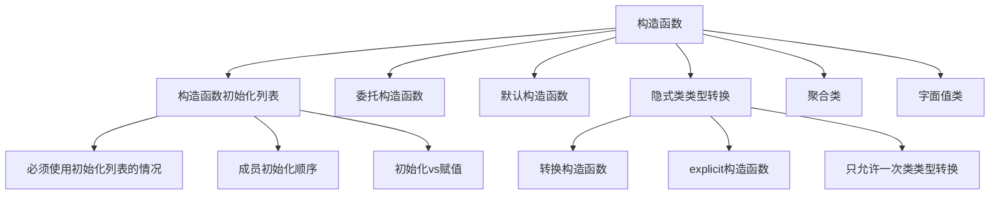

# 📘 7.5 构造函数再探 (Constructors Revisited)

> 来源说明：C++ Primer 7.5 | 本节涵盖：构造函数的初始化列表、委托构造函数、默认构造函数的作用、隐式类类型转换、聚合类和字面值类

---

## 🗺️ 知识体系图



## 🧠 核心概念总览

* [*知识点1: 构造函数初始化列表*](#id1)：理解初始化与赋值的区别及初始化列表的必要性
* [*知识点1.1: 必须使用初始化列表的情况*](#id2)：const成员、引用成员、无默认构造函数的类类型成员
* [*知识点1.2: 成员初始化顺序*](#id3)：按类定义顺序初始化，与初始化列表顺序无关
* [*知识点1.3: 最佳实践*](#id4)：使用构造函数参数而非其他成员进行初始化
* [*知识点2: 默认参数与构造函数*](#id5)：使用默认参数简化构造函数重载
* [*知识点3: 委托构造函数(delegating constructor)*](#id6)：一个构造函数调用同类其他构造函数
* [*知识点4: 默认构造函数的作用*](#id7)：默认初始化和值初始化的场景
* [*知识点5: 使用默认构造函数的正确方式*](#id8)：避免函数声明陷阱
* [*知识点6: 隐式类类型转换*](#id9)：单参数构造函数定义的自动转换
* [*知识点6.1: 只允许一次类类型转换*](#id10)：编译器只自动应用一次转换
* [*知识点6.2: explicit构造函数*](#id11)：阻止隐式转换的构造函数
* [*知识点7: 聚合类*](#id12)：所有成员public、无构造函数、无类内初始值、无基类
* [*知识点8: 字面值类*](#id13)：可在constexpr函数中使用的类类型
* [*知识点8.1: constexpr构造函数*](#id14)：生成constexpr对象的构造函数要求

---

<a id="id1"></a>
## ✅ 知识点1: 构造函数初始化列表

**理论**
* 构造函数初始化列表在对象创建时**直接**初始化成员
* 不使用初始化列表时，成员先被默认初始化，然后在**构造函数体内**赋值
* 初始化比赋值**更高效**，特别是对于复杂类型

**教材示例代码**
```cpp
// 使用赋值方式（不推荐）
Sales_data::Sales_data(const string &s, unsigned cnt, double price)
{
    bookNo = s;           // 赋值，不是初始化
    units_sold = cnt;     // 赋值，不是初始化
    revenue = cnt * price; // 赋值，不是初始化
}

// 使用初始化列表方式（推荐）
Sales_data::Sales_data(const string &s, unsigned cnt, double price)
    : bookNo(s), units_sold(cnt), revenue(cnt * price) { }
```

**注意点**
* ⚠️ 初始化列表在构造函数体执行前完成
* 💡 对于内置类型，初始化与赋值性能差异不大，但对于类类型差异显著
* 🔄 初始化列表更接近变量的直接初始化语法

---

<a id="id2"></a>
### ✅ 知识点1.1: 必须使用初始化列表的情况

**理论**
* **const成员**必须初始化，不能赋值
* **引用成员**必须初始化，不能赋值  
* **没有默认构造函数**的类类型成员必须初始化

**教材示例代码**
```cpp
class ConstRef {
public:
    ConstRef(int ii);
private:
    int i;
    const int ci;    // const成员
    int &ri;         // 引用成员
};

// 错误：ci和ri没有初始化
ConstRef::ConstRef(int ii)
{
    i = ii;    // ok
    ci = ii;   // 错误：不能给const赋值
    ri = i;    // 错误：ri从未初始化
}

// 正确：使用初始化列表
ConstRef::ConstRef(int ii) : i(ii), ci(ii), ri(i) { }
```

**注意点**
* ⚠️ 构造函数体开始执行时，初始化**已经完成**
* 💡 const和引用成员只能在初始化列表中初始化
* 🔄 没有默认构造函数的类类型成员也必须在初始化列表中初始化

---

<a id="id3"></a>
### ✅ 知识点1.2: 成员初始化顺序

**理论**
* 成员初始化的顺序由它们在类定义中的**声明顺序**决定
* 初始化列表中的顺序**不影响**实际初始化顺序
* 如果一个成员用另一个成员初始化，顺序就至关重要

**教材示例代码**
```cpp
class X {
    int i;
    int j;
public:
    // 未定义行为：i在j之前初始化，但试图用j初始化i
    X(int val) : j(val), i(j) { }  // 危险：i(j)时j尚未初始化
};

// 正确做法：使用参数而非其他成员初始化
X(int val) : i(val), j(val) { }  // 安全：不依赖成员初始化顺序
```

**注意点**
* ⚠️ 错误的初始化顺序会导致未定义行为


---

<a id="id4"></a>
### ✅ 知识点1.3: 最佳实践

**理论**
* 总是使用构造函数**初始化列表**
* 让初始化列表顺序与成员声明顺序一致
* 尽可能使用构造函数参数而非其他数据成员来初始化

**教材示例代码**
```cpp
// 好的实践：使用初始化列表，顺序一致，使用参数初始化
class GoodPractice {
    int a;
    const int b;
    string c;
public:
    GoodPractice(int x, int y, const string& z) 
        : a(x), b(y), c(z) { }  // 顺序一致，使用参数
};

// 避免：使用成员初始化其他成员
class BadPractice {
    int a;
    int b;
public:
    BadPractice(int x) : b(x), a(b) { }  // 危险：a(b)时b可能未初始化
};
```

---

<a id="id5"></a>
## ✅ 知识点2: 默认参数与构造函数

**理论**
* 可以通过为构造函数参数**提供默认值**来合并多个构造函数
* 所有参数都有默认值的构造函数**也是**默认构造函数
* 但要谨慎使用，确保默认值在语义上是合理的

**教材示例代码**
```cpp
class Sales_data {
public:
    // 合并默认构造函数和单string参数构造函数
    Sales_data(const string& s = "") : bookNo(s) { }
    
    // 其他构造函数
    Sales_data(const string& s, unsigned cnt, double price)
        : bookNo(s), units_sold(cnt), revenue(cnt * price) { }
        
    Sales_data(istream& is) { read(is, *this); }
};
```

**注意点**
* ⚠️ 不是所有构造函数都适合使用默认参数
    * 比如，对于`Sales_data`的三参数构造函数，不应该使用默认参数，因为如果提供了数量，通常也应该提供价格
* 🔄 带默认参数的构造函数**减少了代码重复**

---

<a id="id6"></a>
## ✅ 知识点3: 委托构造函数 (delegating constructor)

**理论**
* 委托构造函数使用同类**其他**构造函数执行初始化
* 在成员初始化列表中**只**包含一项， 也就是调用其他构造函数
* 先执行被委托构造函数的初始化列表和函数体，再执行委托构造函数的函数体

**教材示例代码**
```cpp
class Sales_data {
public:
    // 非委托构造函数
    Sales_data(const string& s, unsigned cnt, double price)
        : bookNo(s), units_sold(cnt), revenue(cnt * price) { }
    
    // 委托构造函数
    Sales_data() : Sales_data("", 0, 0) { }  // 委托给三参数构造函数
    Sales_data(const string& s) : Sales_data(s, 0, 0) { }  // 委托给三参数构造函数
    Sales_data(istream& is) : Sales_data() { read(is, *this); }  // 先委托，再执行函数体
};
```

**注意点**
* ⚠️ 委托构造函数可以减少代码重复
* 🔄 委托链**不能**形成循环

---

<a id="id7"></a>
## ✅ 知识点4: 默认构造函数的作用

**理论**
* 默认构造函数在以下情况下被自动调用：
  - 块作用域中定义非静态变量或数组且无初始化器时
  - 类使用合成默认构造函数时
  - 类成员在构造函数初始化列表中未显式初始化时

* 值初始化发生在：
  - 数组初始化时提供的初始值少于数组大小时
  - 定义局部静态对象无初始化器时
  - 显式请求值初始化时（如T()）

**教材示例代码**
```cpp
class NoDefault {
public:
    NoDefault(const string&);  // 没有默认构造函数
};

struct A {
    NoDefault my_mem;  // 错误：A不能合成默认构造函数
};

A a;  // 错误：无法为A合成构造函数
```

**注意点**
* ⚠️ 如果类有成员没有默认构造函数，该类可能无法使用默认构造函数
* 💡 实践中，如果定义了其他构造函数，几乎总是应该也提供默认构造函数
* 🔄 值初始化会对内置类型进行零初始化

---

<a id="id8"></a>
## ✅ 知识点5: 使用默认构造函数的正确方式

**理论**
* 常见的错误是使用空括号声明对象，这实际上声明了一个函数
* 正确的做法是省略空括号

**教材示例代码**
```cpp
// 错误：声明了一个函数，不是对象
Sales_data obj();  // 函数声明，返回Sales_data，无参数

// 正确：声明了一个默认初始化的对象
Sales_data obj;    // 对象定义

// 错误使用
if (obj.isbn() == primer_5th_ed.isbn())  // 错误：obj是函数
```

**注意点**
* ⚠️ 这是C++新手常见错误
* 💡 记住：想要默认构造的对象，不要加空括号
* 🔄 只有使用new动态分配时才会在类型名后使用空括号

---

<a id="id9"></a>
## ✅ 知识点6: 隐式类类型转换

**理论**
* 能用一个实参调用的构造函数定义了对该类类型的隐式转换
* 这种构造函数称为转换构造函数
* 编译器会自动应用这种转换

**教材示例代码**
```cpp
string null_book = "9-999-99999-9";
// 编译器用string构造临时Sales_data对象
item.combine(null_book);  // 合法：隐式转换

// 等价于：
Sales_data temp(null_book);  // 用string构造函数
item.combine(temp);          // 传递临时对象
```

**注意点**
* ⚠️ 隐式转换可能产生性能开销（创建临时对象）
* 💡 隐式转换可以简化代码，但可能掩盖逻辑
* 🔄 只有单参数构造函数（或多参数但只有第一个参数无默认值）才是转换构造函数

---

<a id="id10"></a>
### ✅ 知识点6.1: 只允许一次类类型转换

**理论**
* 编译器只会自动应用一次类类型转换
* 如果需要多次转换，必须显式进行

**教材示例代码**
```cpp
// 错误：需要两次用户定义的转换
// 1. "9-999-99999-9" 转换为 string
// 2. string 转换为 Sales_data
item.combine("9-999-99999-9");  // 错误

// 正确：显式进行一次转换
item.combine(string("9-999-99999-9"));  // 正确：显式转string
item.combine(Sales_data("9-999-99999-9"));  // 正确：显式转Sales_data
```

**注意点**
* ⚠️ 编译器不会链式应用多个用户定义的转换
* 💡 可以使用static_cast进行显式转换
* 🔄 内置类型之间的转换不算在这一次限制内

---

<a id="id11"></a>
### ✅ 知识点6.2: explicit构造函数

**理论**
* 在构造函数前加explicit关键字阻止隐式转换
* explicit构造函数只能用于直接初始化，不能用于拷贝初始化
* 库类示例：vector的size构造函数是explicit，string的const char*构造函数不是

**教材示例代码**
```cpp
class Sales_data {
public:
    explicit Sales_data(const string& s) : bookNo(s) { }
    explicit Sales_data(istream& is);
};

string null_book = "9-999-99999-9";
Sales_data item1(null_book);   // 正确：直接初始化
Sales_data item2 = null_book;  // 错误：不能用于拷贝初始化
item.combine(null_book);       // 错误：不能隐式转换

// 仍然可以显式转换
item.combine(static_cast<Sales_data>(cin));  // 正确：显式转换
```

**注意点**
* ⚠️ explicit构造函数只能用于直接初始化
* 💡 需要多个转换的构造函数通常应该声明为explicit
* 🔄 可以在需要时用static_cast进行显式转换

---

<a id="id12"></a>
## ✅ 知识点7: 聚合类

**理论**
* 聚合类是特殊的类，满足：
  - 所有成员都是public
  - 没有定义任何构造函数
  - 没有类内初始值
  - 没有基类和虚函数

* 可以使用花括号列表初始化聚合类

**教材示例代码**
```cpp
struct Data {  // 聚合类
    int ival;
    string s;
};

// 聚合类初始化
Data val1 = {0, "Anna"};  // 正确
Data val2 = {"Anna", 1024};  // 错误：顺序不匹配

// 初始值少于成员数时，剩余成员值初始化
Data val3 = {42};  // val3.ival=42, val3.s为空字符串
```

**注意点**
* ⚠️ 初始值必须按成员声明顺序出现
* ⚠️ 初始值不能多于成员数量
* 💡 聚合类初始化类似数组初始化
* 🔄 聚合类的缺点：所有成员必须public，用户负责正确初始化

---

<a id="id13"></a>
## ✅ 知识点8: 字面值类

**理论**
* 字面值类是可以在constexpr函数中使用的类类型
* 字面值类的要求：
  - 聚合类且数据成员都是字面值类型，或
  - 非聚合类但满足：
    * 数据成员都是字面值类型
    * 至少有一个constexpr构造函数
    * 类内初始值（如果有）必须是常量表达式
    * 必须使用默认的析构函数

**教材示例代码**
```cpp
class Debug {  // 字面值类
public:
    constexpr Debug(bool b = true) : hw(b), io(b), other(b) { }
    constexpr Debug(bool h, bool i, bool o) : hw(h), io(i), other(o) { }
    
    constexpr bool any() const { return hw || io || other; }
    void set_io(bool b) { io = b; }
    void set_hw(bool b) { hw = b; }
    void set_other(bool b) { other = b; }
    
private:
    bool hw;    // 硬件错误
    bool io;    // IO错误  
    bool other; // 其他错误
};
```

**注意点**
* ⚠️ 字面值类的成员函数可以是constexpr，且隐式是const
* 💡 字面值类用于编译期计算和常量表达式

---

<a id="id14"></a>
### ✅ 知识点8.1: constexpr构造函数

**理论**
* constexpr构造函数用于生成constexpr对象
* 要求：
  - 不能返回结果（与普通构造函数一样）
  - 函数体通常是空的（唯一可执行语句是return）
  - 必须初始化所有数据成员
  - 初始值必须是constexpr构造函数或常量表达式

**教材示例代码**
```cpp
constexpr Debug io_sub(false, true, false);  // 调试IO
if (io_sub.any())  // 等价于if(true)
    cerr << "print appropriate error messages" << endl;

constexpr Debug prod(false);  // 生产环境无调试
if (prod.any())  // 等价于if(false)
    cerr << "print an error message" << endl;
```

**注意点**
* ⚠️ constexpr构造函数体通常为空
* 💡 constexpr构造函数可以声明为=default
* 🔄 constexpr对象必须在编译期可求值

---

## 🔑 核心要点总结

1. **初始化列表优先**：总是使用构造函数初始化列表，特别是对于const、引用和无默认构造的成员
2. **注意初始化顺序**：成员按声明顺序初始化，与初始化列表顺序无关
3. **委托减少重复**：委托构造函数可以简化代码，避免重复的初始化逻辑
4. **谨慎隐式转换**：单参数构造函数定义隐式转换，用explicit阻止不需要的转换
5. **理解默认构造**：知道默认构造函数何时被调用，避免函数声明陷阱
6. **特殊类类型**：聚合类和字面值类有特定的使用场景和限制

## 📌 考试速记版

**口诀**：*"Const引用必须初始化列表，成员顺序按声明不按列表，单参构造可能隐式转，聚合类要花括号初始化"*

**关键对比**：
| 特性 | 初始化列表 | 构造函数内赋值 |
|------|------------|----------------|
| const成员 | ✅ 必须使用 | ❌ 不能赋值 |
| 引用成员 | ✅ 必须使用 | ❌ 不能赋值 |
| 无默认构造成员 | ✅ 必须使用 | ❌ 无法默认构造 |
| 性能 | 直接初始化 | 先默认构造再赋值 |

**必须记住**：
- 使用默认构造函数时不要加空括号
- 编译器只自动应用一次类类型转换  
- explicit构造函数阻止隐式转换
- 聚合类所有成员必须public且无构造函数