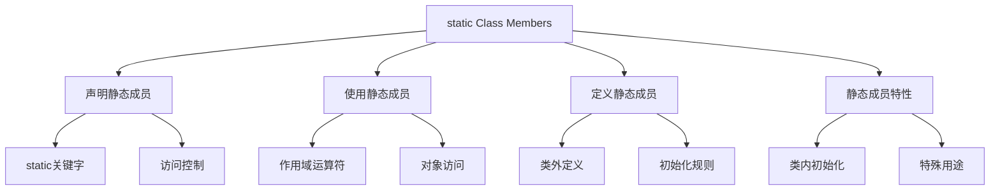

# 📘 7.6 static Class Members (静态类成员)

> 来源说明：C++ Primer 7.6 | 本节涵盖：静态类成员的定义、使用和特性

---

## 🗺️ 知识体系图



## 🧠 核心概念总览

* [*知识点1: 静态成员概念与声明*](#id1)：静态成员与类关联而非对象
    * [*知识点1.1: 静态数据成员特性*](#id2)：静态数据成员被所有对象共享
    * [*知识点1.2: 静态成员函数特性*](#id3)：静态成员函数无this指针
* [*知识点2: 使用静态成员*](#id4)：多种访问静态成员的方式
* [*知识点3: 定义静态成员*](#id5)：类外定义和初始化规则
    * [*知识点3.1: 静态数据成员定义*](#id6)：必须在类外定义和初始化
    * [*知识点3.2: 静态成员函数定义*](#id7)：类外定义不重复static关键字
* [*知识点4: 类内初始化静态成员*](#id8)：constexpr和const整型的特例
* [*知识点5: 静态成员的特殊用途*](#id9)：不完整类型和默认参数

---

<a id="id1"></a>
## ✅ 知识点1: 静态成员概念与声明

**理论**
* 静态成员是与**类本身**关联的成员，而不是与类的各个对象关联
* 适用于需要被所有对象共享的数据，如银行的当前基准利率
* 从效率角度，避免每个对象都存储相同数据的副本
* 当共享数据变化时，确保所有对象都能使用新值

**教材示例代码**
```cpp
class Account {
public:
    void calculate() { amount += amount * interestRate; }
    static double rate() { return interestRate; }
    static void rate(double);
private:
    std::string owner;
    double amount;
    static double interestRate;
    static double initRate();
};
```

**注意点**
* 💡 使用`static`关键字声明静态成员，可出现在`public`或`private`区域

---

<a id="id2"></a>
## ✅ 知识点1.1: 静态数据成员特性

**理论**
* 静态数据成员存在于任何对象**之外**
* 对象**不包含**与静态数据成员相关的数据
* **所有**类对象共享同一个静态数据成员实例
* 在示例中，每个`Account`对象包含`owner`和`amount`，但所有对象共享一个`interestRate`


**注意点**
* 💡 静态数据成员提供了一种在类的所有实例间共享数据的方式
* ⚠️ 静态数据成员不占用单个对象的存储空间
* ⚠️ 静态数据成员的类型**可以是**const、引用、数组、类类型等

---

<a id="id3"></a>
## ✅ 知识点1.2: 静态成员函数特性

**理论**
* 静态成员函数**不绑定**到任何特定对象
* 静态成员函数**没有**`this`指针
* 因此**不能**声明为`const`成员函数
* **不能**在静态成员函数体中引用`this`（显式或隐式）

**注意点**
* ⚠️ 静态成员函数**不能**调用非静态成员，因为缺乏`this`指针
* 💡 静态成员函数**可以**直接访问其他静态成员

---

<a id="id4"></a>
## ✅ 知识点2: 使用静态成员

**理论**
* 可以通过**作用域运算符**直接访问静态成员
* 也可以通过类的对象、引用或指针访问静态成员
* 成员函数**可以直接**使用静态成员，无需作用域运算符

**教材示例代码**
```cpp
// 通过作用域运算符直接访问
double r;
r = Account::rate();

// 通过对象、引用或指针访问
Account ac1;
Account &ac2 = ac1;
r = ac1.rate();    // 通过Account对象
r = ac2.rate();    // 通过Account引用
r = ac1->rate();   // 通过Account指针

// 成员函数内直接使用
class Account {
public:
    void calculate() { amount += amount * interestRate; }
    // ...
};
```

**注意点**
* 💡 推荐使用**作用域运算符**访问，明确表示访问的是类成员而非对象成员
* ⚠️ 通过对象访问静态成员可能误导读者认为该成员是对象的一部分

---

<a id="id5"></a>
## ✅ 知识点3: 定义静态成员

**理论**
* 静态成员函数**可以**在类内或类外定义
* 在类外定义时，**不用**重复`static`关键字，只需在类中声明即可
* 静态数据成员**不是**类对象的一部分，**不由**构造函数初始化
    * 因此通常**不能**在类内初始化静态数据成员
    * 我们只能在类外初始化，且静态成员只能被定义一次

**注意点**
* ⚠️ 在类外引用类静态成员时**必须**使用作用域运算符指定所属类
* 🔄 `static`关键字只在类内声明时使用

---

<a id="id6"></a>
### ✅ 知识点3.1: 静态数据成员定义

**理论**
* 必须在类外定义和初始化每个静态数据成员
* 类似于全局对象，在**函数外**定义，存在于整个程序生命周期
* 定义后直到程序**结束**才被销毁
* 定义的方式和函数定义相似：
    * `Type class::member = initializer;`


**教材示例代码**
```cpp
// 定义并初始化静态类成员
double Account::interestRate = initRate();
```
**代码解析**
* 静态成员属于整个程序，而不是对象的一部分
* 因此类内部不能为它分配存储，只能声明
* 如果需要存储的话需要真正的“定义”，因此必须单独写一次
* 定义静态数据成员时，一旦看到类名，剩余部分就在类作用域内
* 即使`initRate()`是`private`，也可以在定义`interestRate`时使用它

**注意点**
* ⚠️ **最佳实践**：将静态数据成员定义放在包含类非内联成员函数定义的文件中
    * 非内联成员函数一般都写在对应的 `.cpp`中，因为它们的定义只能出现一次，而 `.h` 文件可能被多个`.cpp`包含，会引发多重定义错误, 静态成员也是这个道理

---

<a id="id7"></a>
### ✅ 知识点3.2: 静态成员函数定义
**理论**
* 静态成员函数定义**可以**访问类的私有成员

**教材示例代码**
```cpp
// 类外定义静态成员函数，不重复static关键字
void Account::rate(double newRate)
{
    interestRate = newRate;
}
```

**注意点**
* ⚠️ 在类外定义静态成员函数时，不要写`static`关键字


---

<a id="id8"></a>
## ✅ 知识点4: 类内初始化静态成员

**理论**
* 一般情况下，static 数据成员不能在类内初始化，但有两种例外：

    1. `static const` 整型类型（integral type）

    2. `static constexpr` 字面类型（literal type）
* 初始化器**必须是**常量表达式
* 如果 `static const` / `static constexpr` 的值只用于编译期（比如数组维度），可以不在类外定义
* 但如果用到了这个成员的“地址”或“引用”，**就必须**类外定义
* 如果类内已经写了初始化，则类外定义时**不能再**写初始化

**教材示例代码**
```cpp
class Account {
public:
    static double rate() { return interestRate; }
    static void rate(double);
private:
    static constexpr int period = 30;  // period是常量表达式
    double daily_tbl[period];          // 使用静态成员指定数组维度
};
```
```cpp
int x = Account::period;      // 有些编译器也不会出错，但标准要求定义
f(Account::period);           // ❌ 如果 f 需要 const int&，就必须类外定义
cout << &Account::period;     // ❌ 一定需要类外定义
```
```cpp
// 在类内提供初始化器后，成员定义不能指定初始值
constexpr int Account::period;  // 初始值在类定义中提供
```

**代码解析**
* 如果只使用于数组维度**不需要**类外定义因为编译器不需要在运行期取它的地址，也不需要实体对象
* 然而当我们遇到第二段代码的情况时，因为编译期“展开常量”已经不够了
* 程序需要一个“真实存在的变量存储空间”，所以必须在类外面定义

**注意点**
* 💡 **最佳实践**：即使const静态数据成员在类体内初始化，通常也应在类定义外定义它


---

<a id="id9"></a>
## ✅ 知识点5: 静态成员的特殊用途

**理论**
* 静态成员**独立**于任何其他对象而存在
* 可以以非静态数据成员不允许的方式使用：
    * 静态数据成员可以有**不完整**类型(详见7.12)
    * 静态数据成员可以有与其**所属类相同**的类型
    * 静态成员**可以用作**默认参数

**教材示例代码**
```cpp
// 静态成员可以有不完整类型
class Bar {
public:
    // ...
private:
    static Bar mem1;  // 正确：静态成员可以有不完整类型
    Bar *mem2;        // 正确：指针成员可以有不完整类型  
    Bar mem3;         // 错误：数据成员必须有完整类型
};

// 静态成员用作默认参数
class Screen {
public:
    // bkground引用稍后在类定义中声明的静态成员
    Screen& clear(char = bkground);
private:
    static const char bkground;
};
```

**注意点**
* ⚠️ 默认实参在没有对象存在的环境中被解析，非静态成员属于具体对象，但默认实参中没有对象可供取值，因此会报错
* 🔄 静态成员的特殊性质使其在设计模式中非常有用

---

## 🔑 核心要点总结

1. **共享性**：静态成员与类关联，被所有对象共享，适合存储类级别的数据
2. **独立性**：静态成员存在于对象之外，不占用单个对象的存储空间
3. **访问灵活性**：可通过作用域运算符、对象、引用或指针多种方式访问
4. **定义特殊性**：静态数据成员必须在类外定义和初始化，有特定的初始化规则
5. **用途广泛性**：支持不完整类型、默认参数等特殊用法，扩展了设计可能性

## 📌 考试速记版

**口诀**：*静态共享类级别，外定义内声明特，const整型可内初，默认参数静可设*

**关键对比表格**：
| 特性 | 静态成员 | 普通成员 |
|------|----------|----------|
| 关联对象 | 类 | 对象实例 |
| 存储 | 独立存储 | 对象内存储 |
| this指针 | 无 | 有 |
| const成员 | 不能声明 | 可以声明 |
| 默认参数 | 可以用作 | 不能用作 |
| 类型限制 | 可有不完整类型 | 必须有完整类型 |