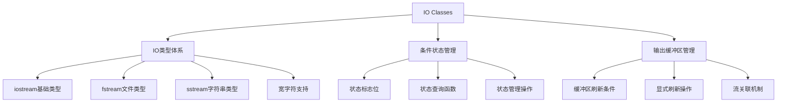

# 📘 8.1 The IO Classes (IO类)

> 来源说明：C++ Primer 8.1 | 本节涵盖：C++ IO类的基本概念、类型体系、条件状态管理和输出缓冲区

---

## 🗺️ 知识体系图



## 🧠 核心概念总览

* [*知识点1: IO类型体系*](#id1)：C++ IO类的层次结构和继承关系
    * [*知识点1.1: 基础IO类型*](#id2)：iostream、fstream、sstream三大类
    * [*知识点1.2: 宽字符支持*](#id3)：wchar_t类型的IO操作支持
    * [*知识点1.3: 继承关系*](#id4)：IO类型的继承层次和设计原理
* [*知识点2: IO对象限制*](#id5)：IO对象的拷贝和赋值限制
* [*知识点3: 条件状态管理*](#id6)：IO操作错误状态检测和处理
    * [*知识点3.1: 状态标志位*](#id7)：badbit、failbit、eofbit、goodbit
    * [*知识点3.2: 状态查询函数*](#id8)：good()、bad()、fail()、eof()
    * [*知识点3.3: 状态管理操作*](#id9)：clear()、setstate()、rdstate()
* [*知识点4: 输出缓冲区管理*](#id10)：输出缓冲区的刷新机制
    * [*知识点4.1: 自动刷新条件*](#id11)：程序正常结束、缓冲区满等
    * [*知识点4.2: 显式刷新操作*](#id12)：endl、flush、ends操纵符
    * [*知识点4.3: unitbuf操纵符*](#id13)：设置每次输出后自动刷新
    * [*知识点4.4: 流关联机制*](#id14)：输入输出流的关联关系

---

<a id="id1"></a>
## ✅ 知识点1: IO类型体系

**理论**
* C++ IO库支持多种数据源和目标：控制台、文件、内存字符串
* 默认处理`char`类型数据，同时支持宽字符`wchar_t`
* IO类型定义在三个独立头文件中，形成完整的类型体系

**注意点**
* 💡 理解不同类型适用于不同场景：控制台、文件、字符串
* 🔄 所有IO类型共享相同的操作接口，便于统一使用

---

<a id="id2"></a>
## ✅ 知识点1.1: 基础IO类型

**理论**
* **`<iostream>`**：定义基础流类型，用于控制台IO
  * `istream`：从流读取数据
  * `ostream`：向流写入数据  
  * `iostream`：读写流
* **`<fstream>`**：定义文件流类型，用于文件IO
  * `ifstream`：从文件读取
  * `ofstream`：向文件写入
  * `fstream`：读写文件
* **`<sstream>`**：定义在内存中的字符串流类型，用内存中的于字符串IO
  * `istringstream`：从字符串读取
  * `ostringstream`：向字符串写入
  * `stringstream`：读写字符串


**注意点**
* ⚠️ 注意头文件名称的正确拼写：`<iostream>`、`<fstream>`、`<sstream>`
* 💡 根据数据源选择适当的IO类型：控制台用`iostream`，文件用`fstream`，字符串处理用`sstream`

---

<a id="id3"></a>
## ✅ 知识点1.2: 宽字符支持

**理论**
* 为支持使用宽字符的语言，库定义了操作`wchar_t`的类型
* 宽字符类型名称以 **`w`开头**，如`wcin`、`wcout`、`wcerr`
* 宽字符类型与普通`char`类型定义在相同的头文件中
    * 比如`fstream`头文件同时定义了`ifstream`和`wifstream`类型

**教材示例代码**
```cpp
// 宽字符类型对应关系
wistream, wostream, wiostream  // 对应istream, ostream, iostream
wifstream, wofstream, wfstream  // 对应ifstream, ofstream, fstream
wistringstream, wostringstream, wstringstream  // 对应istringstream, ostringstream, stringstream
```

**注意点**
* 💡 处理国际化文本或需要宽字符支持的语言时使用宽字符版本
* 🔄 宽字符类型与普通字符类型接口**一致**，便于代码迁移

---

<a id="id4"></a>
## ✅ 知识点1.3: 继承关系

**理论**
* IO库使用**继承**来忽略不同流类型的差异
    * `ifstream`和`istringstream`继承自`istream`，与`cin`有共同的使用方法
    * `ofstream`和`ostringstream`继承自`ostream`，与`cout`有共同的使用方法
* 继承使得我们可以**统一**处理不同类型的流对象

**教材示例代码**
```cpp
// 可以像使用cin一样使用ifstream或istringstream
ifstream file_input("data.txt");
istringstream string_input("hello world");

// 两者都可以使用相同的istream接口
char ch;
file_input >> ch;        // 从文件读取
string_input >> ch;      // 从字符串读取
```

**注意点**
* 🔄 所有流类型共享相同的操作符(`>>`, `<<`)和成员函数(`getline`等)


---

<a id="id5"></a>
## ✅ 知识点2: IO对象限制

**理论**
* IO类型对象**不能拷贝**也不能**赋值**
* 因此不能将流对象作为函数参数或返回值的类型（按值传递）
* 需要进行IO操作的函数通常通过**引用**方式传递和返回流对象
* 由于IO操作会改变流状态，引用**必须**是非`const`的

**教材示例代码**
```cpp
ofstream out1, out2;
out1 = out2; // 错误：不能赋值流对象

ofstream print(ofstream); // 错误：不能初始化ofstream参数
out2 = print(out2); // 错误：不能拷贝流对象
```

**注意点**
* ⚠️ IO对象包含状态信息，拷贝会导致状态不一致
* ⚠️  始终使用引用传递IO对象：`istream&`、`ostream&`


---

<a id="id6"></a>
## ✅ 知识点3: 条件状态管理(condition state)

**理论**
* IO操作可能发生错误，IO类提供机制来检测和管理这些错误状态
* 流对象有内部**状态标志(condition state)**，指示最近操作的成功或失败
* 在使用流对象前应该检查其状态，确保处于有效状态


**注意点**
* ⚠️ 一旦流进入错误状态，后续IO操作都会失败

---

<a id="id7"></a>
## ✅ 知识点3.1: 状态标志位

**理论**
* `strm::iostate`类型：机器相关的整型类型，用作**位集合**来表示条件状态
* 四个`constexpr`值表示特定的位模式：
  * `strm::badbit`：系统级错误，通常**不可**恢复
  * `strm::failbit`：可恢复错误，如类型不匹配, 通常可以恢复
  * `strm::eofbit`：到达文件末尾
  * `strm::goodbit`：值为0，表示没有错误
* 到达文件末尾时同时设置`eofbit`和`failbit`

**注意点**
* ⚠️ 
* 💡 任何错误位被设置时，流作为条件**都会**返回false
* 🔄 可以使用位操作符(bitwise operator)(详见4.8)测试或设置多个标志位

---

<a id="id8"></a>
## ✅ 知识点3.2: 状态查询函数

**理论**
* `s.good()`：所有错误位**都没有**设置在流中时返回`true`
* `s.bad()`：`badbit`设置在流中时返回`true`
* `s.fail()`：`failbit`或`badbit`设置在流中时返回`true`  
* `s.eof()`：`eofbit`被设置在流中时返回`true`

**教材示例代码**
```cpp
int val;
while (cin >> val) {
    // 读取操作成功时执行
    // 如果输入非数字字符或遇到EOF，条件为false
}
```
**代码解析**
* 当我们输入`boo`到标准输入的时候，读取会失败
* 因为输入符期望读取一个`int`但是读到的是`B`字符
* 结果就是`cin`会进入错误状态，就像到了end-of-file也会进入错误状态
* 我们只能在非错误状态读写
* 代码需要在使用流之前检查其状态
* while检查`>>`表达式返回的流状态

**注意点**
* 💡 确定**流整体状态**的最佳方法：使用`good()`或`fail()`
* ⚠️ `eof()`和`bad()`只检查特定错误，不反映整体状态
* 🔄 流作为条件表达式时，等价于调用`!fail()`

---

<a id="id9"></a>
## ✅ 知识点3.3: 状态管理操作

**理论**
* `s.rdstate()`：**返回**当前的流`s`的状态的`strm::iostate`值
* `s.setstate(flags)`：不覆盖，只在当前状态上<b>“加”</b>新指定状态位，`flags`类型为`strm::iostate`
* `s.clear()`：无参数版本**清除所有**状态标志位，使流恢复有效状态，返回`void`
* `s.clear(flags)`：把`s`的状态**设成指定 `flags`状态**，`flags`类型为`strm::iostate`, 返回`void`
* 使用位操作可以精确控制要清除或设置的错误位

**教材示例代码**
```cpp
// 保存并恢复流状态
auto old_state = cin.rdstate();  // 记住当前状态
cin.clear();                     // 使cin有效
process_input(cin);              // 使用cin
cin.setstate(old_state);         // 恢复cin到原状态

// 清除特定错误位
cin.clear(cin.rdstate() & ~cin.failbit & ~cin.badbit);
```

**注意点**
* ⚠️ 修改流状态时要小心，避免丢失重要的错误信息

---

<a id="id10"></a>
## ✅ 知识点4: 输出缓冲区管理

**理论**
* 每个输出流管理一个缓冲区(buffer)，用于暂存程序写入的数据
* 使用缓冲区可以提高性能：操作系统可以合并多个输出操作
  * 缓冲区减少了系统调用的次数，提高了IO效率
* 缓冲区会在特定条件下被刷新（写入实际设备）

**注意点**
* ⚠️ 程序崩溃时输出缓冲区不会自动刷新，可能会有数据还在缓冲区内：
  * 因此调试时要确保数据已实际写出，避免浪费时间追踪“看似未执行”的代码

---

<a id="id11"></a>
## ✅ 知识点4.1: 自动刷新条件

**理论**
缓冲区在以下情况下自动刷新：
1. **程序正常结束**：`main`函数返回时刷新所有输出缓冲区
2. **缓冲区满**：写入下一个值前刷新已满的缓冲区  
3. **使用操纵符**：如`endl`显式请求刷新
4. **unitbuf设置**：设置每次输出操作后自动刷新
    * 默认情况下，`cerr`设置了`unitbuf`，因此写到`cerr`的内容立即刷新
5. **流关联**：读/写被关联的流时刷新关联流的缓冲区
    * `cin`和`cerr`都默认关联到`cout`，因此读`cin`或写`cerr`都会刷新`cout`的缓冲区


---

<a id="id12"></a>
## ✅ 知识点4.2: 显式刷新操作

**理论**
* `endl`：输出**换行符**并刷新缓冲区
* `flush`：刷新缓冲区，**不添加**任何字符
* `ends`：输出**空字符**并刷新缓冲区

**教材示例代码**
```cpp
cout << "hi!" << endl;   // 输出hi!和换行，然后刷新缓冲区
cout << "hi!" << flush;  // 输出hi!，然后刷新缓冲区  
cout << "hi!" << ends;   // 输出hi!和空字符，然后刷新缓冲区
```

**注意点**
* ⚠️ 过度使用刷新操作会降低IO性能

---

<a id="id13"></a>
### ✅ 知识点4.3: unitbuf操纵符

**理论**
* `unitbuf`：设置流在每次写操作后都刷新缓冲区
* `nounitbuf`：恢复正常的系统管理缓冲区刷新

**教材示例代码**
```cpp
cout << unitbuf;     // 所有写操作都立即刷新
// 任何输出都立即刷新，无缓冲
cout << nounitbuf;   // 恢复到正常缓冲
```

**注意点**
* ⚠️ 设置`unitbuf`会显著影响IO性能，应谨慎使用
* 💡 适用于需要立即看到输出的调试场景
* 🔄 `cerr`默认设置了`unitbuf`，确保错误信息及时显示

---

<a id="id14"></a>
### ✅ 知识点4.4: 流关联机制

**理论**
* 当输入流关联到输出流时，读输入流会先刷新关联的输出流缓冲区
* 库默认将`cout`关联到`cin`，因此`cin >> ival`会刷新`cout`缓冲区
* `tie()`函数用于管理流关联关系

**教材示例代码**
```cpp
cin.tie(&cout); // 说明：库已默认关联cin和cout

// 解除cin的关联
ostream *old_tie = cin.tie(nullptr); // cin不再关联任何流

// 将cin关联到cerr（通常不是好主意）
cin.tie(&cerr); // 读cin会刷新cerr，而不是cout

// 恢复正常的cin-cout关联
cin.tie(old_tie); // 重新建立cin和cout的关联
```

**注意点**
* 💡 交互式系统通常应该关联输入流和输出流，确保提示信息在读取前显示
* ⚠️ 每个流最多只能关联一个输出流，但多个流可以关联到同一个输出流
* 🔄 `tie()`无参数版本返回当前关联的流指针，空指针表示没有关联

---

## 🔑 核心要点总结

1. **IO类型体系**：三大类(iostream/fstream/sstream)通过继承提供统一接口，支持多态使用
2. **对象限制**：IO对象不能拷贝赋值，必须通过引用传递
3. **状态管理**：通过badbit/failbit/eofbit/goodbit检测错误，使用clear()/setstate()管理状态
4. **缓冲区机制**：自动刷新+手动刷新(endl/flush/ends)+流关联，平衡性能与及时性
5. **错误处理**：始终检查流状态，使用流作为条件或显式调用状态查询函数

## 📌 考试速记版

**口诀**：*继承统一接口，禁止拷贝赋值，状态四bit管理，缓冲三法刷新*

**关键对比表格**：
| 状态位 | 含义 | 可恢复性 |
|--------|------|----------|
| `badbit` | 系统级错误 | 通常不可恢复 |
| `failbit` | 可恢复错误 | 通常可恢复 |
| `eofbit` | 文件结束 | 不可恢复 |
| `goodbit` | 无错误 | - |

**刷新方法对比**：
| 方法 | 效果 | 使用场景 |
|------|------|----------|
| `endl` | 换行+刷新 | 标准行输出 |
| `flush` | 仅刷新 | 需要立即输出 |
| `ends` | 空字符+刷新 | 字符串处理 |
| `unitbuf` | 每次输出后刷新 | 调试和错误输出 |