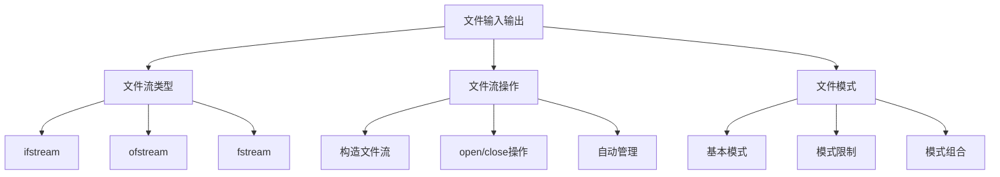

# 📘 8.2 File Input and Output (文件输入和输出)

> 来源说明：C++ Primer 8.2 | 本节涵盖：C++文件流的基本概念、操作方法和文件模式

---

## 🗺️ 知识体系图



## 🧠 核心概念总览

* [*知识点1: 文件流类型概述*](#id1)：fstream头文件定义的三种文件流类型
* [*知识点2: 文件流特定操作*](#id2)：fstream特有的文件管理操作
* [*知识点3: 使用文件流对象*](#id3)：文件流的创建、打开和关闭
    * [*知识点3.1: 替代iostream对象*](#id4)：文件流对象在函数参数中的使用
    * [*知识点3.2: open和close成员函数*](#id5)：显式文件管理操作
    * [*知识点3.3: 自动构造和析构*](#id6)：文件流的生命周期管理
* [*知识点4: 文件模式*](#id7)：文件打开模式的定义和含义
    * [*知识点4.1: 模式限制和默认值*](#id8)：各文件流类型的默认模式
    * [*知识点4.2: out模式的特性*](#id9)：out模式默认会截断文件
    * [*知识点4.3: 文件模式的重置*](#id10)：每次open调用都会重置文件模式

---

<a id="id1"></a>
## ✅ 知识点1: 文件流类型概述

**理论**
* `fstream`头文件定义了三种支持文件IO的类型：
  * **ifstream**：从给定文件读取数据
  * **ofstream**：向给定文件写入数据  
  * **fstream**：对给定文件进行读写操作
* 这些类型提供与`cin`和`cout`相同的操作
* 可以使用IO运算符(`<<`和`>>`)读写文件
* 可以使用`getline`读取`ifstream`
* 支持8.1中介绍的所有IO操作比如我们对`cin`和`cout`的操作

**注意点**
* 💡 文件流类型继承自`iostream`类型，具有相同的接口
* 🔄 可以使用相同的文件进行输入和输出（在§17.5.3中详细说明）

---

<a id="id2"></a>
## ✅ 知识点2: 文件流特定操作

**理论**
* 除了继承自`iostream`的操作外，`fstream`类型还添加了管理关联文件的成员
* 这些操作可以在`fstream`、`ifstream`或`ofstream`对象上调用
* 但不能在其他IO类型上调用
* `fstream`特定操作，注意这些构造函数都是**显示**的：
    1. `fstream fstrm;`: 
        * 创建未绑定的文件流, `fstream`是在`fstream`头文件中定义的类型之一
    2. `fstream fstrm(s)`: 
        * 创建一个`fstream`文件流并立即打开文件`s`
        * `s` 可以是 `std::string`或者是 C 风格字符串（`const char*`）
    3. `fstream fstrm(s, mode)`:
        * 和上面类似，但 可以指定打开模式
    4. `fstrm.open(s)`:
        * 打开文件`s`，并绑定到已有的`fstsream`对象
        * 如果已经使用默认构造创建了流，需要用该函数绑定文件
        * `s` 可以是 `std::string`或者是 C 风格字符串（`const char*`）
        * 默认文件`mode`由`fstream`的类型决定
        * 关闭被流所绑定的文件时候，会返回`void`
    5. `fstrm.open(s, mode);`:
        * 和上面一样，只是附带 mode
    6. `fstrm.close();`:
        * 关闭文件,返回`void`
    7. `fstrm.is_open()`:
        * 返回`bool`，表示文件是否已成功打开且未被关闭


**注意点**
* ⚠️ 接受文件名的构造函数是`explicit`的


---

<a id="id3"></a>
## ✅ 知识点3: 使用文件流对象

**理论**
* 当要读写文件时，需要**定义**文件流对象并将其与文件**关联**
* 每个文件流类都定义了名为`open`的成员函数，执行系统特定的操作来定位并打开文件
* 创建文件流时可以（可选地）提供文件名，此时会**自动**调用`open`

**教材示例代码**
```cpp
ifstream in(ifile);  // 构造ifstream并打开给定文件
ofstream out;        // 未关联任何文件的输出文件流
```

**注意点**
* 💡 新标准支持库string和C风格字符数组作为文件名,旧版本只支持C风格字符数组


---

<a id="id4"></a>
## ✅ 知识点3.1: 替代`iostream`对象

**理论**
* **可以**在需要原始类型对象的地方使用继承类型的对象
* 这意味着接受`iostream`类型<b>引用（或指针）</b>的函数可以代表相应的`fstream`(或`sstream`)类型调用
* 如果函数接受`ostream&`，可以传递`ofstream`对象
* 同样适用于`istream`和`ifstream`

**教材示例代码**
```cpp
ifstream input(argv[1]);  // 打开销售交易文件
ofstream output(argv[2]); // 打开输出文件
Sales_data total;         // 保存运行总和的变量

if (read(input, total)) { // 读取第一笔交易
    Sales_data trans;     // 保存下一笔交易数据的变量
    while(read(input, trans)) { // 读取剩余交易
        if (total.isbn() == trans.isbn()) 
            total.combine(trans); // 更新运行总和
        else {
            print(output, total) << endl; // 输出结果
            total = trans; // 处理下一本书
        }
    }
    print(output, total) << endl; // 输出最后一笔交易
} else {
    cerr << "No data?!" << endl; // 没有输入
}
```

**注意点**
* 💡 可以将fstream对象传递给接受istream/ostream参数的函数
* 🔄 这种设计体现了面向对象的多态性

---

<a id="id5"></a>
## ✅ 知识点3.2: open和close成员函数

**理论**
* 定义空文件流对象后，可以通过调用`open`将其与文件关联
* 如果`open`调用失败，会设置`failbit`
* 由于`open`可能失败，通常需要验证是否成功
* 文件流一旦打开就保持与指定文件的关联
* 对已打开的文件流调用`open`会失败并设置`failbit`

**教材示例代码**
```cpp
ifstream in(ifile);  // 构造fstream并打开给定文件
ofstream out;        // 未关联任何文件的输出文件流
out.open(ifile + ".copy"); // 打开指定文件

// 验证open是否成功
if (out) {  // 检查open是否成功
    // open成功，可以使用文件
}

in.close();          // 关闭文件
in.open(ifile + "2"); // 打开另一个文件
```

**代码解析**
* 类似我们使用`cin`
* 如果`open()`失败了， 那么调用这个函数的对象`cout`的`failbit`就是被设置
* 后续想使用这个文件流的话都会失败
* 对一个已经打开的文件流再次使用`open()`的话，也会失败并设置`failbit`, 后续使用也会失败
* 如果`open()`成功，会设置流状态使`good()`返回`true`

**注意点**
* ⚠️ 必须首先关闭现有文件，才能关联新文件


---

<a id="id6"></a>
## ✅ 知识点3.3: 自动构造和析构

**理论**
* 文件流对象在**作用域结束时自动销毁并关闭**关联的文件
* 当`fstream`对象被销毁时，会自动调用`close`
* 这种特性使得在循环中处理多个文件变得简单安全

**教材示例代码**
```cpp
// 对传递给程序的每个文件
for (auto p = argv + 1; p != argv + argc; ++p) {
    ifstream input(*p);  // 创建输入并打开文件
    if (input) {         // 如果文件正常，"处理"这个文件
        process(input);
    } else {
        cerr << "couldn't open: " + string(*p);
    }
    // input在每次迭代结束时超出作用域并被销毁
}
```

**注意点**
* 💡 利用局部变量的自动析构简化文件管理
* ⚠️ 当`fstream`对象被销毁时，`close会自动调用

---

<a id="id7"></a>
## ✅ 知识点4: 文件模式

**理论**
* 每个流都有关联的文件模式，表示文件的使用方式
* 文件模式在打开文件时指定，可以在调用open或初始化流时提供

**教材示例代码**
```cpp
// 不同的文件模式组合
ofstream out1("file", ios::out);      // 输出模式
ofstream out2("file", ios::out | ios::app); // 输出和追加模式
ifstream in1("file", ios::in);        // 输入模式
fstream io1("file", ios::in | ios::out); // 输入输出模式
```

**注意点**
* 💡 文件模式控制文件的打开方式和可进行的操作

---

<a id="id8"></a>
### ✅ 知识点4.1: 模式限制和默认值

**理论**
* 文件模式的使用有特定限制：
  * `out`只能为`ofstream`或`fstream`对象设置
  * `in`只能为`ifstream`或`fstream`对象设置
  * `trunc`只有在也指定了`out`时才能设置
  * 只要不指定`trunc`，就可以指定`app`模式

**文件模式含义表**
| 模式 | 含义 |
|------|------|
| in | 为输入打开 |
| out | 为输出打开 |
| app | 每次写前定位到文件尾 |
| ate | 打开后立即定位到文件尾 |
| trunc | 截断文件 |
| binary | 以二进制模式进行IO操作 |

**默认文件模式**
* `ifstream`：默认以`in`模式打开
* `ofstream`：默认以`out`模式打开  
* `fstream`：默认以`in`和`out`模式打开

**注意点**
* ⚠️ 默认情况下，以out模式打开的文件会被截断
* 💡 要保留out模式打开的文件内容，必须显式指定app或in模式

---

<a id="id9"></a>
### ✅ 知识点4.2: out模式的特性

**理论**
* 默认情况下，打开ofstream时会丢弃文件内容
* 防止ostream清空给定文件的唯一方法是指定app模式

**教材示例代码**
```cpp
// file1在这些情况下都会被截断
ofstream out("file1");                    // out和trunc是隐式的
ofstream out2("file1", ofstream::out);    // trunc是隐式的  
ofstream out3("file1", ofstream::out | ofstream::trunc);

// 要保留文件内容，必须显式指定app模式
ofstream app("file2", ofstream::app);     // out是隐式的
ofstream app2("file2", ofstream::out | ofstream::app);
```

**注意点**
* ⚠️ **警告**：保留被ofstream打开的文件的现有数据的唯一方法是显式指定app或in模式

---

<a id="id10"></a>
### ✅ 知识点4.3: 文件模式的重置

**理论**
* 给定流的文件模式可能在每次打开文件时改变
* 每次调用open时都会设置文件模式，无论是显式还是隐式
* 只要未指定模式，就使用默认值

**教材示例代码**
```cpp
ofstream out;                       // 未设置文件模式
out.open("scratchpad");             // 模式隐式为out和trunc
out.close();                        // 关闭out以便用于不同文件
out.open("precious", ofstream::app); // 模式为out和app
out.close();
```

**注意点**
* 💡 每次open调用都会重置文件模式
* 🔄 可以利用这一特性在不同的打开操作中使用不同的模式

---

## 🔑 核心要点总结

1. **三种文件流类型**：ifstream用于输入，ofstream用于输出，fstream用于双向IO
2. **自动文件管理**：文件流对象析构时自动关闭文件，简化资源管理
3. **多态兼容性**：文件流对象可以在需要iostream的地方使用，体现继承优势
4. **文件模式控制**：通过不同的模式组合控制文件的打开方式和行为
5. **默认截断行为**：out模式默认会清空文件，需要显式指定app模式来保留内容

## 📌 考试速记版

**文件模式速记表**
| 模式 | 适用流类型 | 效果 |
|------|------------|------|
| in | ifstream, fstream | 输入访问 |
| out | ofstream, fstream | 输出访问 |
| app | ofstream, fstream | 追加写入 |
| trunc | ofstream (+out) | 清空文件 |
| ate | 所有文件流 | 打开即到文件尾 |
| binary | 所有文件流 | 二进制模式 |

**口诀**：*"输入if，输出of，双向f；out默认清，app保内容，每次open重置模式"*

**关键规则**：
- ⚠️ ofstream默认会截断文件
- 💡 使用app模式保留文件内容  
- 🔄 文件流可替代iostream作为函数参数
- ✅ 利用局部作用域自动管理文件资源