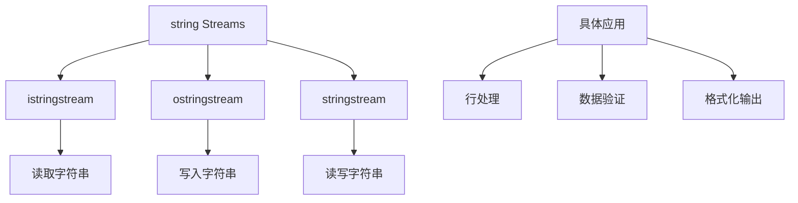

# 📘 8.3 string Streams (字符串流)

> 来源说明：C++ Primer 8.3 | 本节涵盖：字符串流的基本概念、类型和使用方法

---

## 🗺️ 知识体系图



## 🧠 核心概念总览

* [*知识点1: 字符串流概述*](#id1)：字符串流的基本定义和类型
* [*知识点2: stringstream特定操作*](#id2)：stringstream的专用成员函数
* [*知识点3: 与fstream的区别*](#id3)：stringstream与文件流的差异
* [*知识点4: 使用istringstream*](#id4)：istringstream的应用场景和示例
    * [*知识点4.1: 数据结构设计*](#id5)：PersonInfo类的设计
    * [*知识点4.2: 数据处理流程*](#id6)：逐行读取和解析数据
* [*知识点5: 使用ostringstream*](#id7)：ostringstream的应用场景和示例
    * [*知识点5.1: 数据验证和格式化*](#id8)：电话号码验证和格式化输出

---

<a id="id1"></a>
## ✅ 知识点1: 字符串流概述

**理论**
* `sstream`头文件定义了三种支持内存IO的类型
* 这些类型从`string`读取或向`string`写入，就像`string`是IO流一样
    * <b>`istringstream`</b>从`string`读取数据
    * <b>`ostringstream`</b>向`string`写入数据  
    * <b>`stringstream`</b>既可读取又可写入`string`
* 与`fstream`类型类似，`sstream`中定义的类型继承自`iostream`头文件中的类型
    * 继承关系：`stringstream`类型继承自`iostream`的接

**注意点**
* 💡 字符串流允许将字符串当作流来处理，便于数据解析和格式化


---

<a id="id2"></a>
## ✅ 知识点2: `stringstream`特定操作

**理论**
* 除了继承的操作外，`sstream`中定义的类型添加了**管理关联字符串**的成员
* 这些操作可以调用在`stringstream`对象上，但不能调用在其他IO类型上:
    * `sstream strm;`: 
        `strm`是**未绑定**`stringstream`对象，`sstream`被定义在头文件`sstream`中
    * `sstream strm(s);`:  
        持有字符串`s`副本的`sstream`的对象，**显式构造函数**
    * `strm.str()`:
        **返回**`strm`持有的字符串副本
    * `strm.str(s)`:
        将字符串`s`**复制到**`strm`中，返回`void`


---

<a id="id3"></a>
## ✅ 知识点3: 与fstream的区别

**理论**
* 尽管`fstream`和`sstream`共享`iostream`的接口，但它们没有其他相互关系：
    * **不能在**`stringstream`上使用`open`和`close`操作
    * **不能在**`fstream`上使用`str`操作

**注意点**
* ⚠️ 文件流和字符串流的API不互通，各有专用操作
* 🔄 虽然接口相似，但底层机制完全不同

---

<a id="id4"></a>
## ✅ 知识点4: 使用istringstream

**理论**
* `istringstream`常用于需要处理整行数据，然后又需要处理行内单个单词的情况
* 典型应用场景：解析包含结构化数据的文本行

**教材示例代码**
```cpp
// 示例：包含人名和多个电话号码的数据文件
morgan 2015552368 8625550123
drew 9735550130
lee 6095550132 2015550175 8005550000
```

**注意点**
* 💡 每行记录以名字开头，后跟一个或多个电话号码
* 🔄 `istringstream`可以将字符串分解为多个组成部分

---

<a id="id5"></a>
## ✅ 知识点4.1: 数据结构设计

**理论**
* 定义简单类来表示输入数据
* 使用结构体存储人员信息和电话号码列表

**教材示例代码**
```cpp
// members are public by default
struct PersonInfo {
    string name;
    vector<string> phones;
};
```

**注意点**
* 💡 结构体默认成员为public，便于直接访问
* 🔄 使用vector容纳可变数量的电话号码

---

<a id="id6"></a>
## ✅ 知识点4.2: 数据处理流程

**理论**
* 程序读取数据文件并构建`PersonInfo`的`vector`
* `vector`中的每个元素对应文件中的一条记录
* 使用循环逐行读取输入，然后提取每个人的姓名和电话号码

**教材示例代码**
```cpp
string line, word; // 分别保存输入中的行和单词
vector<PersonInfo> people; // 保存输入中的所有记录

// 逐行读取输入直到文件结尾（或其他错误）
while (getline(cin, line)) {
    PersonInfo info; // 创建对象保存当前记录数据
    istringstream record(line); // 将record绑定到刚读取的行
    record >> info.name; // 读取名字
    while (record >> word) // 读取电话号码
        info.phones.push_back(word); // 保存电话号码
    people.push_back(info); // 将此记录添加到people
}
```

**注意点**
* ⚠️ `getline`读取整条记录，`istringstream`解析记录内容
* 💡 当字符串完全读取后，会发出"文件结束"信号，后续操作会失败
* 🔄 内层while循环从字符串读取数据，而不是标准输入

---

<a id="id7"></a>
## ✅ 知识点5: 使用`ostringstream`

**理论**
* `ostringstream`在需要**逐步构建输出但不想立即打印**输出时很有用
* 应用场景：验证和重新格式化数据，延迟输出直到所有数据处理完成

**注意点**
* 💡 允许在内存中构建复杂输出，完成后一次性输出
* 🔄 适用于需要验证所有数据后才能决定输出的场景

---

<a id="id8"></a>
## ✅ 知识点5.1: 数据验证和格式化

**理论**
* 对于有无效号码的人员，不输出到新文件，而是输出错误信息
* 使用`ostringstream`对象在内存中构建格式化输出和错误信息

**教材示例代码**
```cpp
for (const auto &entry : people) { // 遍历people中的每个条目
    ostringstream formatted, badNums; // 每次循环创建的对象
    for (const auto &nums : entry.phones) { // 遍历每个号码
        if (!valid(nums))
            badNums << " " << nums; // 将字符串写入badNums
        else
            formatted << " " << format(nums); // "写入"到格式化字符串
    }
    if (badNums.str().empty()) // 没有错误号码
        os << entry.name << " " // 打印名字
           << formatted.str() << endl; // 和重新格式化的号码
    else
        cerr << "input error: " << entry.name
             << " invalid number(s)" << badNums.str() << endl;
}
```

**注意点**
* ⚠️ 假设存在`valid`和`format`函数来验证和重新格式化电话号码
* 💡 使用正常的输出操作符(`<<`)写入这些对象，实际上是字符串操作
* 🔄 这些"写入"操作向`formatted`和`badNums`内部的字符串添加字符
* 💡 使用`const auto &`避免不必要的拷贝，提高效率

---

## 🔑 核心要点总结

1. **字符串流类型**：istringstream用于读取，ostringstream用于写入，stringstream用于读写
2. **专用操作**：str()函数管理底层字符串，与文件流API不互通
3. **应用模式**：istringstream用于解析结构化文本行，ostringstream用于延迟格式化输出
4. **数据处理**：结合getline和字符串流可以实现复杂的数据解析和验证
5. **内存效率**：使用引用避免不必要的字符串拷贝，提高程序性能

## 📌 考试速记版

**口诀**：*"读用istring，写用ostring，读写都用stringstream；str()管字符串，文件流API不通用"*

**关键对比表格**：
| 流类型 | 用途 | 关键操作 |
|--------|------|----------|
| istringstream | 从字符串读取 | record >> variable |
| ostringstream | 向字符串写入 | formatted << data |
| stringstream | 读写字符串 | strm.str()获取/设置字符串 |

**重要限制**：
- ❗ 不能在stringstream上使用open/close
- ❗ 不能在fstream上使用str()
- ❗ stringstream构造函数是显式的