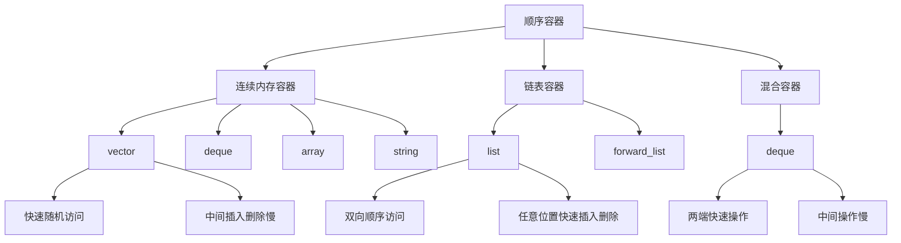

# 📘 9.1 顺序容器概述 (Overview of the Sequential Containers)

> 来源说明：C++ Primer 第9章第1节 | 本节涵盖：顺序容器的类型、性能特点和选择指南

---

## 🗺️ 知识体系图

## 🧠 核心概念总览

## 🧠 核心概念总览
* [*知识点1: 顺序容器基本概念*](#id1)：顺序容器的定义和性能考量因素
* [*知识点2: 顺序容器类型概述*](#id2)：六种顺序容器的基本介绍
    * [*知识点2.1: string/vector容器特点*](#id3)：可变大小数组的性能特点
    * [*知识点2.2: deque容器特点*](#id4)：双端队列的性能特点
    * [*知识点2.3: list容器特点*](#id5)：双向链表的性能特点
    * [*知识点2.4: forward\_list容器特点(c++11)*](#id6)：单向链表的性能特点
    * [*知识点2.5: array容器特点(c++11)*](#id7)：固定大小数组的特点
* [*知识点3: 容器选择指南：何时使用哪种 C++ 序列式容器*](#id14)：如何根据需求选择合适的顺序容器
    * [*知识点3.1: 复杂场景与策略*](#id15)：涵盖输入处理策略、读写平衡决策及最佳实践

---

## ✅ 知识点1: 顺序容器基本概念

**理论**
* 顺序容器提供对其元素的快速顺序访问
* 不同容器在性能上有所权衡，主要涉及：
  - 添加或删除元素的成本
  - 执行非顺序访问元素的成本

---

## ✅ 知识点2: 顺序容器类型概述

**理论**
* C++标准库提供六种顺序容器类型
* 每种容器采用的整理数据的策略很大影响了他们的操作效率，甚至影响他们是否支持某个操作
* 每种容器都有特定的访问方式和性能特征
* 根据具体需求选择合适的容器类型

**序列式容器类型总结**：

| 容器名称 | 基本结构和特性 | 访问方式 | 插入/删除效率 | 尺寸灵活性 |
| :--- | :--- | :--- | :--- | :--- |
| **vector** | **灵活尺寸的数组**。 | **快速随机访问**。 | 尾部操作快。**非尾部操作可能慢**。 | 灵活可变。 |
| **deque** | **双端队列**。 | **快速随机访问**。 | **头部和尾部操作都快**。 | 灵活可变。 |
| **list** | **双向链表**。 | **仅支持双向顺序访问**。 | **在列表中任意位置都快**。 | 灵活可变。 |
| **forward\_list** | **单向链表**。 | **仅支持单向顺序访问**。 | **在列表中任意位置都快**。 | 灵活可变。 |
| **array** | **固定尺寸的数组**。 | **快速随机访问**。 | 无法添加或删除元素。 | 固定不变。 |
| **string** | **特化的容器**，类似于 `vector`，但包含字符。 | **快速随机访问**。 | 尾部操作快。 | 灵活可变。 |

**注意点**
* ⚠️ 现代 C++ 库容器的性能**非常优秀**，建议在程序中优先使用它们，而不是更原始的数据结构（如 C 风格的内置数组）

---

## ✅ 知识点2.1: `string`/`vector`容器特点

**理论**
* **结构：** 可变大小的数组，元素在内存中是**连续存储**的。
* **访问：** 支持**快速随机访问** (O(1))，因为可以通过索引直接计算元素地址。
* **增删：** 在尾部插入或删除元素很快。在**尾部之外**的位置插入或删除元素会**很慢** (O(n))，因为需要移动后续的所有元素来维持内存连续性。
* **扩容：** 当空间不足时，会触发**重新分配内存**并将所有元素移动到新位置，操作成本很高。

**注意点**
* ⚠️ **适合场景：** 需要频繁**随机读取/访问**，并且**不频繁进行中间或者开头插入/删除**的场景。

---

## ✅ 知识点2.2: `deque`容器特点

**理论**
* **结构：** 双端队列（Double-Ended Queue），是一种比 `vector` 更复杂的**分段连续内存结构**
* **访问：** 支持**快速随机访问** (O(1))，**与 `string` 和 `vector` 类似**
* **增删：** 在**头部和尾部**插入或删除元素都是**快速操作** (O(1))，效率上可与 `list`/`forward_list` 的插入操作相比
* **中间操作：** 在**中间位置**插入或删除元素是**昂贵的**操作 (O(n))

**注意点**
* ⚠️ **中间插入删除操作代价较高** (O(n))，应尽量避免
* 💡 **适合场景：** 需要频繁在**两端进行操作**，且同时需要**随机访问**能力的场景

---

## ✅ 知识点2.3: `list`容器特点

**理论**

  * **结构：** **双向链表** (Doubly Linked List)
  * **访问：** **不支持随机访问**，只支持**双向顺序访问**，只能通过迭代遍历元素
  * **增删：** 旨在使在容器**任意位置**添加或删除元素的操作**非常快** (O(1))
  * **内存开销：** 与 `vector`、`deque` 等连续内存容器相比，有**显著的额外内存开销**（因为每个节点需要存储指向前驱和后继节点的指针）

**注意点**

  * ⚠️ **不支持快速随机访问**，查找元素效率低 (O(n))
  * 💡 **适合场景：** 需要频繁在容器的**任意位置进行插入和删除**操作的场景

---

## ✅ 知识点2.4: `forward_list`容器特点 (C++11)

**理论**
* **结构：** **C++11 新增**，是**单向链表** (Singly Linked List)
* **访问：** **仅支持单向顺序访问**
* **增删：** 在列表**任意位置**插入或删除元素都是**快速操作** (O(1))
* **内存开销：** 与 `vector`、`deque` 等连续内存容器相比，有**显著的额外内存开销**（因为每个节点需要存储指向前驱和后继节点的指针）。
* **特点：** **不提供 `size()` 操作**。这是为了避免存储或计算大小所产生的开销，使其性能可与最佳手写单向链表相媲美

**注意点**
* ⚠️ 只支持单向遍历，且**没有 `size()` 方法**（与其他容器不同）
* 💡 **设计目标：** 旨在成为**最轻量**的链表容器，媲美最佳手写单向链表

---

## ✅ 知识点2.5: array容器特点 (C++11)

**理论**
* **结构：** **C++11 新增**，是**固定大小**的数组 (Fixed-size Array)
* **访问：** 支持**快速随机访问** (O(1))
* **增删：** **不能添加或删除元素**，也不支持调整容器大小

**注意点**
* ⚠️ **大小固定**，不支持容器大小调整操作, 这个不是内置数组
* 💡 **是内置数组更安全、易用的替代品**

---

## ✅ 知识点3: 容器选择指南：何时使用哪种 C++ 序列式容器

### 基础指导原则 (General Guidelines)

| 理论总结 | 注意点 |
| :--- | :--- |
| **现代 C++ 程序应优先使用标准库容器**，而不是 C 风格的内置数组等原始结构。 | **💡 优先原则：** 优先使用标准库容器，避免重复造轮子。 |
| 新标准库容器的性能显著优于旧版本，通常表现优于甚至最精心设计的替代方案。 | **💡 性能保证：** 相信库容器的性能和实现质量。 |

---

### 默认选择规则 (The Default Choice)

| 理论总结 | 注意点 |
| :--- | :--- |
| **除非有充分理由选择其他容器，否则通常最好使用 `vector`。** | **💡 默认选择：`vector`。** 除非有理由不用 `vector`，否则就用 `vector`。 |

---

### 关键决策矩阵

选择容器时，主要考虑**访问需求、操作位置**和**内存开销**。

| 决策因素 | 你的需求是... | 推荐容器 | 理由/注意点 |
| :--- | :--- | :--- | :--- |
| **访问模式** | **需要快速随机访问** (通过下标 `O(1)`) | `vector`, `deque` | **⚠️ 链表容器** (`list`/`forward_list`) **不支持随机访问**，只能顺序访问。 |
| **插入/删除位置** | 频繁在**中间插入或删除**元素 | `list`, `forward_list` | 链表操作速度快 ($O(1)$)，`vector`/`deque` 中间操作慢 ($O(n)$)。 |
| **插入/删除位置** | 频繁在**头部或尾部**插入/删除元素 | `deque` | `deque` 在两端操作高效，同时保持了随机访问能力。 |
| **空间开销** | 程序有很多小元素且**空间开销至关重要** | **避免** `list` 或 `forward_list` | 链表需要为每个元素存储额外的指针，内存开销大。 |
| **尺寸限制** | 需要**固定大小**且不能增删元素 | `array` | `array` 是内置数组的更安全替代品。 |

---

## ✅ 知识点3.1: 复杂场景与策略

#### 输入处理策略

| 策略场景 | 理论总结 | 注意点 |
| :--- | :--- | :--- |
| 输入阶段**不需要**中间插入，后续需要随机访问 | 1.  先向`vector`追加元素，输入完成后调用 `sort` 函数重新排序 | 利用`vector`批量处理和排序的优势。|
| 输入阶段**必须**中间插入，后续需要随机访问| 2.  在输入阶段使用 `list` 进行快速插入，输入完成后将 `list` 内容**复制到 `vector`** 进行后续处理 | 利用链表在输入阶段快速插入的优势 |

#### 复杂场景决策 (读写平衡)

* **决策挑战：** 当程序既需要**随机访问** (利于 `vector`/`deque`)，又需要在**中间插入/删除** (利于 `list`/`forward_list`) 时
* **决策依据：** 决策取决于在 `list`/`forward_list` 中访问元素的成本 **VS** 在 `vector`/`deque` 中插入删除元素的成本
* **最终策略：** **应用程序的主要操作频率**（读多写少 vs. 写多读少）决定容器选择。在不确定的情况下，**可能需要使用两种容器对应用程序进行性能测试**

**最佳实践**
* ⚠️ 在不确定使用 `vector` 还是 `list` 时，应遵循最佳实践，通过使用迭代器而非下标，并避免随机访问元素，来编写仅依赖两者通用操作的代码，从而使后续容器切换变得容易

---

## 🔑 核心要点总结

1. **性能权衡**：顺序容器在随机访问性能与插入删除性能之间存在固有权衡
2. **内存布局**：连续内存容器(vector/string)支持快速随机访问但中间操作慢；链表容器(list/forward_list)支持快速任意位置操作但不支持随机访问
3. **默认选择**：没有特殊需求时优先选择vector，它是性能最均衡的容器
4. **混合策略**：复杂场景可以组合使用不同容器，如输入阶段用list，处理阶段用vector
5. **实践原则**：编写容器无关的代码，使用迭代器而非下标，便于后续调整容器选择

## 📌 考试速记版

| 容器 | 随机访问 | 中间插入删除 | 两端插入删除 | 内存开销 | 适用场景 |
|------|----------|--------------|--------------|----------|----------|
| vector | ✅ 快速 | ❌ 慢 | ✅ 尾部快 | 小 | 默认选择，随机访问多 |
| deque | ✅ 快速 | ❌ 慢 | ✅ 两端都快 | 中等 | 两端操作频繁 |
| list | ❌ 无 | ✅ 快速 | ✅ 快速 | 大 | 中间插入删除多 |
| forward_list | ❌ 无 | ✅ 快速 | ✅ 快速 | 较小 | 单向遍历，极致性能 |
| array | ✅ 快速 | ❌ 不支持 | ❌ 不支持 | 最小 | 固定大小需求 |
| string | ✅ 快速 | ❌ 慢 | ✅ 尾部快 | 小 | 字符处理 |

**口诀**：默认vector，中间改选用list，两头操作选deque，固定大小用array  