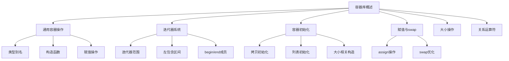

# 📘 9.2 Container Library Overview (容器库概述)

> 来源说明：C++ Primer 9.2 | 本节涵盖：C++标准容器库的通用操作和基本概念

---

## 🗺️ 知识体系图



## 🧠 核心概念总览

* [*知识点1: 容器操作层次结构*](#id1)：容器操作的分层体系
* [*知识点2: 通用容器操作*](#id2)：所有容器类型共有的操作
  * [*知识点2.1: 容器的定义与初始化*](#id6)：容器的定义与初始化
* [*知识点3: 迭代器系统*](#id7)：容器的迭代器机制
  * [*知识点3.1: 迭代器范围*](#id8)：迭代器范围的概念和性质
  * [*知识点3.2: 左包含区间*](#id9)：左包含区间的特性和编程意义
  * [*知识点3.3: begin和end成员*](#id10)：获取迭代器的成员函数
* [*知识点4: 容器类型成员*](#id11)：容器内部定义的类型
* [*知识点5: 容器定义和初始化*](#id12)：容器的各种初始化方式
  * [*知识点5.1: 拷贝初始化*](#id13)：通过拷贝另一个容器初始化
  * [*知识点5.2: 列表初始化*](#id14)：使用初始化列表
  * [*知识点5.3: 大小相关构造函数*](#id15)：指定大小的构造方式
  * [*知识点5.4: 固定大小数组*](#id16)：array容器的特殊性质
* [*知识点6: 赋值和swap操作*](#id17)：容器内容的修改
  * [*知识点6.1: assign操作*](#id18)：顺序容器的assign成员
  * [*知识点6.2: swap操作*](#id19)：容器内容的快速交换
* [*知识点7: 容器大小操作*](#id20)：获取容器大小的函数
* [*知识点8: 关系运算符*](#id21)：容器之间的比较操作

---

<a id="id1"></a>
## ✅ 知识点1: 容器操作层次结构

**理论**
* 容器类型的操作形成一个层次结构：
  - 某些操作由所有容器类型提供
  - 其他操作特定于顺序容器、关联容器或无序容器
  - 还有一些操作只对较小的容器子集通用

**注意点**
* 🎯 理解操作的分层有助于记忆不同容器的能力
* 🔄 关联容器和无序容器的特定操作在第11章详细讨论

---

<a id="id2"></a>
## ✅ 知识点2: 通用容器操作

**理论**
* 以下列出了所有容器类型都支持的操作
* 这些操作构成了容器的基础接口


#### 📊 容器操作

#### 类型别名 (Type Aliases)

| 别名 | 描述 |
| :--- | :--- |
| `iterator` | 此容器类型的迭代器类型 |
| `const_iterator` | 可以读取但不能更改其元素的迭代器类型 |
| `size_type` | 无符号整型，足够大以容纳此容器类型可能容纳的最大容器大小 |
| `difference_type` | 有符号整型，足够大以容纳两个迭代器之间的距离 |
| `value_type` | 元素类型 |
| `reference` | 元素的 **左值类型 (lvalue type)**；是 `value_type&` 的同义词 |
| `const_reference` | 元素的 **const 左值类型** (即 `const value_type&`) |

---

#### 构造 (Construction)

| 操作 | 描述 |
| :--- | :--- |
| `C c;` | 默认构造函数，空容器 (数组: 参见 p. 336) |
| `C c1(c2);` | 将 `c2` 复制构造为 `c1` |
| `C c(b, e);` | 从由迭代器 `b` 和 `e` 指定的范围复制元素；(**不适用于 array**) |
| `C c{a,b,c...};` | 列表初始化 `c` |

---

#### 赋值与交换 (Assignment and swap)

| 操作 | 描述 |
| :--- | :--- |
| `c1 = c2` | 用 `c2` 中的元素替换 `c1` 中的元素 |
| `c1 = {a,b,c...}` | 用列表中的元素替换 `c1` 中的元素 (**不适用于 array**) |
| `a.swap(b)` | 交换 `a` 和 `b` 中的元素 |
| `swap(a, b)` | 等同于 `a.swap(b)` |

---

#### 大小 (Size)

| 操作 | 描述 |
| :--- | :--- |
| `c.size()` | `c` 中的元素数量 (**不适用于 forward_list**) |
| `c.max_size()` | `c` 可以容纳的最大元素数量 |
| `c.empty()` | 如果 `c` 包含任何元素则为 `false`，否则为 `true` |

---

#### 添加/删除元素 (**不适用于 `array`**)

> *注意：这些操作的接口因容器类型而异*

| 操作 | 描述 |
| :--- | :--- |
| `c.insert(args)` | 将 `args` 指定的元素复制到 `c` 中 |
| `c.emplace(inits)` | 使用 `inits` 在 `c` 中构造一个元素 |
| `c.erase(args)` | 删除由 `args` 指定的元素 |
| `c.clear()` | 从 `c` 中移除所有元素；返回 `void` |

---

#### 相等性与关系运算符 (Equality and Relational Operators)

| 运算符 | 描述 |
| :--- | :--- |
| `==`, `!=` | 相等性适用于所有容器类型 |
| `<`, `<=`, `>`, `>=` | 关系运算 (**不适用于无序关联容器 (unordered associative containers)**) |

---

#### 获取迭代器 (Obtain Iterators)

| 操作 | 描述 |
| :--- | :--- |
| `c.begin()`, `c.end()` | 返回指向第一个元素、**尾后**元素的迭代器 |
| `c.cbegin()`, `c.cend()` | 返回 `const_iterator` |

---

#### 可逆容器的附加成员 (**不适用于 `forward_list`**)

| 成员 | 描述 |
| :--- | :--- |
| `reverse_iterator` | 以相反顺序访问元素的迭代器 |
| `const_reverse_iterator` | 不能写入元素的 **反向** 迭代器 |
| `c.rbegin()`, `c.rend()` | 返回指向最后一个元素、**首前** 元素的迭代器 |
| `c.crbegin()`, `c.crend()` | 返回 `const_reverse_iterator` |

---

#### 定义和初始化容器 (Defining and Initializing Containers)

> 通用构造函数和初始化方式

| 语法/操作 | 描述 |
| :--- | :--- |
| `C c;` | **默认构造函数**。如果 `C` 是 `array`，则 `c` 中的元素是 **默认初始化** 的；否则 `c` 是空的。 |
| `C c1(c2)` | `c1` 是 `c2` 的拷贝。`c1` 和 `c2` 必须具有相同的类型（即必须是相同的容器类型并存储相同的元素类型；对于 `array`，还必须具有相同的大小）。 |
| `C c1 = c2` | 与 `C c1(c2)` 相同。 |
| `C c{a, b, c...}` | `c` 是初始化列表中的元素的拷贝。列表中的元素类型必须与 `C` 的元素类型兼容。对于 `array`，列表必须与数组大小具有相同或更少的元素；任何缺失的元素都将进行 **值初始化** (§ 3.3.1, p. 98)。 |
| `C c = {a, b, c...}` | 与 `C c{a, b, c...}` 相同。 |
| `C c(b, e)` | `c` 是由迭代器 `b` 和 `e` 指定的范围内的元素的拷贝。范围内的元素类型必须与 `c` 的元素类型兼容。(**不适用于 array**。) |

---

#### 仅适用于顺序容器 (Sequential Containers) 的构造函数

> 仅对顺序容器（不包括 `array`）有效。

| 语法/操作 | 描述 |
| :--- | :--- |
| `C seq(n)` | `seq` 拥有 $n$ 个 **值初始化** 的元素；此构造函数是 **explicit** (§ 7.5.4, p. 296)。(**不适用于 string**。) |
| `C seq(n, t)` | `seq` 拥有 $n$ 个值为 $t$ 的元素。 |

**注意点**
* ⚠️ 由于`array`是 定长、内嵌元素 的聚合类型，没有构造函数，其默认构造函数不会创建空容器
* ⚠️ `swap`操作通常比复制元素快得多
* ⚠️ `empty()`通常比检查`size() == 0`更高效 
  * `empty()` 只需看容器内部一个布尔标志，而 `size()` 可能要遍历或做减法运算。

---
<a id="id6"></a>
## ✅ 知识点2.1: 容器的定义与初始化

* 一般来说，每个容器都定义在一个与其类型名称相同的头文件中。例如：
    * `deque` 在 `<deque>` 头文件中。
    * `list` 在 `<list>` 头文件中。
* 容器是 **类模板 (class templates)**。

* 与 `vector` 一样，我们必须提供附加信息来生成特定的容器类型。
* 对于大多数（但不是全部）容器，我们必须提供的信息是 **元素类型 (element type)**：
    * `list<Sales_data>`: 列表持有 `Sales_data` 类型的对象。
    * `deque<double>`: 双端队列持有 `double` 类型的值。

---
<a id="id5"></a>
## ✅ 知识点2.2: 容器可以容纳的类型约束

**理论**
* **任何类型皆可作为元素类型：** 几乎任何类型都可以用作顺序容器的元素类型。
  * **容器的容器：** 可以定义一个容器，其元素类型本身就是另一个容器类型。
* 尽管容器几乎可以存储任何类型，但**某些容器操作**会对其所存储的**元素类型**施加额外的要求或约束。
* 如果一个容器的元素类型不满足某个操作的要求，则**不能**对该容器执行该操作。

  * **问题所在：** 接受大小参数的顺序容器构造函数 (§ 3.3.1) 会使用元素类型的**默认构造函数**来初始化元素。
  * **后果：** 如果一个类**没有默认构造函数** (`noDefault` 类)，那么您就**不能仅凭**元素数量来构造该容器。

**代码示例**
```cpp
  vector<vector<string>> lines;   //正确： lines 是一个元素为 string 向量的向量
  vector<noDefault> v1(10, init); //正确
  vector<noDefault> v1(10);       //错误：必须提供元素初始化式
```


**注意点**
* ⚠️ 较旧的编译器可能需要在右侧的连续尖括号之间留出空格，例如 `vector<vector<string> >`


---

<a id="id7"></a>
## ✅ 知识点3: 迭代器系统

**理论**
* **迭代器具有通用接口**：如果迭代器提供某个操作，那么每个提供该操作的迭代器都以相同的方式支持它
* 所有标准容器类型的迭代器**都允许**我们访问容器中的元素，都提供**解引用运算符**
* 所有库容器的迭代器**都定义递增运算符**来移动到下一个元素

**注意点**
* ⚠️ `forward_list`迭代器**不支持**递减(`--`)运算符
* 🔄 迭代器算术运算（3.7章的表）仅适用于`string`、`vector`、`deque`和`array`的迭代器

---

<a id="id8"></a>
## ✅ 知识点3.1: 迭代器范围

**理论**
迭代器范围由两个迭代器定义：
- `begin` - 指向第一个元素
- `end` - 指向最后一个元素的下一个位置

范围表示为`[begin, end)`，是左包含区间：
- 包含`begin`指向的元素
- 不包含`end`指向的位置

**有效范围要求**
- 两个迭代器必须属于同一容器
- `end`不能位于`begin`之前
- 可以通过重复递增`begin`到达`end`

**注意点**
* ⚠️ 编译器**无法**保证这些需求被满足，我们需要去保证这些这些规则被满足

---

<a id="id9"></a>
### ✅ 知识点3.2: 左包含区间

**理论**
* 元素范围称为**左包含区间**(left-inclusive ranges)
* **左包含区间的便利属性**
  * 如果`begin`等于`end`，范围为空
  * 如果`begin`不等于`end`，范围内至少有一个元素，`begin`引用该范围内的第一个元素
  * 我们可以递增`begin`若干次直到`begin == end`
* 这种设计保证循环能正确处理空范围和非空范围

**教材示例代码**
```cpp
// 处理元素范围的典型循环
while (begin != end) {
    *begin = val;  // 范围非空，begin指向元素
    ++begin;       // 推进迭代器获取下一个元素
}
```


---

<a id="id10"></a>
### ✅ 知识点3.3: begin和end成员

**理论**
* `begin()`和`end()`操作生成引用容器中第一个和最后一个元素之后位置的迭代器
* 这些迭代器最常用于形成包含容器中所有元素的迭代器范围

**begin和end的版本**
* 带r的版本返回反向迭代器
* 以c开头的返回相关迭代器的const版本

**教材示例代码**
```cpp
list<string> a = {"Milton", "Shakespeare", "Austen"};
auto it1 = a.begin();    // list<string>::iterator
auto it2 = a.rbegin();   // list<string>::reverse_iterator  
auto it3 = a.cbegin();   // list<string>::const_iterator
auto it4 = a.crbegin();  // list<string>::const_reverse_iterator
```

**注意点**
* 💡 不带c的函数是重载的：一个是const成员，另一个是非const成员
* 🎯 当不需要写访问时，使用cbegin和cend
* 🔄 c版本支持将auto与begin和end函数一起使用

---

<a id="id11"></a>
## ✅ 知识点4: 容器类型成员

**理论**
* 除了我们已经使用的类型，大多数容器还提供反向迭代器
* 反向迭代器是向后遍历容器的迭代器，颠倒了迭代器操作的含义
* 元素相关的类型别名让我们可以使用容器中存储的元素类型而无需知道具体类型

**教材示例代码**
```cpp
// iter是list<string>定义的迭代器类型
list<string>::iterator iter;

// count是vector<int>定义的difference_type类型
vector<int>::difference_type count;
```

**注意点**
* 💡 要使用这些类型，必须命名它们所属的类
* 🔄 使用范围运算符访问容器定义的成员类型

---

<a id="id12"></a>
## ✅ 知识点5: 容器定义和初始化

**理论**
* 每个容器类型都定义了一个默认构造函数
* 除了array，默认构造函数创建指定类型的空容器
* 其他构造函数接受指定容器大小和元素初始值的参数

**注意点**
* ⚠️ array的默认构造函数不会创建空容器
* 🔄 容器类型是类模板，必须提供额外信息来生成特定的容器类型

---

<a id="id13"></a>
### ✅ 知识点5.1: 拷贝初始化

**理论**
* 创建新容器作为另一个容器的副本有两种方式：
  1. 直接复制容器
  2. 复制迭代器对表示的元素范围（array除外）

**教材示例代码**
```cpp
list<string> authors = {"Milton", "Shakespeare", "Austen"};
vector<const char*> articles = {"a", "an", "the"};

list<string> list2(authors);        // 正确：类型匹配
deque<string> authList(authors);    // 错误：容器类型不匹配
vector<string> words(articles);     // 错误：元素类型必须匹配

// 正确：可以将const char*元素转换为string
forward_list<string> words(articles.begin(), articles.end());
```

**注意点**
* ⚠️ 将容器初始化为另一个容器的副本时，两个容器的容器类型和元素类型必须相同
* 💡 接受两个迭代器的构造函数允许我们复制容器的子序列

---

<a id="id14"></a>
### ✅ 知识点5.2: 列表初始化

**理论**
* 在新标准中，我们可以列表初始化容器
* 对于array以外的类型，初始化列表还隐式指定容器的大小

**教材示例代码**
```cpp
list<string> authors = {"Milton", "Shakespeare", "Austen"};
vector<const char*> articles = {"a", "an", "the"};
```

**注意点**
* 🔄 容器将具有与初始化器数量相同的元素

---

<a id="id15"></a>
### ✅ 知识点5.3: 大小相关构造函数

**理论**
* 除了与关联容器共有的构造函数外，还可以从大小和（可选的）元素初始化器初始化顺序容器（不包括array）
* 如果不提供元素初始化器，库会为我们创建一个值初始化的元素

**教材示例代码**
```cpp
vector<int> ivec(10, -1);       // 10个int元素，每个初始化为-1
list<string> svec(10, "hi");    // 10个字符串；每个元素是"hi"  
forward_list<int> ivec(10);     // 10个元素，每个初始化为0
deque<string> svec(10);         // 10个元素，每个都是空字符串
```

**注意点**
* ⚠️ 如果元素类型没有默认构造函数，则必须与大小一起指定显式元素初始化器
* 🎯 接受大小参数的构造函数仅对顺序容器有效，关联容器不支持

---

<a id="id16"></a>
### ✅ 知识点5.4: 固定大小数组

**理论**
* 与内置数组一样，库array的大小是其类型的一部分
* 定义array时，除了指定元素类型，还要指定容器大小
* array不支持普通的容器构造函数

**教材示例代码**
```cpp
array<int, 42>;          // 类型是：保存42个int的array
array<string, 10>;       // 类型是：保存10个string的array

array<int, 10>::size_type i;  // array类型包括元素类型和大小
array<int>::size_type j;      // 错误：array<int>不是类型
```

**array的特殊性质**
* 默认构造的array不为空：它具有与其大小一样多的元素
* 这些元素是默认初始化的，就像内置数组中的元素一样
* 如果列表初始化array，初始化器的数量必须等于或小于array的大小

**教材示例代码**
```cpp
array<int, 10> ia1;          // 10个默认初始化的int
array<int, 10> ia2 = {0,1,2,3,4,5,6,7,8,9};  // 列表初始化
array<int, 10> ia3 = {42};   // ia3[0]是42，剩余元素是0

// 与内置数组不同，array可以复制和赋值
array<int, 10> digits = {0,1,2,3,4,5,6,7,8,9};
array<int, 10> copy = digits;  // 正确：只要array类型匹配
```

**注意点**
* ⚠️ 使用array类型必须同时指定元素类型和大小
* 🔄 虽然不能复制或分配内置数组类型的对象，但对array没有这样的限制

---

<a id="id17"></a>
## ✅ 知识点6: 赋值和swap操作

**理论**
* 赋值相关运算符作用于整个容器
* 赋值运算符将左侧容器中的整个元素范围替换为右侧操作数元素的副本

**教材示例代码**
```cpp
c1 = c2;           // 用c2中元素的副本替换c1中的内容
c1 = {a,b,c};      // 赋值后c1的大小为3
```

**注意点**
* ⚠️ 赋值相关操作使指向左侧容器的迭代器、引用和指针失效
* 🔄 交换后它们仍然有效，并且它们引用的容器被交换

---

<a id="id18"></a>
### ✅ 知识点6.1: assign操作

**理论**
* 赋值运算符要求左右操作数具有相同的类型
* 顺序容器（除了array）还定义了一个名为assign的成员，允许我们从不同但兼容的类型赋值，或从容器的子序列赋值
* assign操作将左侧容器中的所有元素替换为其参数指定的元素的副本

**教材示例代码**
```cpp
list<string> names;
vector<const char*> oldstyle;

names = oldstyle;  // 错误：容器类型不匹配

// 正确：从const char*到string的构造函数
names.assign(oldstyle.cbegin(), oldstyle.cend());

// 等效于slist1.clear(); 后跟 slist1.insert(slist1.begin(), 10, "Hiya!");
list<string> slist1(1);       // 一个元素，是空字符串
slist1.assign(10, "Hiya!");   // 十个元素；每个都是"Hiya!"
```

**注意点**
* ⚠️ 由于现有元素被替换，传递给assign的迭代器不能引用调用assign的容器
* 💡 assign的参数确定容器将拥有多少元素以及这些元素的值

---

<a id="id19"></a>
### ✅ 知识点6.2: swap操作

**理论**
* swap操作交换两个相同类型容器的内容
* 调用swap后，两个容器中的元素互换
* 除了array，交换两个容器保证很快——元素本身不被交换；内部数据结构被交换

**教材示例代码**
```cpp
vector<string> svec1(10);  // 包含10个元素的vector
vector<string> svec2(24);  // 包含24个元素的vector  
swap(svec1, svec2);        // 交换后svec1包含24个元素，svec2包含10个
```

**swap的特殊行为**
* 除了array，swap不复制、删除或插入任何元素，保证在恒定时间内运行
* 对于string，调用swap可能会使迭代器、引用和指针失效
* 交换两个数组确实会交换元素，需要与数组中元素数量成比例的时间

**注意点**
* 🎯 在新库中，容器提供swap的成员和非成员版本
* 💡 作为习惯，最好使用swap的非成员版本

---

<a id="id20"></a>
## ✅ 知识点7: 容器大小操作

**理论**
* `size()`成员返回容器中的元素数量
* `empty()`返回一个bool，如果size为零则为true，否则为false
* `max_size()`返回大于或等于该类型容器可以包含的元素数量的数字

**注意点**
* ⚠️ forward_list提供max_size和empty，但不提供size
* 💡 empty通常比检查size() == 0更高效

---

<a id="id21"></a>
## ✅ 知识点8: 关系运算符

**理论**
* 每个容器类型都支持相等运算符（==和!=）
* 除了无序关联容器外，所有容器还支持关系运算符（>、>=、<、<=）
* 右操作数和左操作数必须是相同类型的容器，并且必须包含相同类型的元素

**比较规则**
* 如果两个容器大小相同且所有元素都相等，则两个容器相等；否则不相等
* 如果容器大小不同但较小容器的每个元素都等于较大容器的对应元素，则较小容器小于另一个
* 如果两个容器都不是另一个的初始子序列，则比较取决于比较第一个不相等元素

**教材示例代码**
```cpp
vector<int> v1 = {1, 3, 5, 7, 9, 12};
vector<int> v2 = {1, 3, 9};
vector<int> v3 = {1, 3, 5, 7};
vector<int> v4 = {1, 3, 5, 7, 9, 12};

v1 < v2     // true; v1和v2在元素[2]处不同；v1[2]小于v2[2]
v1 < v3     // false; 所有元素都相等，但v3的元素更少
v1 == v4    // true; 每个元素都相等且v1和v4大小相同
v1 == v2    // false; v2的元素比v1少
```

**注意点**
* ⚠️ 只有当元素类型定义了相应的比较运算符时，才能使用关系运算符比较两个容器
* 🔄 容器相等运算符使用元素的==运算符，关系运算符使用元素的<运算符

---

## 🔑 核心要点总结

1. **容器操作分层**：操作分为通用操作、顺序容器特定操作、关联容器特定操作
2. **迭代器范围**：使用[begin, end)左包含区间，是标准库的基础概念
3. **初始化多样性**：支持拷贝构造、范围构造、列表初始化等多种方式
4. **swap优化**：除array外，swap操作在常数时间内完成，只交换内部数据结构
5. **类型安全**：关系运算符要求容器类型和元素类型都匹配，并使用元素的比较运算符

## 📌 考试速记版

**口诀**：容器操作分三层，迭代范围左包含，swap优化不拷贝，比较需要类型同

**关键对比表**：
| 操作类型 | 适用容器 | 关键特点 |
|---------|----------|----------|
| 通用操作 | 所有容器 | 构造、赋值、大小检查 |
| 顺序容器操作 | vector, list, deque等 | 大小构造、assign |
| 关联容器操作 | set, map等 | 键值对操作 |
| 固定大小 | array | 大小是类型一部分 |

**特殊记忆点**：
- forward_list没有size()
- array支持赋值但不支持列表赋值
- swap在array上会真正交换元素
- 关系比较使用元素的<和==运算符