# 📘 9.3 顺序容器操作 (Sequential Container Operations)

> 来源说明：C++ Primer 第5版 第9章第3节 | 本节涵盖：顺序容器的元素添加、访问、删除、forward_list特殊操作、resize及迭代器失效规则

---

## 🗺️ 知识体系图

```mermaid
graph TD
    A[9.3 顺序容器操作] --> B[9.3.1 添加元素]
    A --> C[9.3.2 访问元素]
    A --> D[9.3.3 删除元素]
    A --> E[9.3.4 forward_list特殊操作]
    A --> F[9.3.5 调整容器大小]
    A --> G[9.3.6 迭代器失效规则]
    
    B --> B1[push_back/push_front]
    B --> B2[insert系列操作]
    B --> B3[emplace系列操作]
    B --> B4[返回值与迭代器管理]
    
    C --> C1[front/back成员]
    C --> C2[at/下标运算符]
    C --> C3[返回引用特性]
    
    D --> D1[pop_back/pop_front]
    D --> D2[erase操作]
    D --> D3[clear操作]
    
    E --> E1[insert_after/emplace_after]
    E --> E2[erase_after]
    E --> E3[before_begin迭代器]
    
    F --> F1[resize基本行为]
    F --> F2[元素初始化规则]
    
    G --> G1[添加元素的影响]
    G --> G2[删除元素的影响]
    G --> G3[不同容器差异]
    G --> G4[最佳实践]
```



---

## 🧠 核心概念总览

* [知识点1: 顺序容器操作概述](#id1)：介绍顺序容器与关联容器的差异及操作分类
* [知识点1.1: 添加元素操作总览](#id2)：Table 9.5列出的所有添加元素操作
    * [知识点1.1.1: push_back和push_front操作](#id3)：在容器首尾添加元素
    * [知识点1.1.2: insert插入操作](#id4)：在指定位置插入元素
    * [知识点1.1.3: emplace构造操作(C++11)](#id5)：直接在容器内构造元素
    * [知识点1.1.4: 返回值与迭代器管理(C++11)](#id6)：insert操作的返回值及应用
    * [知识点1.1.5: 容器元素是副本](#id7)：元素拷贝行为的重要概念
* [知识点2: 元素访问操作](#id8)：front、back、at和下标访问
    * [知识点2.1: front和back成员](#id9)：访问首尾元素
    * [知识点2.2: at和下标运算符](#id10)：随机访问元素
    * [知识点2.3: 返回引用特性](#id11)：访问操作的返回值类型
* [知识点3: 元素删除操作](#id12)：pop、erase和clear操作
    * [知识点3.1: pop_front和pop_back](#id13)：删除首尾元素
    * [知识点3.2: erase删除指定元素](#id14)：按位置删除元素
    * [知识点3.3: clear清空容器](#id15)：删除所有元素
* [知识点4: forward_list特殊操作](#id16)：单向链表的特殊插入删除机制
    * [知识点4.1: insert_after/emplace_after](#id17)：在指定元素后插入
    * [知识点4.2: erase_after](#id18)：删除指定元素后的元素
    * [知识点4.3: before_begin迭代器](#id19)：获取首元素前的迭代器
* [知识点5: resize调整容器大小](#id20)：改变容器元素数量
* [知识点6: 迭代器失效规则](#id21)：添加/删除元素对迭代器的影响
    * [知识点6.1: 添加元素后的迭代器有效性](#id22)
    * [知识点6.2: 删除元素后的迭代器有效性](#id23)
    * [知识点6.3: 循环中管理迭代器的最佳实践](#id24)
    * [知识点6.4: end()迭代器的特殊处理](#id25)

---

<a id="id1"></a>
## ✅ 知识点1: 顺序容器操作概述

**理论**
* 顺序容器与关联容器的组织元素方式不同，这些差异影响元素的存储、访问、添加和删除方式
* 本节介绍顺序容器特有的操作，这些操作建立在第9.2节所述的通用容器操作基础之上。

---

<a id="id2"></a>
## ✅ 知识点1.1: 添加元素操作总览

**理论**
* 除`array`外，所有库容器都提供灵活的内存管理，可在运行时动态改变大小
* 下面列表列出了向顺序容器添加元素的所有操作。这些操作会改变容器大小，因此`array`不支持
* `forward_list`有特殊的`insert`和`emplace`版本
* 不同容器类型对同一操作的支持程度不同，性能特征也有显著差异

**操作支持情况**
| 操作 | vector | string | deque | list | forward_list |
|------|--------|--------|-------|------|--------------|
| push_back | ✅ | ✅ | ✅ | ✅ | ❌ |
| push_front | ❌ | ❌ | ✅ | ✅ | ✅ |
| insert | ✅ | ✅ | ✅ | ✅ | 特殊版本 |
| emplace | ✅ | ✅ | ✅ | ✅ | 特殊版本 |

**注意点**
* ⚠️ 向`vector`、`string`或`deque`添加元素可能使所有现有迭代器、引用和指针**失效**
* 💡 在`vector`/`string`中间或任何或者`deque`中间位置添加元素需要移动元素，可能引发整个**对象重新分配**
    * 导致重新分配内存，并将元素移动到新位置

---

<a id="id3"></a>
### ✅ 知识点1.1.1: `push_back`和`push_front`操作

**理论**
* `push_back(t)`在容器末尾创建值为t的元素，`push_front(t)`在容器开头创建元素。两者都返回`void`
* **往容器里放元素时，放进去的是“值的副本”，不是原对象本身**
因此：

    * 容器中的元素和原对象彼此独立
    * 改动容器里的元素不会影响原对象；改动原对象也不会影响容器里的元素


**代码示例**
```cpp
// 从标准输入读取字符串到容器
string word;
while (cin >> word)
    container.push_back(word); // container可以是list、vector或deque

// 使用push_front在list头部添加
list<int> ilist;
for (size_t ix = 0; ix != 4; ++ix)
    ilist.push_front(ix); // 循环结束后ilist包含3,2,1,0（逆序）
```
**代码解析**
* `string`类型是`char`的容器，所以我们同样可以对`string`使用`push_back`

**注意点**
* ⚠️ `push_front`**不适用**于`vector`和`string`
* ⚠️ `push_back`不适用于`forward_list`(`push_back`支持`string`)
* 💡 在循环中使用`push_front`会导致元素逆序存储

---

<a id="id4"></a>
### ✅ 知识点1.1.2: `insert`插入操作

**理论**
* `insert`成员允许通过在容器任意迭代器指定位置插入元素，支持多种形式：
    - `c.insert(p, t)`：在迭代器`p`**前**插入单个元素t
    - `c.insert(p, n, t)`：在p前插入`n`个值为`t`的元素
    - `c.insert(p, b, e)`：在`p`前插入迭代器范围`[b, e)`内的元素
    - `c.insert(p, il)`：在`p`前插入**初始化列表**`il`中的元素


**代码示例**
```cpp
// 在list开头插入（等效于push_front）
list<string> slist;
slist.insert(slist.begin(), "Hello!"); // 即使容器不支持push_front也可用

// 在vector末尾插入10个"Anna"
vector<string> svec;
svec.insert(svec.end(), 10, "Anna");

// 插入范围元素
vector<string> v = {"quasi", "simba", "frollo", "scar"};
// 将v的最后两个元素插入slist开头
slist.insert(slist.begin(), v.end() - 2, v.end());

// 插入初始化列表
slist.insert(slist.end(), {"these", "words", "go", "at", "the", "end"});
```


**注意点**
* ⚠️ 迭代器参数`p`可以是容器的**任何位置**，甚至是尾后位置`end()`
* ⚠️ 迭代器`b`和`e`**不能**指向要插入的同一容器
    * 因为如果促发reallocation的话， 原来指向的位置就无效了(dangling)
* ⚠️ 在`vector/string/deque`中间插入**代价很高**，需要移动元素
* 💡 `insert`总是将元素插入到给定位置**之前**

---

<a id="id5"></a>
### ✅ 知识点1.1.3: `emplace`构造操作(C++11)

**理论**
* C++11引入的三个新成员`emplace_front`、`emplace`和`emplace_back`直接在容器管理的内存中**构造元素**，而非拷贝元素
* 它们分别对应`push_front`、`insert`和`push_back`

    * **push / insert**：你把一个已经存在的对象传进去，容器<b>把这个对象复制（或移动）</b>到内部存储
    * **emplace**：你传入的是构造元素所需的**构造参数**，容器会在内部存储空间里**直接构造这个元素**，避免额外的临时对象和拷贝

**代码示例**
```cpp
// 假设c存储Sales_data元素
// 在c末尾直接构造对象
c.emplace_back("978-0590353403", 25, 15.99); 
// 使用三个参数的Sales_data构造函数

// 错误：push_back没有接受三个参数的版本
c.push_back("978-0590353403", 25, 15.99); // 编译错误

// 正确：必须创建临时对象传递给push_back
c.push_back(Sales_data("978-0590353403", 25, 15.99));

// 不同形式的emplace
c.emplace_back(); // 使用默认构造函数
c.emplace(iter, "999-999999999"); // 使用string构造函数
c.emplace_front("978-0590353403", 25, 15.99); // 在开头构造
```

**注意点**
* 💡 `emplace`函数将参数转发给元素类型的构造函数，在容器内存中直接构造对象
* 💡 `push/insert`操作传递的是已构造的对象，会发生拷贝
* ⚠️ `emplace`参数**必须**与元素类型的某个构造函数匹配

---

<a id="id6"></a>
### ✅ 知识点1.1.4: 返回值与迭代器管理(C++11)

**理论**
* 新标准C++11:
    * 接受**数量**和**范围参数**的`insert`函数会返回一个指向第一个插入元素位置的迭代器
    * 如果范围参数为空，那么`insert`函数返回传入的迭代器，也就是第一个参数
    * 利用此返回值可反复在指定位置插入, 实现`push_front()`操作


**代码示例**
```cpp
// 使用insert返回值模拟push_front
list<string> lst;
auto iter = lst.begin(); // 初始指向begin
while (cin >> word)
    iter = lst.insert(iter, word); // 每次在iter前插入，iter指向新元素

// 移除奇数元素并复制偶数元素的循环
vector<int> vi = {0,1,2,3,4,5,6,7,8,9};
auto iter = vi.begin();
while (iter != vi.end()) {
    if (*iter % 2) {
        iter = vi.insert(iter, *iter); // 复制当前元素
        iter += 2; // 跳过新插入和原元素
    } else {
        iter = vi.erase(iter); // 删除偶数，iter自动指向下一个
    }
}
```
**代码解析**
* 在这个迭代里面, `insert`接受了一个`string`参数并将其插入到`iter`迭代器前
* 并且返回指向这个新元素的迭代器
* 也就是每次插入都会插入到之前第一个元素前面

**注意点**

* ⚠️ 调用`insert`后需调整迭代器位置，否则可能陷入无限循环
* 💡 `erase`返回指向被删元素后一个元素的迭代器，无需额外递增

---

<a id="id7"></a>
### ✅ 知识点1.1.5: 容器元素是副本

**理论**
* 当初始化容器或向容器插入对象时，放入容器的是对象值的副本，而非对象本身
* 容器内元素与源对象之间无关联，后续修改互不影响

**代码示例**
```cpp
string word = "test";
container.push_back(word); // word的副本被存入容器
word = "modified"; // 容器内元素不受影响
```

---

<a id="id8"></a>
## ✅ 知识点2: 元素访问操作

**理论**
* 下面列表列出了顺序容器的元素访问操作。这些操作仅适用于`string、vector、deque`和`array`
* `forward_list`不提供`back()`，所有容器都提供`front()`

**操作汇总**
| 操作 | 返回值 | 适用容器 | 空容器行为 |
|------|--------|----------|------------|
| `c.front()` | 首元素**引用** | 所有 | 未定义 |
| `c.back()` | 尾元素**引用** | 除`forward_list` | 未定义 |
| `c[n]` | 位置n元素**引用** | `string/vector/deque/array` | 未定义 |
| `c.at(n)` | 位置n元素**引用** | `string/vector/deque/array` | 抛出异常 |

---

<a id="id9"></a>
### ✅ 知识点2.1: `front`和`back`成员

**理论**
* `c.front()`返回首元素的引用，`c.back()`返回尾元素**引用**
* 所有顺序容器（包括`array`）都有`front`，除`forward_list`外都有`back`
* 操作前必须**检查**容器非空

**代码示例**
```cpp
if (!c.empty()) {
    auto val1 = *c.begin();  // 间接访问首元素
    auto val2 = c.front();   // 直接访问首元素
    
    auto last = c.end();
    auto val3 = *(--last);   // 间接访问尾元素
    auto val4 = c.back();    // 直接访问尾元素
    
    c.front() = 42;          // 修改首元素
    auto &v = c.back();      // v是尾元素的引用
    v = 1024;                // 修改尾元素
    auto v2 = c.back();      // v2是副本，修改不影响容器
    v2 = 0;
}
```
**代码解析**
* 值得注意的是，`end()`是返回的不存在的元素， 也就是尾后位置
* 但是`back()`并不是，它返回的就是最后一个存在的元素

**注意点**
* ⚠️ 访问空容器的`front/back`是**严重编程错误**, 就相当于下标访问out of range
* 💡 可使用`begin/end`迭代器间接访问，但`back()`更直接
* ⚠️ 对`forward_list`**不能**递减`end()`迭代器，不支持`back()`

---

<a id="id10"></a>
### ✅ 知识点2.2: `at`和下标运算符

**理论**
* 提供快速随机访问的容器<b>(`string`, `vector`, `deque`, `array`)</b>支持下标运算符`c[n]`和`c.at(n)`
* 下标运算符`[]`不检查是否下标在正确范围中，使用越界下标是严重错误，编译器无法检测
* `at()`在越界时抛出`out_of_range`异常，帮编译器确保下标的可行

**代码示例**
```cpp
vector<string> svec; // 空容器
cout << svec[0];     // 运行时错误：未定义行为
cout << svec.at(0);  // 抛出out_of_range异常
```

**注意点**
* ⚠️ 需要**安全检查**时使用`at()`，**性能关键**且能保证范围正确时使用`[]`
* 💡 `array`也支持下标和`at`，这是其与内置数组的重要区别

---

<a id="id11"></a>
### ✅ 知识点2.3: 返回引用特性

**理论**
* 访问成员<b>(`front`, `back`, 下标, `at`)</b>返回引用
* `const`对象返回`const`引用，非`const`对象返回普通引用，可用于修改元素值
* 使用`auto&`获取引用以修改元素，使用`auto`获取副本

**代码示例**
```cpp
if (!c.empty()) {
    c.front() = 42;     //给c的第一个元素赋值
    auto &v = c.back(); // 得到c最后一个元素的引用
    v = 1024;           // 修改最后那个元素的值
    auto v2 = c.back(); // v2不是引用，时c最后元素的副本
    v2 = 0;             // 并不会修改最后一个元素
}
```

**注意点**
* 💡 理解引用返回类型对正确修改容器元素至关重要

---

<a id="id12"></a>
## ✅ 知识点3: 元素删除操作

**理论**
* 下表列出了从顺序容器删除元素的操作,这些操作**改变容器大小**
* `array`不支持。`forward_list`有特殊的`erase`版本。

**操作汇总**
| 操作 | 作用 | 返回值 | 空容器行为 |
|------|------|--------|------------|
| `c.pop_back()` | 删除尾元素 | `void` | 未定义 |
| `c.pop_front()` | 删除首元素 | void | 未定义 |
| `c.erase(p)` | 删除迭代器p指向元素 | 被删元素后迭代器 | p为尾后迭代器时未定义 |
| `c.erase(b, e)` | 删除范围`[b, e)`元素 | `e` | 如果`e`为尾后迭代器返回尾后迭代器 |
| `c.clear()` | 删除所有元素 | `void` | - |

**注意点**
* ⚠️ 在`vector`或`string`中，删除点之后的迭代器、引用和指针都会失效
* ⚠️ 在`deque`中，若从中间删除元素，会使所有迭代器、引用和指针失效
* ⚠️ `erase()`删除操作不检查合法性；删之前你自己得确认元素存在

---

<a id="id13"></a>
### ✅ 知识点3.1: `pop_front`和`pop_back`

**理论**
* `pop_front()`删除首元素
    * `vector`和`string`**不支持**`pop_front`
* `pop_back()`删除尾元素
    * `forward_list`**不支持**`pop_back`
* 两者都返回`void`, 需要保存值时必须先获取再删除

**代码示例**
```cpp
while (!ilist.empty()) {
    process(ilist.front()); // 处理当前首元素
    ilist.pop_front();      // 删除已处理元素
}
```

**注意点**
* ⚠️ 对空容器执行`pop`是未定义行为, 不应该对空容器使用
* ⚠️ pop操作不返回被删值，需手动先获取


---

<a id="id14"></a>
### ✅ 知识点3.2: `erase`删除指定元素

**理论**
* `erase(p)`删除迭代器`p`指向的单个元素， 如果p是尾后位置迭代器，行为未定义
* `erase(b, e)`删除范围为[b, e）的元素，注意是左闭右开
    * 返回指向被删元素后一个位置的迭代器
    * 或者返回尾后迭代器如果`e`就是尾后迭代器
    * 如果`p`表示的是最后一个元素，则返回尾后迭代器
    * 如果`p`表示的是尾后迭代器，表现未定义


**代码示例**
```cpp
// 删除list中的奇数元素
list<int> lst = {0,1,2,3,4,5,6,7,8,9};
auto it = lst.begin();
while (it != lst.end()) {
    if (*it % 2)          // 如果是奇数
        it = lst.erase(it); // 删除并获取下一个位置
    else
        ++it;             // 偶数则继续
}

// 删除范围
auto elem1 = slist.begin(), elem2 = slist.end();
elem1 = slist.erase(elem1, elem2); // elem1 == elem2
```

**注意点**
* 💡 `erase`返回的迭代器自动指向下一个元素，无需额外递增
* ⚠️ 删除`deque`首尾之外的元素会使所有迭代器失效
* ⚠️ 删除`vector/string`中某点后的元素会使后续迭代器失效

---

<a id="id15"></a>
### ✅ 知识点3.3: `clear`清空容器

**理论**
* `clear()`删除容器所有元素，返回void。等价于`erase(begin(), end())`

---

<a id="id16"></a>
## ✅ 知识点4: `forward_list`特殊操作

**理论**
* `forward_list`的插入删除操作更复杂，因为需要访问被修改元素的前驱
* **原理**：
    * **单链表**删除元素需要修改前驱(predecessor)节点的链接
    * 由于单链表性质无法直接访问前驱
    * `forward_list`操作通过"修改给定元素之后的元素"来实现插入删除
* 由于`forward_list`的`insert`, `emplace`等有着不同的表现，其定义了自己版本的操作:
    * `insert_after`、`emplace_after`和`erase_after`
    * 它们修改给定元素之后的元素


---

<a id="id17"></a>
### ✅ 知识点4.1: `insert_after`/`emplace_after`

**理论**
在指定迭代器之后插入元素：
- `insert_after(p, t)`：在`p`后插入`t`
- `insert_after(p, n, t)`：在`p`后插入n个`t`
- `insert_after(p, b, e)`：在`p`后插入范围元素
- `insert_after(p, il)`：在`p`后插入初始化列表
    - 以上`insert`返回最后一个插入的元素， 如果范围为空就返回`p`
    - 如果`p`为尾后迭代器， 那么表现未定义
- `emplace_after(p, args)`：在`p`后构造元素
    - `emplace`返回指向新插入的元素的迭代器
    - 如果`p`是尾后迭代器则表现未定义


**注意点**
* ⚠️ p不能是尾后迭代器
* 💡 需要维护两个迭代器：一个指向**当前元素**，一个**指向其前驱**

---

<a id="id18"></a>
### ✅ 知识点4.2: `erase_after`

**理论**
* `erase_after(p)`删除`p`之后的单个元素
* `erase_after(b, e)`删除(b, e)范围（不包括b，包括e后）
    * 返回指向被删元素后一个位置的迭代器
    * 或者返回尾后迭代器如果没有找到目标元素
    * 表现未定义如果`p`表示的是最后一个元素或是尾后位置                                                 

**代码示例**
```cpp
forward_list<int> flst = {0,1,2,3,4,5,6,7,8,9};
auto prev = flst.before_begin(); // 首元素前"不存在的元素"
auto curr = flst.begin();        // 首元素

while (curr != flst.end()) {
    if (*curr % 2)               // 奇数
        curr = flst.erase_after(prev); // 删除curr，curr自动后移
    else {
        prev = curr;             // 两个迭代器都前移
        ++curr;
    }
}
```                                    

**注意点**
* ⚠️ `p`**不能**指向最后一个元素或尾后迭代器
* ⚠️ 删除后需正确更新迭代器以避免失效

---

<a id="id19"></a>
### ✅ 知识点4.3: `before_begin`迭代器

**理论**
* `before_begin()`返回指向首元素前"不存在的元素"的迭代器，用于在首元素前插入或删除
* `cbefore_begin()`返回`const_iterator`

**注意点**
* ⚠️ `before_begin()`返回的迭代器不能解引用
* 💡 它是实现`forward_list`头部操作的必要工具

---

<a id="id20"></a>
## ✅ 知识点5: resize调整容器大小

**理论**
`resize(n)`将容器大小调整为n。若n小于当前大小，从尾部删除多余元素；若n大于当前大小，在尾部添加值初始化的元素。`resize(n, t)`新增元素使用值t。

**代码示例**
```cpp
list<int> ilist(10, 42); // 10个42
ilist.resize(15);        // 增加5个值初始化的元素(0)
ilist.resize(25, -1);    // 增加10个值为-1的元素
ilist.resize(5);         // 删除20个元素，保留前5个
```

**注意点**
* ⚠️ resize会改变容器大小，不适用于array
* ⚠️ 缩小容器会使被删元素的迭代器失效
* 💡 若元素是类类型且需要添加元素，必须提供初始化值或类型有默认构造函数
* 💡 对vector/string/deque进行resize可能使所有迭代器失效

---

<a id="id21"></a>
## ✅ 知识点6: 迭代器失效规则

**理论**
添加或删除元素可能使指针、引用或迭代器失效。使用失效的迭代器是严重错误。不同容器类型在元素增减后的迭代器有效性规则各异。

---

<a id="id22"></a>
### ✅ 知识点6.1: 添加元素后的迭代器有效性

**理论**
* **vector/string**: 若发生重新分配，所有迭代器失效；否则插入点前的迭代器保持有效，插入点及之后的失效。end()总是失效。
* **deque**: 在首尾添加时，迭代器失效但引用和指针有效；在其他位置添加，所有迭代器失效。
* **list/forward_list**: 所有迭代器、引用和指针保持有效（包括end和before_begin）。

**注意点**
* ⚠️ vector添加元素时end()总是失效
* 💡 list/forward_list的迭代器稳定性是其重要优势

---

<a id="id23"></a>
### ✅ 知识点6.2: 删除元素后的迭代器有效性

**理论**
* **vector/string**: 被删元素及之后的迭代器失效；删除点前的保持有效。end()总是失效。
* **deque**: 删除首尾元素时，end()失效但其他迭代器有效；删除其他位置元素时，所有迭代器失效。
* **list/forward_list**: 被删元素的迭代器失效，其他所有迭代器保持有效。

**注意点**
* ⚠️ 任何情况下，指向被删除元素的迭代器都会失效
* 💡 删除操作后必须立即更新迭代器

---

<a id="id24"></a>
### ✅ 知识点6.3: 循环中管理迭代器的最佳实践

**理论**
在修改vector、string或deque的循环中，必须在每次插入/删除后刷新迭代器。insert和erase返回的迭代器可用于更新。

**代码示例**
```cpp
// 正确做法：使用insert/erase返回值更新迭代器
while (iter != vi.end()) {
    if (*iter % 2) {
        iter = vi.insert(iter, *iter); // 刷新迭代器
        iter += 2;                     // 跳过新元素和原元素
    } else {
        iter = vi.erase(iter);         // 刷新迭代器，已指向下一元素
    }
}
```

**注意点**
* 💡 最小化迭代器必须保持有效的代码范围
* ⚠️ 循环中必须假设每次操作后迭代器都可能失效

---

<a id="id25"></a>
### ✅ 知识点6.4: end()迭代器的特殊处理

**理论**
向vector/string添加元素，或在deque首尾之外添加/删除元素时，end()总是失效。因此循环中必须每次重新计算end()，不能缓存。

**代码示例**
```cpp
// 灾难：缓存end()导致未定义行为
auto begin = v.begin();
auto end = v.end(); // 错误：缓存end迭代器
while (begin != end) { // 添加元素后end可能失效
    ++begin;
    begin = v.insert(begin, 42); // 使end失效
    ++begin;
}

// 正确：每次重新计算end()
while (begin != v.end()) { // 每次获取新的end()
    ++begin;
    begin = v.insert(begin, 42);
    ++begin;
}
```

**注意点**
* ⚠️ 缓存end()是常见错误，可能导致无限循环或程序崩溃
* 💡 标准库实现通常使end()调用非常高效，无需担心性能

---

## 🔑 核心要点总结

1. **添加元素策略**：push_back/push_front用于首尾，insert用于任意位置，emplace直接构造避免拷贝
2. **访问元素方式**：front/back访问首尾，at/[]用于随机访问，返回引用可修改元素
3. **删除元素操作**：pop删除首尾，erase删除指定位置，clear清空全部，注意pop不返回值
4. **forward_list特殊性**：单向链表需要before_begin()和_after版本操作，必须维护双迭代器
5. **resize行为**：调整大小，不足补值初始化，多余删除尾部，可能导致迭代器失效
6. **迭代器失效规则**：vector/string最不稳定，list/forward_list最稳定，end()总是易失效，循环中必须刷新迭代器

---

## 📌 考试速记版

**快速记忆口诀**
- **插入三剑客**：push（首尾）、insert（任意）、emplace（构造）
- **删除三兄弟**：pop（首尾）、erase（任意）、clear（全部）
- **访问四金刚**：front（首）、back（尾）、at（安全）、[]（快速）
- **链表特殊化**：forward_list用_after，before_begin是关键
- **迭代器生死**：vector最脆弱，list最稳定，end()别缓存

**关键限制表**
| 容器类型 | 不支持的操作 | 特殊操作 | 迭代器稳定性 |
|----------|--------------|----------|--------------|
| array | 所有改变大小操作 | - | 完全稳定 |
| vector | push_front/pop_front | - | 插入/删除后可能失效 |
| string | push_front/pop_front | - | 同vector |
| deque | - | - | 首尾操作较稳定 |
| list | - | - | 完全稳定 |
| forward_list | push_back/pop_back | _after系列 | 完全稳定 |

**危险操作警告**
- ⚠️ 访问空容器的front/back/at：未定义行为
- ⚠️ 缓存vector/string/deque的end()：必定导致错误
- ⚠️ 删除元素后使用原迭代器：严重错误
- ⚠️ forward_list操作不维护前驱迭代器：逻辑错误