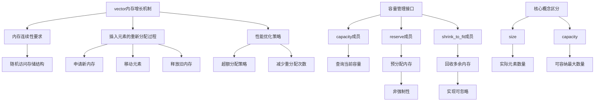

# 📘 9.4 How a vector Grows（vector如何增长）

> 来源说明：《C++ Primer》第9.4节 | 本节涵盖：vector的内存增长机制、容量管理成员函数、size与capacity的区别

---

## 🗺️ 知识体系图



---

## 🧠 核心概念总览

* [*知识点1: vector的内存布局与随机访问特性*](#id1)：vector元素连续存储以支持快速随机访问
* [*知识点2: vector插入元素的内存重分配机制*](#id2)：当容量不足时，vector必须重新分配内存并移动所有元素
  * [*知识点2.1: 单次插入触发重分配的完整过程*](#id3)：涉及申请新内存、移动元素、释放旧内存三个步骤
  * [*知识点2.2: 频繁重分配的性能问题*](#id4)：每次添加元素都重分配会导致性能不可接受
* [*知识点3: 超额分配策略*](#id5)：库实现通过超额分配减少重分配次数，提升效率
* [*知识点4: 容量管理成员函数概览*](#id6)：vector和string提供capacity、reserve和shrink_to_fit管理内存
* [*知识点5: capacity成员函数*](#id7)：返回容器在不重分配前可容纳的元素数量
  * [*知识点5.1: capacity的性质与限制*](#id8)：capacity大于等于size，具体值由实现定义
* [*知识点6: reserve成员函数*](#id9)：预先分配至少容纳n个元素的内存空间
  * [*知识点6.1: reserve的行为规范*](#id10)：仅当请求空间超过当前容量时才生效，且不会改变size
  * [*知识点6.2: reserve不保证精确容量*](#id11)：可能分配超过请求大小的容量
* [*知识点7: shrink_to_fit成员函数(C++11)*](#id12)：请求将capacity减少到与size相等
  * [*知识点7.1: shrink_to_fit的非强制性*](#id13)：实现可自由选择是否回收内存
* [*知识点8: size与capacity的核心区别*](#id14)：size是当前元素数量，capacity是可容纳最大数量
  * [*知识点8.1: size的定义*](#id15)：容器已持有的元素个数
  * [*知识点8.2: capacity的定义*](#id16)：容器必须分配更多空间之前能容纳的元素个数
* [*知识点9: size与capacity交互的代码示例*](#id17)：通过ivec示例演示两者的变化过程
  * [*知识点9.1: 空vector的初始状态*](#id18)：size为0，capacity实现定义为0
  * [*知识点9.2: 添加24个元素后的状态*](#id19)：size为24，capacity至少为24（示例中为32）
  * [*知识点9.3: vector的容量倍增策略*](#id20)：实现采用翻倍策略分配新存储
* [*知识点10: shrink_to_fit使用示例*](#id21)：演示如何请求回收多余内存
* [*知识点11: reserve使用示例*](#id22)：演示如何预先设置容量
* [*知识点12: 消耗预留容量的过程*](#id23)：当size等于capacity时，下次插入将触发重分配
* [*知识点13: vector的实现策略与性能保证*](#id24)：所有实现必须确保push_back的高效性
  * [*知识点13.1: 实现自由度与限制*](#id25)：可自定义分配策略，但不得提前分配不必要内存
  * [*知识点13.2: push_back的摊还常量时间保证*](#id26)：连续调用push_back n次的总时间复杂度为O(n)


---

<a id="id1"></a>
## ✅ 知识点1: vector的内存布局与随机访问特性

**理论**
* vector为了支持**快速随机访问**，将元素**连续存储**在内存中
* 每个元素都与前一个元素**相邻排列**，这种布局是随机访问操作O(1)时间复杂度的基础
* 这种实现细节虽然通常对用户透明，但在某些操作（如内存重分配）时会暴露出来

**注意点**
* 🎯 **核心原理**：连续存储是vector高性能随机访问的根本原因
* 💡 **理解技巧**：可以想象vector就像数组，元素在内存中是紧密排列的

---

<a id="id2"></a>
## ✅ 知识点2: vector插入元素的内存重分配机制

**理论**
* 当向已满的`vector`添加新元素时，由于**内存连续性要求**，无法在原位置"插入"元素
* 必须执行**完整的重分配流程**：1) 分配新内存 2) 移动所有元素 3) 释放旧内存
* 这一过程涉及所有现有元素的拷贝/移动操作，**开销巨大**

**教材示例代码**
```cpp
// vector<int> ivec; 假设capacity已满
ivec.push_back(42); // 触发重分配流程：
// 1. 申请一块能容纳(当前元素+新元素)的新内存
// 2. 将ivec中所有24个现有元素移动到新内存
// 3. 将42添加到新位置
// 4. 释放原来的内存块
```

**注意点**
* ⚠️ **性能陷阱**：重分配是`vector`最昂贵的操作，涉及所有元素
* 💡 **实现细节**：移动语义（C++11后）可以显著降低移动成本

---

<a id="id3"></a>
### ✅ 知识点2.1: 单次插入触发重分配的完整过程

**理论**
* **步骤1**：分配一块新内存，大小至少为当前size + 1（通常会分配更大空间）
* **步骤2**：将旧内存中的所有元素逐一**移动**到新内存对应位置
* **步骤3**：将新元素添加到新内存的末尾位置
* **步骤4**：释放旧内存块，将其归还给系统

**注意点**
* ⚠️ **迭代器失效**：重分配后，所有指向原`vector`的迭代器、引用和指针都会失效
* 💡 **性能优化**：现代实现会使用移动而非拷贝，特别是对于大型对象

---

<a id="id4"></a>
### ✅ 知识点2.2: 频繁重分配的性能问题

**理论**
* 如果每次调用`push_back`都触发重分配，时间复杂度将达到O(n²)
* 对于n个元素的`vector`，总共需要1+2+3+...+n = n(n+1)/2次元素移动
* 这种性能在实际应用中是**不可接受**的

**注意点**
* 🔄 **对比分析**：这正是`vector`需要超额分配策略的根本原因
* 💡 **经验法则**：避免频繁的小规模插入，应预先分配足够空间

---

<a id="id5"></a>
## ✅ 知识点3: 超额分配策略

**理论**
* 为避免频繁重分配，`vector`和`string`实现采用**超额分配**（over-allocation）策略
* 当需要新内存时，会分配**超过立即需求**的空间作为**储备**（reserve）
* 后续添加的元素可以直接使用预留空间，无需重分配

**注意点**
* 🎯 **性能优势**：虽然每次重分配仍需移动所有元素，但**重分配次数显著减少**
* 🔄 **反直觉结论**：即使需要移动所有元素，`vector`通常比`list`/`deque`增长更高效
* 💡 **原因分析**：内存局部性更好，缓存命中率更高，且重分配频率低

---

<a id="id6"></a>
## ✅ 知识点4: 容量管理成员函数概览

**理论**
* `vector`和`string`提供专门的成员函数与内存分配部分交互
* 三个关键函数：`capacity`、`reserve`、`shrink_to_fit`
* 这些函数在标准库头文件`<vector>`或`<string>`中定义

**注意点**
* ⚠️ **适用范围**：capacity和reserve仅适用于vector和string
* ⚠️ **适用范围**：shrink_to_fit仅适用于vector、string和deque
* 💡 **用途**：主要用于性能调优和内存管理

---

<a id="id7"></a>
## ✅ 知识点5: capacity成员函数

**理论**
* **函数原型**：`size_type capacity() const noexcept;`
* **功能**：返回容器在**必须分配更多空间**之前能够容纳的元素数量
* **性质**：返回值**大于等于**当前size，具体数值由实现定义
  * 始终满足 `capacity() >= size()`

**教材示例代码**
```cpp
vector<int> ivec;
cout << "capacity: " << ivec.capacity() << endl; // 输出实现定义的值
// 添加元素后
cout << "capacity: " << ivec.capacity() << endl; // 输出 >= 当前size
```

**注意点**
* 💡 **实现定义**：标准不规定具体值，不同STL实现可能有不同策略
---

<a id="id8"></a>
### ✅ 知识点5.1: capacity的性质与限制

**理论**
* **只读属性**：capacity反映当前内存块的可用容量，不能直接修改
* **增长方向**：capacity**只增不减**（除非通过`shrink_to_fit`请求）
* **实现依赖**：具体容量值和增长策略完全由库实现决定


---

<a id="id9"></a>
## ✅ 知识点6: `reserve`成员函数

**理论**
* **函数原型**：`void reserve(size_type n);`
* **功能**：指示容器修改`capacity`到**至少n个元素**，但不改动容器中的元素数量
* **作用时机**：仅当**n > `capacity()`** 时才分配新内存
  * 因此，每次调用完`reserve`后, `capacity`一定大于或等于传入`reserve`的参数

**教材示例代码**
```cpp
vector<int> ivec;
ivec.reserve(50); // 容量至少变为50，可能更大
// capacity >= 50, size == 0
```


---

<a id="id10"></a>
### ✅ 知识点6.1: `reserve`的行为规范

**理论**
* **不会改变size**：`reserve`只分配内存，**不添加任何元素**，`size`保持不变
  * `resize`与`reserve`正好相反，`resize`只能改动容器的`size`而无法改动`capacity`
* **条件触发**：仅在`请求空间 > 当前容量`时生效
* **拒绝缩容**：如果`n <= capacity()`，调用**无任何效果**


---

<a id="id11"></a>
### ✅ 知识点6.2: `reserve`不保证精确容量

**理论**
* **可能超额分配**：对于调用`reserve(n)`后，实现可能分配**多于n**的空间，`capacity`可能大于n
  * 不要依赖`capacity`等于n，应假设`capacity` >= n
* **最小保证**：`capacity`至少达到或超过n，不会少于请求值
* **无上限约束**：具体分配多少由实现自由决定


---

<a id="id12"></a>
## ✅ 知识点7: `shrink_to_fit`成员函数(C++11)

**理论**
* **函数原型**（C++11起）：`void shrink_to_fit();`
* **功能**：**请求**容器将`capacity`减少到与`size`相等，释放不需要的内存
* **限定**：仅适用于`vector`、`string`和`deque`

**教材示例代码**
```cpp
vector<int> ivec;
// ... ivec.size() == 24, capacity() == 32
ivec.shrink_to_fit(); // 请求释放多余内存
// size仍为24，capacity可能变为24（取决于实现）
```

**注意点**
* 🎯 **核心用途**：在大量元素被删除后，回收不再需要的内存
* 💡 **调用时机**：在size远小于capacity且内存紧张时使用

---

<a id="id13"></a>
### ✅ 知识点7.1: `shrink_to_fit`的非强制性

**理论**
* **请求而非命令**：标准明确说明这是**请求（request）**，实现可忽略
* **无保证**：调用后**不保证**`capacity`一定会减小
* **实现自由**：库实现可基于性能考虑拒绝收缩


---

<a id="id14"></a>
## ✅ 知识点8: `size`与`capacity`的核心区别

**理论**
* **size**：容器中**已经存在**的元素数量，可通过`size()`获取
* **capacity**：容器在**必须分配新内存**之前能容纳的元素数量，可通过`capacity()`获取
* **关系**：`size() <= capacity()`始终成立
* **本质区别**：`size`是**逻辑大小**，`capacity`是**物理容量**


---

<a id="id15"></a>
### ✅ 知识点8.1: `size`的定义

**理论**
* **精确含义**：调用`push_back()`、`insert()`等操作后，容器中实际存储的元素个数
* **变化方式**：通过`push_back`、`emplace_back`、`resize`等操作增加
* **与迭代器关系**：`[begin(), end())`范围内的有效元素数

**注意点**
* 💡 **直接体现**：`size`是容器接口层面的"可见"大小
* 🔄 **与`capacity`无关**：`size`只反映元素数量，不涉及内存管理

---

<a id="id16"></a>
### ✅ 知识点8.2: `capacity`的定义

**理论**
* **精确含义**：当前已分配内存块能够容纳的最大元素数量
* **变化方式**：通过`reserve`、`shrink_to_fit`或自动重分配时改变
* **性能意义**：决定何时触发昂贵的重分配操作

**注意点**
* ⚠️ **容量耗尽**：当`size() == capacity()`时，下次插入必然触发重分配
* 💡 **性能调优**：`capacity`越大，重分配频率越低，但内存占用越多

---

<a id="id17"></a>
## ✅ 知识点9: `size`与`capacity`交互的代码示例

**理论**
* 通过一个完整示例演示`vector`从空到满的`size`和`capacity`变化
* 使用循环添加24个元素，观察`capacity`增长模式

**完整代码流程**
```cpp
vector<int> ivec;

// 初始状态
cout << "ivec: size: " << ivec.size() 
     << " capacity: " << ivec.capacity() << endl;
// 输出: size: 0 capacity: 0 (实现定义)

// 添加24个元素
for (vector<int>::size_type ix = 0; ix != 24; ++ix)
    ivec.push_back(ix);

// 添加后状态
cout << "ivec: size: " << ivec.size()
     << " capacity: " << ivec.capacity() << endl;
// 输出: size: 24 capacity: 32 (实现定义)
```

**注意点**
* 💡 **观察重点**：`capacity`增长不是线性的，而是跳跃式增长
* 🎯 **理解目标**：通过实际输出了实现策略（如翻倍策略）

---

<a id="id18"></a>
### ✅ 知识点9.1: 空`vector`的初始状态

**理论**
* **size**：空`vector`的`size`为**0**，没有元素
* **capacity**：标准不规定，但多数实现将空`vector`的`capacity`设为**0**
* **内存占用**：初始时可能不分配任何内存
* **常见实现**：`libstdc++`和`libc++`都将空`vector`的`capacity`设为0
* **性能考量**：延迟分配，避免为可能不使用的容器浪费内存


---

<a id="id19"></a>
### ✅ 知识点9.2: 添加24个元素后的状态

**理论**
* **size**：循环结束后size为**24**，恰好等于添加的元素数量
* **capacity**：必须**至少为24**，示例中显示为32，说明超额分配了8个位置
* **递增模式**：逐个push_back，每次检查size是否等于capacity

**注意点**
* 💡 **增长策略**：添加第1个元素 → capacity可能变为1或更大的初始值
* 💡 **后续增长**：容量耗尽时，capacity按指数策略增长（如1→2→4→8→16→32）

---

<a id="id20"></a>
### ✅ 知识点9.3: vector的容量倍增策略

**理论**
* **观察现象**：添加24个元素后capacity为32，接近2的幂次
* **典型策略**：多数实现采用**翻倍**或**1.5倍**增长因子
* **合理性**：平衡内存浪费和重分配频率

**注意点**
* 💡 **数学优势**：指数增长使push_back的平均时间复杂度为O(1)
* 🎯 **性能保证**： ensures `push_back` to add elements is efficiently

---

<a id="id21"></a>
## ✅ 知识点10: shrink_to_fit使用示例

**理论**
* 演示在size远小于capacity时如何请求回收内存
* 展示调用前后size和capacity的变化

**完整代码流程**
```cpp
// 接上文，ivec: size: 24 capacity: 32
ivec.shrink_to_fit(); // 请求释放多余内存

cout << "ivec: size: " << ivec.size()
     << " capacity: " << ivec.capacity() << endl;
// 输出: size: 24 capacity: 24 (可能实现定义为仍32)

// 可视化表示：
// 收缩前: [0|1|2|...|23| | | | ]  (24个元素，8个空位)
// 收缩后: [0|1|2|...|23]          (容量恰好匹配)
```

**注意点**
* ⚠️ **不确定性**：调用后capacity可能变为24，也可能保持32
* 💡 **何时使用**：删除大量元素后，内存占用长期过高时

---

<a id="id22"></a>
## ✅ 知识点11: reserve使用示例

**理论**
* 演示如何主动预留内存空间，避免多次重分配
* 展示reserve对size和capacity的不同影响

**完整代码流程**
```cpp
// 重新创建vector
vector<int> ivec;

// 预留50个元素的空间
ivec.reserve(50); 

cout << "ivec: size: " << ivec.size()
     << " capacity: " << ivec.capacity() << endl;
// 输出: size: 0 capacity: 50 (或更大)

// 说明：size不变，capacity至少为50
```

**注意点**
* 🎯 **核心效果**：capacity增长，size保持不变
* 💡 **最佳实践**：已知大致元素数量时，先reserve再push_back

---

<a id="id23"></a>
## ✅ 知识点12: 消耗预留容量的过程

**理论**
* 演示如何用完reserve预留的内存，触发下次重分配
* 展示size从24增长到50的过程中capacity的变化

**完整代码流程**
```cpp
// 接reserve示例后，ivec: size: 0 capacity: 50

// 添加24个元素
for (int i = 0; i < 24; ++i)
    ivec.push_back(i);
// 现在: size: 24 capacity: 50

// 消耗剩余预留空间
while (ivec.size() != ivec.capacity())
    ivec.push_back(0); // 添加元素直到满

cout << "ivec: size: " << ivec.size()
     << " capacity: " << ivec.capacity() << endl;
// 输出: size: 50 capacity: 50

// 此时再添加元素将触发重分配
ivec.push_back(42); // size: 51, capacity: >=51 (可能100)
```

**注意点**
* ⚠️ **关键点**：当`size == capacity`时，下次push_back必然触发重分配
* 💡 **性能观察**：使用预留容量期间，push_back无任何内存分配开销
* 🎯 **容量耗尽现象**：size与capacity由不相等到相等的转变标志重分配点

---

<a id="id24"></a>
## ✅ 知识点13: vector的实现策略与性能保证

**理论**
* **实现自由度**：每个vector实现可**选择自己的分配策略**
* **限制条件**：**不能分配新内存，直到被迫为止**（即size==capacity时）
* **增长因子**：超额分配的具体倍数由实现决定（通常为1.5-2倍）

**注意点**
* ⚠️ **灵活性**：不同STL实现（GCC、Clang、MSVC）可能有不同策略
* 💡 **可观测性**：通过capacity()变化可以推测实现的分配策略
* 🎯 **设计哲学**：在性能和内存浪费之间提供平衡点

---

<a id="id25"></a>
### ✅ 知识点13.1: 实现的自由度与限制

**理论**
* **允许的行为**：可自由选择增长因子、初始容量、收缩策略
* **禁止的行为**：不得在size<capacity时主动重分配（浪费性能）
* **边界情况**：插入、resize、reserve超过当前容量时必须重分配

**注意点**
* 💡 **实现差异**：libstdc++（GCC）使用2倍增长，libc++（Clang）使用1.5-2倍
* ⚠️ **依赖风险**：代码不应依赖特定的capacity值或增长因子

---

<a id="id26"></a>
### ✅ 知识点13.2: push_back的摊还常量时间保证

**理论**
* **性能要求**：通过push_back n次创建n元素vector的时间**不超过O(n)的常数倍**
* **摊还分析**：虽然单次重分配是O(n)，但重分配频率指数级递减
* **数学保证**：平均每次push_back操作的时间复杂度为O(1)

**注意点**
* 🎯 **核心保证**：这是vector相较于list的重要性能优势
* 💡 **理论支撑**：指数增长策略使得总移动次数约为2n，而非n²
* 🔄 **实际意义**：可放心使用push_back构建大vector


---

## 🔑 核心要点总结

1. **内存连续性迫使重分配**：vector元素必须连续存储，插入时需申请新内存、移动元素、释放旧内存

2. **超额分配是性能关键**：通过预留额外空间，将重分配次数从O(n)降至O(log n)，使push_back摊还O(1)

3. **size vs capacity是根本区别**：size=实际元素数（逻辑大小），capacity=可容纳数（物理容量），满足`capacity >= size`

4. **容量管理三成员函数**：
   - `capacity()`：查询内存容量
   - `reserve(n)`：预分配至少n个空间（不改变size）
   - `shrink_to_fit()`：请求回收多余内存（非强制）

5. **实现策略与标准保证**：各STL实现可自定义增长因子，但必须确保push_back高效率

---

## 📌 考试速记版

**核心记忆口诀**：
> **"连续存储需重分，超额分配保性能；size是量capacity是杯，预留回收两成员"**

**关键对比表**：

| 函数/概念 | 作用 | 改变size? | 改变capacity? | 是否强制? |
|-----------|------|-----------|---------------|-----------|
| `push_back` | 添加元素 | ✅ 是 | 可能（满时） | ✅ 是 |
| `reserve(n)` | 预留空间 | ❌ 否 | ✅ 是（当n>cap） | ✅ 是（条件触发） |
| `shrink_to_fit` | 回收内存 | ❌ 否 | ✅ 可能 | ❌ 否（请求） |
| `resize(n)` | 调整大小 | ✅ 是 | 可能（当n>cap） | ✅ 是 |

**三大铁律**：
1. `capacity() >= size()` 永远成立
2. `reserve(n)`不改变size，仅当n>capacity时生效
3. `shrink_to_fit()`是请求，实现可忽略