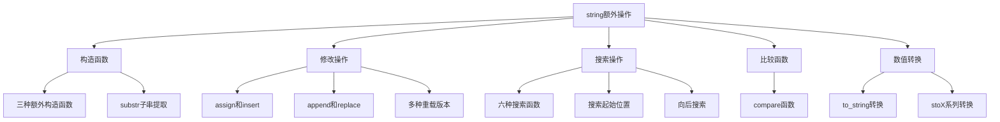

# 📘 9.5 字符串的额外操作 (Additional string Operations)

> 来源说明：C++ Primer 9.5节 | 本节涵盖：string类的构造函数、修改操作、搜索功能、比较函数和数值转换

---

## 🗺️ 知识体系图



---

## 🧠 核心概念总览

* [*知识点1: 其他构造string的方式*](#id1)：string类特有的构造函数和substr操作
* [*知识点1.1: 三种额外构造函数详解*](#id2)：从字符数组和string构造子串
  * [*知识点1.2: substr子串提取操作*](#id3)：返回原字符串的部分或全部拷贝
* [*知识点2: 其他修改string的方式*](#id4)：assign、insert、append和replace操作
* [*知识点2.1: assign和insert操作*](#id5)：替换和插入字符的多种方式
  * [*知识点2.2: append和replace函数*](#id6)：追加内容和替换子串的快捷操作
  * [*知识点2.3: insert和assign的重载版本*](#id7)：支持索引和迭代器的多种参数组合
* [*知识点3: string搜索操作*](#id8)：在string中查找字符或子串
  * [*知识点3.1: 六种搜索函数详解*](#id9)：find、rfind、find_first_of等操作
  * [*知识点3.2: 搜索起始位置的指定*](#id10)：通过可选参数控制搜索起点
  * [*知识点3.3: 向后搜索操作*](#id11)：从右向左搜索的rfind和find_last系列
* [*知识点4: compare函数*](#id12)：类似C风格strcmp的字符串比较
* [*知识点5: 数值转换*](#id13)：string与算术类型之间的相互转换

---

<a id="id1"></a>
## ✅ 知识点1: 其他构造`string`的方式

**理论**
* `string`类型提供三种额外的**构造函数**
  * 这些构造函数支持与C风格字符数组的紧密交互，
  * 并允许使用索引代替迭代器来构造子串
  * 此外，`string`还提供`substr`操作来提取子串

**教材示例代码**
```cpp
const char *cp = "Hello World!!!"; // null-terminated array
char noNull[] = {'H', 'i'}; // not null terminated

string s1(cp); // 拷贝cp中直到null的所有字符
string s2(noNull, 2); // 从noNull拷贝2个字符
string s3(noNull); // 未定义：noNull不是null终止的
string s4(cp + 6, 5); // 从cp[6]开始拷贝5个字符
string s5(s1, 6, 5); // 从s1[6]开始拷贝5个字符
string s6(s1, 6); // 从s1[6]拷贝到末尾
string s7(s1, 6, 20); // ok，只拷贝到s1末尾
string s8(s1, 16); // 抛出out_of_range异常
```

**注意点**
* ⚠️ **Null终止要求**：从`const char*`构造时，数组**必须**以`null`终止
  * 若同时传递计数，则不要求`null`终止
  * 如果n超过了`string`的长度并且没有`null`终止的话，那么表现未定义
* ⚠️ **越界检查**：从`string`构造时，起始位置必须≤`string`大小，否则会抛出`out_of_range`异常
* 💡 **计数调整**：若请求字符数超过实际可用数量，库会自动调整为最多拷贝到字符串末尾

---

<a id="id2"></a>
### ✅ 知识点1.1: 三种额外构造函数详解

**理论**
string支持三种额外的构造函数，参数均为`unsigned`类型：
1. `string s(cp, n)`：从字符数组指针`cp`指向的前`n`个字符拷贝
2. `string s(s2, pos2)`：从string `s2`的`pos2`位置开始拷贝到末尾
3. `string s(s2, pos2, len2)`：从`s2`的`pos2`位置开始拷贝`len2`个字符，最多拷贝`s2.size() - pos2`个

**技术规范**
* 对于`string s(cp, n)`：数组必须至少有n个字符
* 对于`string s(s2, pos2)`：若`pos2` > `s2.size()`，行为未定义
* 对于`string s(s2, pos2, len2)`：无论如何，最多拷贝`s2.size() - pos2`个字符

---

<a id="id3"></a>
### ✅ 知识点1.2: `substr`子串提取操作

**理论**
* `substr`操作返回一个`string`，是原字符串的部分或全部**拷贝**
* 可传递可选的起始位置和计数，返回从`pos`开始的`n`个字符，若`pos` + `n`超过大小则调整计数
  * **默认参数**：`pos`默认为0，n默认为拷贝从`pos`到末尾的所有字符

**教材示例代码**
```cpp
string s("hello world");
string s2 = s.substr(0, 5); // s2 == "hello"
string s3 = s.substr(6);    // s3 == "world"
string s4 = s.substr(6, 11); // s3 == "world"
string s5 = s.substr(12);   // 抛出out_of_range异常
```

**注意点**
* ⚠️ **异常处理**：若`pos`超过字符串大小，抛出`out_of_range`异常

---

<a id="id4"></a>
## ✅ 知识点2: 其他修改`string`的方式

**理论**
`string`支持顺序容器的赋值运算符以及`assign`、`insert`和`erase`操作。此外还提供接受索引的版本，以及使用C风格字符数组的`assign`和`insert`版本。

**教材示例代码**
```cpp
string s("C++ Primer"), s2 = s;
s.insert(s.size(), " 4th Ed."); // 在末尾插入
s2.append(" 4th Ed.");          // 等价于上一行
s.insert(s.size(), 5, '!');     // 在末尾插入5个感叹号
s.erase(s.size() - 5, 5);       // 删除最后5个字符
```

**注意点**
* 🔄 **append是简写**：append操作是insert在末尾插入的简写形式
* 🎯 **索引vs迭代器**：string同时提供接受索引和迭代器的版本，方便不同使用场景

---

<a id="id5"></a>
### ✅ 知识点2.1: assign和insert操作

**理论**
assign替换string的全部内容，insert在指定位置前插入字符。两者都有多个重载版本，支持从string、字符数组、字符计数等多种来源。

**教材示例代码**
```cpp
const char *cp = "stately, plump Buck";
string s;
s.assign(cp, 7);           // s == "Stately"
s.insert(s.size(), cp + 7); // s == "Stately, plump Buck"

string s2 = "some string", s3 = "some other string";
s2.insert(0, s3);          // 在位置0前插入s3的拷贝
s2.insert(0, s3, 0, s3.size()); // 等价形式
```

**注意点**
* ⚠️ **assign的替换性**：assign总是替换整个string内容
* ⚠️ **insert位置**：插入发生在给定位置之前，位置可以是索引或迭代器

---

<a id="id6"></a>
### ✅ 知识点2.2: append和replace函数

**理论**
append是向string末尾添加内容的简写形式。replace是erase和insert的组合，先删除指定范围的字符，再插入新字符。

**教材示例代码**
```cpp
string s("C++ Primer");
s.append(" 4th Ed."); // 追加到末尾

s.replace(11, 3, "Fifth"); // s == "C++ Primer Fifth Ed."
// 删除3个字符，插入5个字符
```

**注意点**
* 🔄 **replace的灵活性**：可以删除和插入不同长度的字符串
* 💡 **返回值**：所有修改操作都返回string的引用，支持链式调用

---

<a id="id7"></a>
### ✅ 知识点2.3: insert和assign的重载版本

**理论**
修改操作有多种重载版本，新字符可来自另一个string、字符指针、花括号列表或字符加计数。不同函数支持的参数组合不同。

**参数支持表**
| 参数形式 | replace(pos,len,args) | replace(b,e,args) | insert(pos,args) | insert(iter,args) |
|----------|----------------------|-------------------|------------------|-------------------|
| str      | yes                  | yes               | yes              | no                |
| str,pos,len | yes              | no                | yes              | no                |
| cp,len   | yes                  | yes               | yes              | no                |
| cp       | yes                  | yes               | no               | no                |
| n,c      | yes                  | yes               | yes              | yes               |
| b2,e2    | no                   | yes               | no               | yes               |
| initializer list | no             | yes               | no               | yes               |

**注意点**
* ⚠️ **参数限制**：insert接受索引时不能使用initializer list；insert使用迭代器时不能使用字符指针
* ⚠️ **str必须独立**：str必须与目标string不同，迭代器b和e不能指向目标string

---

<a id="id8"></a>
## ✅ 知识点3: string搜索操作

**理论**
string类提供六个不同的搜索函数，每个都有四个重载版本。搜索是区分大小写的，返回找到位置的索引或`string::npos`（表示未找到）。

**核心概念**
* `string::npos`是静态成员，为unsigned类型，初始化为-1，代表string可能的最大大小
* 所有搜索操作返回`string::size_type`，不应使用signed类型存储

**教材示例代码**
```cpp
string name("AnnaBelle");
auto pos1 = name.find("Anna"); // pos1 == 0

string lowercase("annabelle");
pos1 = lowercase.find("Anna"); // pos1 == npos（未找到）
```

---

<a id="id9"></a>
### ✅ 知识点3.1: 六种搜索函数详解

**理论**
1. `s.find(args)`：查找args第一次出现的位置
2. `s.rfind(args)`：查找args最后一次出现的位置
3. `s.find_first_of(args)`：查找args中任意字符第一次出现的位置
4. `s.find_last_of(args)`：查找args中任意字符最后一次出现的位置
5. `s.find_first_not_of(args)`：查找第一个不在args中的字符
6. `s.find_last_not_of(args)`：查找最后一个不在args中的字符

**教材示例代码**
```cpp
string numbers("0123456789"), name("r2d2");
auto pos = name.find_first_of(numbers); // 返回1，第一个数字的位置

string dept("03714p3");
auto pos2 = dept.find_first_not_of(numbers); // 返回5，第一个非数字字符
```

**注意点**
* 🎯 **区分函数语义**：`find`查找完整子串，`find_first_of`查找字符集合中的任意字符
* ⚠️ **npos检查**：必须检查返回值是否等于`npos`来判断是否找到

---

<a id="id10"></a>
### ✅ 知识点3.2: 搜索起始位置的指定

**理论**
所有搜索函数都接受可选的第二个参数pos，指定从字符串的哪个位置开始搜索，默认为0。利用此特性可循环查找所有匹配项。

**教材示例代码**
```cpp
string::size_type pos = 0;
// 循环查找所有数字
while ((pos = name.find_first_of(numbers, pos)) != string::npos) {
    cout << "found number at index: " << pos 
         << " element is " << name[pos] << endl;
    ++pos; // 移动到下一个字符，避免无限循环
}
```

**注意点**
* ⚠️ **必须递增pos**：若不递增，可能陷入无限循环
* 💡 **编程模式**：这是遍历字符串查找所有匹配的标准模式

---

<a id="id11"></a>
### ✅ 知识点3.3: 向后搜索操作

**理论**
rfind系列操作从右向左搜索。`rfind`查找子串最后一次出现，`find_last_of`查找字符集合中任意字符最后一次出现，`find_last_not_of`查找最后一个不匹配字符。

**教材示例代码**
```cpp
string river("Mississippi");
auto first_pos = river.find("is");    // 返回1，第一个"is"
auto last_pos = river.rfind("is");    // 返回4，最后一个"is"
```

**注意点**
* 🔄 **搜索方向**：向后搜索的函数名以`r`或`last`开头
* 🎯 **返回位置**：返回位置仍是从左到右的索引，不是反向索引

---

<a id="id12"></a>
## ✅ 知识点4: compare函数

**理论**
string提供compare函数，类似C库strcmp，返回0（相等）、正值（大于）或负值（小于）。支持多种参数形式，可比较整个或部分字符串。

**参数形式**
* `s2`：比较s和s2
* `pos1, n1, s2`：比较s从pos1开始的n1个字符与s2
* `pos1, n1, s2, pos2, n2`：比较s的n1个字符与s2的n2个字符
* `cp`：比较s与cp指向的null-terminated数组
* `pos1, n1, cp`：比较s的n1个字符与cp指向的数组
* `pos1, n1, cp, n2`：比较s的n1个字符与cp的前n2个字符

---

<a id="id13"></a>
## ✅ 知识点5: 数值转换

**理论**
C++11引入to_string和stoX系列函数，实现string与算术类型间的转换。to_string将数值转为string，stoX将string转为数值。

**教材示例代码**
```cpp
int i = 42;
string s = to_string(i); // 将int转为string

string s2 = "pi = 3.14";
// 找到第一个数字字符并转换
d = stod(s2.substr(s2.find_first_of("+-.0123456789")));

string s3 = "123";
int val = stoi(s3); // 将string转为int
```

**技术规范**
* **to_string**：支持所有算术类型，包括浮点和整型（int及以上），小整型会被提升
* **stoX系列**：包括`stoi`, `stol`, `stoul`, `stoll`, `stoull`, `stof`, `stod`, `stold`
  * `p`参数：指向size_t的指针，存储第一个非数字字符的索引，默认为0（不存储）
  * `b`参数：数字基数，默认为10
* **转换规则**：首个非空白字符必须是符号或数字；可0x/0X开头表示十六进制；浮点可含小数点和指数符号

**注意点**
* ⚠️ **异常处理**：无法转换时抛出`invalid_argument`；转换结果无法表示时抛出`out_of_range`
* ⚠️ **起始字符**：转换的string必须以有效数字表示形式开头，否则抛出异常
* 💡 **实用技巧**：可先用`find_first_of`定位数字再转换子串

---

## 🔑 核心要点总结

1. **构造灵活性**：string提供从C数组和子串构造的能力，支持位置和大小的精确控制，但需注意null终止和越界检查

2. **修改操作多样性**：assign/replace/insert/append提供多种重载，支持string、字符数组、字符计数、初始化列表等多种参数，但不同函数支持的参数组合有差异

3. **搜索函数体系**：六大搜索函数（find/rfind/find_first_of/find_last_of/find_first_not_of/find_last_not_of）构成完整搜索体系，返回`npos`表示未找到，可通过起始位置参数循环搜索

4. **数值转换安全**：stoX系列转换首个字符必须是有效数字格式，否则抛出异常；to_string支持所有算术类型，实现安全的类型转换

---

## 📌 考试速记版

**核心记忆口诀**
- **构造三方式**：数组+计数、string+位置、string+位置+计数
- **搜索六函数**：find/rfind/first_of/last_of/first_not_of/last_not_of
- **修改四剑客**：assign/insert/append/replace，返回引用支持链式
- **转换两方向**：to_string转字符串，stoX转数值，注意异常安全

**关键易错点**
* ❗ 从`const char*`构造无计数参数时必须null终止
* ❗ 搜索返回`npos`要用unsigned类型接收
* ❗ 循环搜索必须手动递增pos避免死循环
* ❗ 数值转换string必须以数字符号开头，否则会抛异常