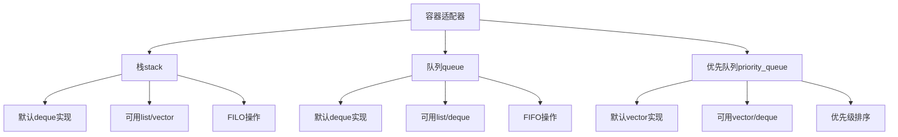

# 📘 9.6 容器适配器 (Container Adaptors)

> 来源说明：C++ Primer 9.6 | 本节涵盖：容器适配器的概念、三种适配器（stack、queue、priority_queue）的定义、使用和底层容器要求

---

## 🗺️ 知识体系图



## 🧠 核心概念总览

* [*知识点1: 容器适配器概述*](#id1)：适配器概念、共有操作和类型
  * [*知识点1.1: 适配器的定义*](#id2)：构造函数的两种形式
  * [*知识点1.2: 底层容器要求*](#id3)：不同适配器对底层容器的要求
* [*知识点2: 栈适配器stack*](#id4)：栈的定义、操作和示例
  * [*知识点2.1: 栈的操作*](#id5)：表9.18中的栈专用操作
* [*知识点3: 队列适配器queue和priority_queue*](#id6)：队列和优先队列的定义
  * [*知识点3.1: 队列操作*](#id7)：表9.19中的队列专用操作

---

<a id="id1"></a>
## ✅ 知识点1: 容器适配器概述

**理论**
* 适配器是C++标准库中的一个通用概念，包括容器适配器、迭代器适配器和函数适配器
* 容器适配器接受一个现有的容器类型，使其表现得像另一种类型
* 三种容器适配器：`stack`、`queue`、`priority_queue`
* 这是 **C++ 容器适配器（`stack / queue / priority_queue`）共有的类型与操作**，核心要点如下：

* **1️⃣ 公共类型**

  * `size_type`：能表示容器大小的类型
  * `value_type`：元素类型
  * `container_type`：底层使用的容器类型

* **2️⃣ 构造与比较**

  * `A a;`：创建空的适配器
  * `A a(c);`：用底层容器 `c` 初始化
  * 支持关系运算符 `== != < <= > >=`（比较底层容器）

* **3️⃣ 常用操作**

  * `a.empty()`：是否为空
  * `a.size()`：元素个数
  * `swap(a, b)` / `a.swap(b)`：交换两个适配器内容（类型必须相同）
* 容器适配器统一接口很少，只提供大小、空、比较和交换，具体访问方式由适配器决定


**注意点**
* ⚠️ 适配器不是容器，而是**基于容器的包装器**
* 💡 适配器提供特定接口，隐藏底层容器的实现细节
* 🔄 适配器限制了对底层容器操作的直接访问

---

<a id="id2"></a>
### ✅ 知识点1.1: 适配器的定义

**理论**
* 每个适配器定义两种构造函数：
  1. **默认构造函数**：创建空对象
  2. **拷贝构造函数**：接受一个容器，通过复制容器内容初始化适配器
* 示例：用`deque`初始化`stack`

**教材示例代码**
```cpp
deque<int> deq;
// 将deq中的元素复制到stk中
stack<int> stk(deq);
```

**注意点**
* ⚠️ 初始化是拷贝操作，不会共享数据
* 💡 可以使用不同类型的底层容器，但必须满足适配器的要求

---

<a id="id3"></a>
### ✅ 知识点1.2: 底层容器要求

**理论**
* 默认实现：
  - `stack`和`queue`默认基于`deque`
  - `priority_queue`默认基于`vector`
* 可以覆盖默认容器类型，在创建适配器时指定第二个类型参数
* 适配器对底层容器的要求：
  - 所有适配器要求能**添加**和**删除**元素
  - **不能**使用`array`（不能改变大小）
  - **不能**使用`forward_list`（需要访问尾元素）
* `stack`要求：`push_back`、`pop_back`、`back`操作
  - **可用容器**：`deque`、`list`、`vector`
* `queue`要求：`back`、`push_back`、`front`、`push_front`操作
  - **可用容器**：`list`、`deque`（**不能用`vector`**，缺少`push_front`）
* `priority_queue`要求：随机访问、front、push_back、pop_back操作
  - **可用容器**：`vector`、`deque`（**不能用`list`**，缺少随机访问）

**教材示例代码**
```cpp
// 在vector上实现的空stack
stack<string, vector<string>> str_stk;
// 在vector上实现的stack，初始化为svec的拷贝
stack<string, vector<string>> str_stk2(svec);
```

**代码解析**
* 本来`stack`的实现默认是使用`deque`
* 但是我们可以通过第二个参数来指定使用`vector<string>`来实现 

---

<a id="id4"></a>
## ✅ 知识点2: 栈适配器`stack`

**理论**
* `stack`类型定义在`<stack>`头文件中
* 栈遵循**后进先出**（LIFO）原则
* 只能访问栈顶元素
* 通过限制对底层容器的操作，提供栈的语义

**教材示例代码**
```cpp
stack<int> intStack;  // 空栈
// 填充栈
for (size_t ix = 0; ix != 10; ++ix)
    intStack.push(ix);  // intStack包含0...9

while (!intStack.empty()) {  // 栈中仍有值时
    int value = intStack.top();
    // 使用value的代码
    intStack.pop();  // 弹出栈顶元素，重复
}
```

**注意点**
* ⚠️ 栈操作是底层容器操作的封装
* 💡 实际调用的是底层容器的`push_back`、`pop_back`、`back`等操作
* 🔄 虽然`stack`默认基于`deque`，但不能直接调用`deque`的操作

---

<a id="id5"></a>
### ✅ 知识点2.1: 栈的操作

**理论**
* 栈专用操作：
  - `s.pop()`：移除但不返回栈顶元素
  - `s.push(item)`：通过拷贝或移动item创建新栈顶元素
  - `s.emplace(args)`：通过args构造栈顶元素
  - `s.top()`：返回但不移除栈顶元素
* 这些操作是对底层容器操作的封装

**注意点**
* ⚠️ `pop()`不返回被移除的元素，需要先通过`top()`获取
* 💡 `emplace()`直接在栈顶构造元素，避免拷贝
* ⚠️ 对**空栈**调用`top()`或`pop()`是未定义行为

---

<a id="id6"></a>
## ✅ 知识点3: 队列适配器`queue`和`priority_queue`

**理论**
* `queue`和`priority_queue`定义在`<queue>`头文件中
* `queue`使用**先进先出**（FIFO）策略
* `priority_queue`允许建立元素优先级，新元素根据优先级插入
  * 例子：餐厅排队，但是每个人都有预定时间，根据预定时间入座
* 默认使用`<`运算符确定相对优先级

**注意点**
* ⚠️ `queue`示例：按到达顺序入座的餐厅
* ⚠️ `priority_queue`示例：按预约时间入座的餐厅
* 💡 `priority_queue`的优先级可以通过自定义比较函数改变

---

<a id="id7"></a>
### ✅ 知识点3.1: 队列操作

**理论**
* 队列操作：
  - `q.pop()`：移除但不返回队首元素（`queue`）或最高优先级元素（`priority_queue`）
  - `q.front()`：返回但不移除`queue`的队首元素（仅`queue`）
  - `q.back()`：返回但不移除`queue`的队尾元素（仅`queue`）
  - `q.top()`：返回但不移除`priority_queue`的最高优先级元素（仅`priority_queue`）
  - `q.push(item)`：在队尾创建元素（`queue`）或在适当位置创建元素（`priority_queue`）
  - `q.emplace(args)`：通过`args`构造元素

**注意点**
* ⚠️ `queue`有`front()`和`back()`，`priority_queue`只有`top()`
* ⚠️ 对空队列调用`front()`、`back()`、`top()`或`pop()`是未定义行为
* 💡 `priority_queue`的`push()`会根据优先级自动调整元素位置

---

## 🔑 核心要点总结
1. **适配器概念**：容器适配器基于现有容器提供特定接口（栈、队列、优先队列）
2. **底层容器选择**：不同适配器对底层容器有不同的操作要求
3. **栈操作**：LIFO原则，只能访问栈顶，操作封装了底层容器的push_back/pop_back
4. **队列操作**：FIFO原则，queue有队首队尾，priority_queue按优先级排序
5. **使用限制**：只能使用适配器提供的操作，不能直接使用底层容器操作

## 📌 考试速记版
* **三种适配器**：stack、queue、priority_queue
* **默认容器**：stack→deque、queue→deque、priority_queue→vector
* **禁止容器**：array（无大小调整）、forward_list（无尾访问）
* **栈操作**：push、pop、top、emplace
* **队列操作**：queue有front/back、priority_queue只有top
* **访问规则**：pop不返回值，必须先通过top/front/back获取

**口诀**：
栈是后进先出，队列先进先出，
优先队列看优先级，底层容器有限制。
pop操作不返回，访问元素要分开，
适配器是包装器，原始操作不能直接来。