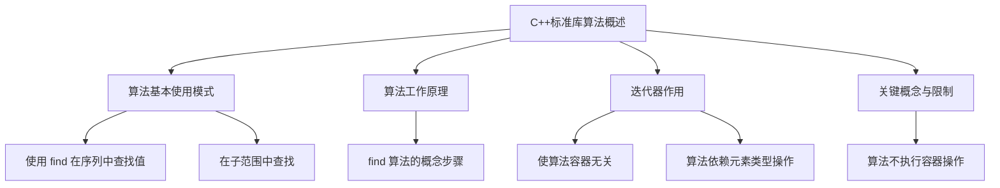

# 📘 10.1 概述 (Overview)

> 来源说明：C++ Primer 10.1 | 本节涵盖：C++标准库算法的基本概念、工作原理、以及与容器和迭代器的关系。

---

## 🗺️ 知识体系图



## 🧠 核心概念总览

* [*知识点1: 算法基本使用模式*](#id1)：介绍如何在容器和数组中调用`find`算法进行查找。
    * [*知识点1.1: 使用库函数获取迭代器范围*](#id2)：如何使用`begin`和`end`函数为数组获取指针范围。
    * [*知识点1.2: 在子范围中查找*](#id3)：如何通过传递特定范围的迭代器（或指针）在序列的子集中进行查找。
* [*知识点2: 算法工作原理*](#id4)：以`find`为例，概念性地分解算法的执行步骤。
    * [*知识点2.1: find 的执行步骤*](#id5)：查找过程的开始、比较和成功返回。
* [*知识点3: 迭代器使算法与容器无关*](#id8)：算法通过迭代器操作访问元素，不依赖容器类型。
* [*知识点4: 算法依赖于元素类型的操作*](#id9)：大多数算法（如`find`）需要元素类型支持特定操作（如`==`）。
* [*知识点5: 关键概念：算法不执行容器操作*](#id10)：强调算法本身不直接改变容器结构（如大小），相关操作由迭代器完成。

---

<a id="id1"></a>
## ✅ 知识点1: 算法基本使用模式

**理论**
* 大多数算法定义在头文件`<algorithm>`中
* 泛型数值算法定义在头文件`<numeric>`中
* 算法不直接操作容器，而是通过遍历由两个迭代器（§ 9.2.1）界定的元素范围来工作
* `find`算法：接受一个表示元素范围的迭代器对和一个目标值，返回**指向第一匹配元素的迭代器**
    * 若未找到，则返回范围的尾后迭代器（第二个参数）
    * 通过**比较返回值与第二个迭代器参数**（尾后迭代器），可以判断查找是否成功
* 由于`find`基于迭代器工作，相同的函数可以用于查找**任何类型容器**的元素，体现了泛型编程的威力


**教材示例代码**
```cpp
// 在 vector 中查找值
int val = 42;
auto result = find(vec.cbegin(), vec.cend(), val); // 使用常量迭代器
cout << "The value " << val
    << (result == vec.cend()
    ? " is not present" : " is present") << endl;

// 在 list<string> 中查找值
string val = "a value";
auto result = find(lst.cbegin(), lst.cend(), val); // 同样的 find 函数，用于不同类型的容器
```


---

<a id="id2"></a>
### ✅ 知识点1.1: 使用库函数获取迭代器范围

**理论**
* 对于内置数组，可以使用标准库的`begin()`和`end()`函数（§ 3.5.3）来获取指向**内置数组**首元素和尾后位置的指针
* 这些指针可以像迭代器一样传递给算法
* 这解决了**C风格数组**无法直接获取`.begin()`, `.end()`成员方法的问题

**教材示例代码**
```cpp
int ia[] = {27, 210, 12, 47, 109, 83};
int val = 83;
int* result = find(begin(ia), end(ia), val); // begin(ia)返回指向ia[0]的指针，end(ia)返回指向尾后位置的指针
```

**注意点**
* ⚠️ 对于内置数组，`end(ia)`返回的是最后一个元素**之后**那个位置的地址，符合迭代器“尾后”的概念

---

<a id="id3"></a>
### ✅ 知识点1.2: 在子范围中查找

**理论**
* 可以向算法传递指向子范围**第一个元素**和**尾后元素**的迭代器（或指针），从而限定算法只在序列的某个**子集**内操作
* 范围是**左闭右开**区间 `[first, last)`，即包含`first`，不包含`last`
* **指针运算**：`ia + N` 移动了N个元素的位置。`ia[1]`的地址就是`ia + 1`

**教材示例代码**
```cpp
int ia[] = {27, 210, 12, 47, 109, 83};
int val = 83;
// 搜索 ia[1], ia[2], ia[3] 这三个元素
// ia + 1 指向 ia[1]，ia + 4 指向 ia[3]的下一个位置（ia[4]）
auto result = find(ia + 1, ia + 4, val);
```

**注意点**
* ⚠️ 理解“尾后”概念至关重要：传递给算法的第二个迭代器指向的是我们**不希望处理**的第一个元素

---

<a id="id4"></a>
## ✅ 知识点2: 算法工作原理

**理论**
* 以`find`在无序序列中查找特定元素的任务为例，可以将其工作流程概念化为几个逻辑步骤
* 理解这些步骤有助于明白算法是如何与迭代器抽象协同工作的

---

<a id="id5"></a>
### ✅ 知识点2.1: `find` 的执行步骤

**理论**
1. **访问序列首元素**：算法从迭代器`first`指向的元素开始
2. **比较元素值**：将当前元素与给定的目标值进行比较
3. **处理匹配**：如果当前元素与目标值匹配，`find`返回一个标识该元素的迭代器（通常就是指向它的迭代器）
4. **迭代与重复**：如果不匹配，算法通过迭代器递增操作(`++iter`)前进到下一个元素，然后重复步骤2和3
5. **终止条件**：当算法抵达序列的末尾（即迭代器等于`last`，尾后迭代器）时，必须停止
6. **处理未找到**：如果抵达序列末尾仍未找到，`find`返回一个指示未找到的值，该值必须与步骤3的返回值类型兼容（通常就是尾后迭代器`last`）

**注意点**
* ⚠️ 以上所有操作并不依赖容器类型实现，只要有能访问元素的迭代器，`find`就可以工作 

---


<a id="id8"></a>
## ✅ 知识点3: 迭代器使算法与容器无关

**理论**
* `find`算法的步骤1、3、4、5、6都可以通过迭代器的标准操作（解引用、递增、比较、返回）来处理
* 这意味着，只要能为某种数据结构提供满足这些操作的迭代器，`find`算法就可以在其上工作，而**完全不关心**底层是`vector`、`list`、`array`还是其他任何容器，甚至数据是否存储在标准容器中

**教材原文强调**
> All but the second step in the find function can be handled by iterator operations... So long as there is an iterator that can be used to access the elements, find doesn't depend in any way on the container type.

**注意点**
* 🎯 这是STL设计的精髓：**算法通过迭代器抽象与数据结构解耦**。

---

<a id="id9"></a>
## ✅ 知识点4: 算法依赖于元素类型的操作

**理论**
* 虽然迭代器解耦了算法和容器，但大多数算法**依赖于元素类型本身支持的操作**
* 例如，`find`算法的步骤2需要使用元素类型的`==`运算符来比较元素
* 其他算法可能要求元素类型支持`<`运算符
* 不过，大多数算法允许用户**提供自定义的比较或操作函数**，以覆盖默认的运算符行为


**注意点**
* ⚠️ 如果你自定义的类对象想要用于标准算法（如`sort`, `find`），可能需要重载相应的运算符（如`==`, `<`）
* 💡 自定义操作函数提供了灵活性，允许算法用于不直接支持特定运算符的类型，或定义非标准的比较逻辑

---

<a id="id10"></a>
## ✅ 知识点5: 关键概念：算法不执行容器操作

**理论**
* **核心原则**：泛型算法**只操作迭代器**，不直接执行任何容器操作（如添加或删除元素）
* **算法能做什么**：它们可以读取、修改或移动容器内**已存在元素**的值
* **算法不能做什么**：算法本身**永远不会增加或删除容器中的元素**，因此也**永远不会直接改变容器的大小**
* **特殊迭代器**：存在一类特殊的迭代器，称为**插入器（inserters）**（§ 10.4.1）。当向这类迭代器赋值时，它们会在底层容器上执行插入操作
    * 当算法操作这类迭代器时，**看起来**像是算法添加了元素，但实际上插入动作是由**迭代器**完成的，算法只是像往常一样向迭代器写入值


**注意点**
* 🎯 **算法不管理存储，只处理数据**。存储管理由容器和特殊的迭代器负责。
* 🔄 这解释了为什么像`remove`这样的算法并不真正删除元素，它只是移动元素
    * 真正的删除需要结合容器操作

---

## 🔑 核心要点总结
1.  **算法通过迭代器工作**：标准库算法接收迭代器范围`[first, last)`作为输入，对范围内的元素进行操作，实现与具体容器类型的解耦。
2.  **`find`是通用查找工具**：用于在无序序列中查找特定值，成功返回指向元素的迭代器，失败返回尾后迭代器`last`。它可以在任何提供迭代器的序列上使用。
3.  **迭代器是抽象关键**：迭代器的标准操作（访问、移动、比较）使得算法逻辑（如遍历、比较、返回）能够独立于底层数据结构实现。
4.  **算法有双重依赖**：算法依赖迭代器接口来访问和遍历数据，同时依赖元素类型的特定操作（如`==`）来完成其核心逻辑。后者通常可以自定义。
5.  **算法不改变容器结构**：算法仅处理现有元素的值和顺序，不负责添加或删除元素。改变容器大小的操作由容器自身或特殊的插入迭代器完成。

## 📌 考试速记版
*   **算法接口**：`result = find(first, last, value)`。
*   **返回值**：找到->指向元素的迭代器；未找到->`last`（尾后迭代器）。
*   **范围约定**：左闭右开 `[first, last)`。
*   **核心抽象**：**算法** + **迭代器** + **容器**。算法通过迭代器操作容器中的元素。
*   **重要限制**：算法本身**不增删**容器元素（大小不变）。

**口诀**：**算法迭代器中转，不增不删只管算；查找失败返`last`，范围左闭右边开。**