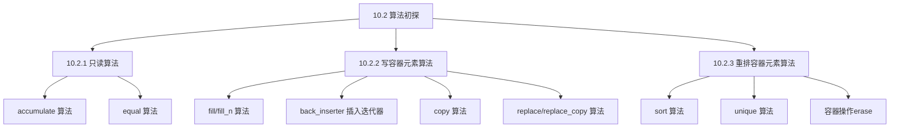

# 📘 10.2 算法初探 (A First Look at the Algorithms)

> 来源说明：C++ Primer 10.2 | 本节涵盖：C++标准库算法的基本概念、分类和使用原则

---

## 🗺️ 知识体系图



## 🧠 核心概念总览

* [*知识点1: 算法架构统一性*](#id1)：标准库100+算法的统一设计原则
* [*知识点2: 算法操作范围*](#id2)：输入范围的概念和迭代器参数约定
* [*知识点3: 算法分类*](#id3)：按读写行为对算法进行分类
* [*知识点4: accumulate 只读算法*](#id4)：累加算法的使用和注意事项
    * [*知识点4.1: accumulate 元素类型要求*](#id5)：累加算法的类型匹配要求
* [*知识点5: equal 只读算法*](#id6)：比较两个序列是否相等的算法
    * [*知识点5.1: equal 算法的重要假设*](#id7)：算法对第二个序列大小的假设
* [*知识点6: fill 写元素算法*](#id8)：填充范围内元素的算法
* [*知识点7: fill_n 写元素算法*](#id9)：填充指定数量元素的算法
    * [*知识点7.1: fill_n 常见错误*](#id10)：在空容器上使用fill_n的问题
* [*知识点8: 算法不检查写操作*](#id11)：算法对写操作的安全性假设
* [*知识点9: back_inserter 插入迭代器*](#id12)：用于向容器末尾添加元素的迭代器适配器
* [*知识点10: copy 算法*](#id13)：复制序列到目标位置的算法
* [*知识点11: replace 和 replace_copy 算法*](#id14)：替换序列中值的算法及其复制版本
* [*知识点12: sort 重排算法*](#id15)：对序列进行排序的算法
* [*知识点13: unique 重排算法*](#id16)：消除相邻重复元素的算法
    * [*知识点13.1: unique 算法的工作方式*](#id17)：unique实际不删除元素，而是覆盖相邻重复项
* [*知识点14: 容器操作与算法配合*](#id18)：使用容器成员函数实际删除元素
    * [*知识点14.1: 安全删除空范围*](#id19)：erase空范围操作的安全性

---

<a id="id1"></a>
## ✅ 知识点1: 算法架构统一性

**理论**
* C++标准库提供100多个算法，但具有一致的架构
* 理解统一架构比记忆所有算法更重要
* 原书附录A按操作方式对所有算法进行了分类

**注意点**
* 💡 学习算法的关键是掌握其设计模式和通用原则，而非死记硬背每个具体算法

---

<a id="id2"></a>
## ✅ 知识点2: 算法操作范围

**理论**
* 绝大多数算法在元素范围上操作
* 这个范围称为"**输入范围**"
* 接受输入范围的算法总是使用前两个参数表示该范围
* 这两个参数是**迭代器**：指向要处理的第一个元素和最后一个元素之后的位置

**教材示例代码**
```cpp
// 典型的算法调用模式
algorithm(begin_iter, end_iter, other_args...);
```

**注意点**
* 🎯 算法操作的是迭代器，而不是容器本身

---

<a id="id3"></a>
## ✅ 知识点3: 算法分类

**理论**
* 理解算法的最基本方式是知道它们是：
  1. **只读元素**：读取但不修改元素
  2. **写元素**：修改元素值
  3. **重排元素顺序**：改变元素在容器中的顺序
* 算法不执行容器操作，因此不能直接添加或删除元素

**注意点**
* ⚠️ 算法通过迭代器操作元素，无法改变容器大小

---

<a id="id4"></a>
## ✅ 知识点4: accumulate 只读算法

**理论**
* `accumulate`算法定义在`<numeric>`头文件中
* 接受三个参数：前两个指定要累加的元素范围，第三个是累加的初始值
* 返回累加结果，结果的类型由**第三个参数的类型决定**

**教材示例代码**
```cpp
#include <numeric>
#include <vector>
using namespace std;

vector<int> vec = {1, 2, 3, 4, 5};
// 对vec中的元素求和，从0开始累加
int sum = accumulate(vec.cbegin(), vec.cend(), 0);
// sum = 15
```

**注意点**
* 💡 使用`cbegin()`和`cend()`获取`const`迭代器，适用于只读算法
* 🔄 `accumulate`的**第三个参数类型决定**了使用哪个加法运算符以及返回类型

---

<a id="id5"></a>
### ✅ 知识点4.1: accumulate 元素类型要求

**理论**
* 序列中的元素类型必须与第三个参数的**类型匹配或可转换**
* 元素必须能够与累加类型进行**加法运算**
* 对于`string`类型，由于有`+`运算符，可以用于**连接字符串**

**教材示例代码**
```cpp
#include <string>
#include <vector>
#include <numeric>
using namespace std;

vector<string> v = {"Hello", " ", "World", "!"};
// 正确：显式创建string作为初始值
string concat = accumulate(v.cbegin(), v.cend(), string(""));
// concat = "Hello World!"

// 错误：使用字符串字面量会导致编译错误
string wrong = accumulate(v.cbegin(), v.cend(), ""); // 错误！
// 原因：const char* 类型没有+运算符
```

**注意点**
* ⚠️ 必须**显式**创建`string`对象作为初始值，**不能**使用字符串字面量
* 💡 字符串字面量的类型是`const char*`，**没有**定义`+`运算符

---

<a id="id6"></a>
## ✅ 知识点5: `equal` 只读算法

**理论**
* `equal`算法用于比较**两个序列**是否包含相同的值
* 比较第一个序列中的每个元素与第二个序列中对应位置的元素
* 如果所有对应元素都相等，返回`true`，否则返回`false`
* **接受三个迭代器**：前两个表示第一个序列的范围，第三个表示第二个序列的起始位置

**教材示例代码**
```cpp
#include <algorithm>
#include <vector>
#include <list>
using namespace std;

vector<string> roster1 = {"Alice", "Bob", "Charlie"};
list<const char*> roster2 = {"Alice", "Bob", "Charlie"};

// 比较两个不同类型的容器
bool same = equal(roster1.cbegin(), roster1.cend(), roster2.cbegin());
// same = true，前提是roster2至少有与roster1一样多的元素
```

**注意点**
* 🎯 `equal`**可以**比较不同类型容器中的元素，只要**元素类型**可以使用`==`进行比较
* 💡 元素类型不必完全相同，但**必须可比较**

---

<a id="id7"></a>
### ✅ 知识点5.1: equal 算法的重要假设

**理论**
* `equal`**算法有一个关键假设**：第二个序列至少与第一个序列一样大
* 算法会遍历第一个序列的每个元素，并假设第二个序列中有对应的元素
* 如果第二个序列较小，算法将访问不存在的元素，导致未定义行为

**教材示例代码**
```cpp
vector<int> vec1 = {1, 2, 3, 4, 5};
vector<int> vec2 = {1, 2, 3}; // 比vec1短

// 危险：vec2没有足够的元素与vec1比较
bool result = equal(vec1.cbegin(), vec1.cend(), vec2.cbegin());
// 未定义行为：将访问vec2[3]、vec2[4]等不存在的元素
```

**注意点**
* ⚠️ **关键警告**：接受单个迭代器表示第二个序列的算法都假设第二个序列至少与第一个序列一样大
* 🔄 程序员有责任确保不访问不存在的位置

---

<a id="id8"></a>
## ✅ 知识点6: `fill` 写元素算法

**理论**
* `fill`算法将给定值赋给输入序列中的每个元素
* 接受一对迭代器表示范围，以及一个要赋的值
* 由于只写入指定范围内的元素，相对安全

**教材示例代码**
```cpp
#include <algorithm>
#include <vector>
using namespace std;

vector<int> vec(10); // 10个元素的vector

// 将所有元素重置为0
fill(vec.begin(), vec.end(), 0);

// 将前一半元素设置为10
fill(vec.begin(), vec.begin() + vec.size()/2, 10);
```

**注意点**
* 💡 `fill`写入给定的输入序列，只要传递有效的输入序列，写入就是安全的

---

<a id="id9"></a>
## ✅ 知识点7: `fill_n` 写元素算法

**理论**
* `fill_n`算法将给定值赋给从指定位置开始的指定数量的元素
* 接受三个参数：目标迭代器、计数n、要赋的值
* 将值赋给从目标迭代器开始的n个元素

**教材示例代码**
```cpp
#include <algorithm>
#include <vector>
using namespace std;

vector<int> vec(5); // 5个元素的vector

// 重置vec的所有元素为0
fill_n(vec.begin(), vec.size(), 0); // 安全：vec有足够元素
```

**注意点**
* ⚠️ `fill_n`假设可以安全写入指定数量的元素
* 🔄 对于`fill_n(dest, n, val)`调用，假设`dest`指向一个元素，并且从`dest`开始的序列中至少有n个元素

---

<a id="id10"></a>
### ✅ 知识点7.1: fill_n 常见错误

**理论**
* 常见的初学错误是在空容器上调用`fill_n`（或其他写元素的算法）
* 如果尝试写入不存在的元素，结果是未定义的

**教材示例代码**
```cpp
#include <algorithm>
#include <vector>
using namespace std;

vector<int> vec; // 空vector

// 灾难：尝试写入10个不存在的元素
fill_n(vec.begin(), 10, 0); // 未定义行为！
```

**注意点**
* ⚠️ **关键警告**：写入目标迭代器的算法假设目标容器足够大，能够容纳要写入的元素数量
* 💡 在调用写元素算法前，必须确保目标位置有足够空间

---

<a id="id11"></a>
## ✅ 知识点8: 算法不检查写操作

**理论**
* 算法本身不检查写操作是否安全
* 它们假设程序员提供的目标位置是有效的且有足够空间
* 这是为了提高性能，避免运行时检查的开销

**注意点**
* ⚠️ C++遵循"信任程序员"的原则，算法不进行边界检查
* 🔄 程序员必须负责确保写操作的安全性

---

<a id="id12"></a>
## ✅ 知识点9: back_inserter 插入迭代器

**理论**
* `back_inserter`是定义在`<iterator>`头文件中的函数
* 接受容器的引用，返回绑定到该容器的插入迭代器
* 通过插入迭代器赋值时，赋值操作会调用容器的`push_back`添加元素
* 这是确保算法有足够元素容纳输出的一种方法

**教材示例代码**
```cpp
#include <iterator>
#include <vector>
#include <algorithm>
using namespace std;

vector<int> vec; // 空vector

// 创建back_inserter迭代器
auto it = back_inserter(vec);
*it = 42; // vec现在有一个值为42的元素

// 使用back_inserter作为算法的目标
fill_n(back_inserter(vec), 10, 0); // 向vec末尾添加10个值为0的元素
// vec现在有11个元素：42, 0, 0, ..., 0
```

**注意点**
* 💡 `back_inserter`创建的迭代器每次赋值都会调用`push_back`，自动扩展容器
* 🔄 这使得在空容器或大小未知的容器上安全使用写元素算法成为可能

---

<a id="id13"></a>
## ✅ 知识点10: copy 算法

**理论**
* `copy`算法将输入范围的元素复制到目标序列
* 接受三个迭代器：前两个表示输入范围，第三个表示目标序列的起始位置
* 目标序列必须至少与输入范围一样大
* 返回指向目标序列中最后复制元素之后位置的迭代器

**教材示例代码**
```cpp
#include <algorithm>
#include <iostream>
using namespace std;

int a1[] = {0, 1, 2, 3, 4, 5, 6, 7, 8, 9};
int a2[sizeof(a1)/sizeof(*a1)]; // a2与a1大小相同

// 将a1复制到a2
auto ret = copy(begin(a1), end(a1), a2);
// ret指向a2中最后一个元素之后的位置
// a2现在包含与a1相同的值
```

**注意点**
* 💡 `copy`返回递增后的目标迭代器，指向最后复制的元素之后
* ⚠️ 必须确保目标序列足够大，否则会导致未定义行为

---

<a id="id14"></a>
## ✅ 知识点11: replace 和 replace_copy 算法

**理论**
* `replace`算法读取序列并将每个等于给定值的元素替换为另一个值
* 接受四个参数：两个迭代器表示输入范围，以及要查找的值和替换值
* `replace_copy`是复制版本，将结果写入新序列而不修改原序列
* `replace_copy`接受额外的目标迭代器参数

**教材示例代码**
```cpp
#include <algorithm>
#include <vector>
#include <iterator>
using namespace std;

vector<int> list = {0, 1, 0, 2, 0, 3};

// 将list中所有0替换为42
replace(list.begin(), list.end(), 0, 42);
// list现在为：42, 1, 42, 2, 42, 3

vector<int> ivec;
// 使用replace_copy保持原list不变
replace_copy(list.begin(), list.end(),
             back_inserter(ivec), 0, 42);
// list不变，ivec包含替换后的副本
```

**注意点**
* 💡 "复制"版本的算法（如`replace_copy`）创建新序列来存放结果，不修改输入序列
* 🔄 使用`back_inserter`可以动态扩展目标容器，无需预先分配空间

---

<a id="id15"></a>
## ✅ 知识点12: sort 重排算法

**理论**
* `sort`算法对输入范围内的元素进行排序
* 默认使用元素类型的`<`运算符进行排序
* 是重排容器元素的算法的典型例子

**教材示例代码**
```cpp
#include <algorithm>
#include <vector>
#include <string>
using namespace std;

vector<string> words = {"the", "quick", "red", "fox", 
                        "jumps", "over", "the", "slow", "red", "turtle"};

// 按字母顺序排序
sort(words.begin(), words.end());
// words排序后：fox, jumps, over, quick, red, red, slow, the, the, turtle
```

**注意点**
* 🎯 排序后，相同的元素会相邻，这是消除重复元素的第一步
* 💡 `sort`修改容器中元素的顺序，但不改变容器大小

---

<a id="id16"></a>
## ✅ 知识点13: unique 重排算法

**理论**
* `unique`算法"消除"相邻的重复项
* 重新排列输入范围，使每个唯一元素出现在序列的前部
* 返回指向最后一个唯一元素之后位置的迭代器
* 容器大小不变，超出返回迭代器的元素的值是未指定的

**教材示例代码**
```cpp
#include <algorithm>
#include <vector>
#include <string>
using namespace std;

vector<string> words = {"fox", "jumps", "over", "quick", 
                        "red", "red", "slow", "the", "the", "turtle"};

// 调用unique消除相邻重复项
auto end_unique = unique(words.begin(), words.end());
// end_unique指向最后一个唯一元素之后的位置
// words现在：fox, jumps, over, quick, red, slow, the, turtle, ???, ???
```

**注意点**
* ⚠️ `unique`实际上并不删除元素，只是覆盖相邻的重复项
* 💡 序列必须已排序，`unique`才能正确工作（因为它只消除相邻的重复项）

---

<a id="id17"></a>
### ✅ 知识点13.1: unique 算法的工作方式

**理论**
* `unique`不改变容器大小，只是重新排列元素
* 唯一的元素被移动到序列的前部
* 返回的迭代器标记唯一元素范围的结束
* 超出该迭代器的元素仍然存在，但值不确定

**注意点**
* 🔄 将`unique`的结果可视化：
  ```
  排序后：fox, jumps, over, quick, red, red, slow, the, the, turtle
  unique后：fox, jumps, over, quick, red, slow, the, turtle, ???, ???
                   ↑
            end_unique指向这里
  ```
* ⚠️ 需要配合容器操作来实际删除多余的元素

---

<a id="id18"></a>
## ✅ 知识点14: 容器操作与算法配合

**理论**
* 算法不能直接添加或删除容器元素
* 要实际删除元素，必须使用容器操作
* 通常先使用算法处理元素，然后使用容器成员函数删除不需要的元素

**教材示例代码**
```cpp
#include <algorithm>
#include <vector>
#include <string>
using namespace std;

void elimDups(vector<string> &words) {
    // 1. 排序使重复项相邻
    sort(words.begin(), words.end());
    
    // 2. 重排，消除相邻重复项
    auto end_unique = unique(words.begin(), words.end());
    
    // 3. 使用容器操作实际删除多余元素
    words.erase(end_unique, words.end());
}

vector<string> words = {"the", "quick", "red", "fox", 
                        "jumps", "over", "the", "slow", "red", "turtle"};
elimDups(words);
// words现在：fox, jumps, over, quick, red, slow, the, turtle
```

**注意点**
* 🎯 这是算法和容器操作配合使用的典型模式
* 💡 算法通过迭代器操作元素，容器操作管理容器本身的结构

---

<a id="id19"></a>
### ✅ 知识点14.1: 安全删除空范围

**理论**
* 即使容器中没有重复元素，`erase`操作也是安全的
* 如果没有重复元素，`unique`返回`words.end()`
* `erase`的两个参数相同，表示空范围
* 删除空范围没有效果

**注意点**
* 💡 这种设计使代码对边界情况具有鲁棒性
* 🔄 即使输入没有重复，`elimDups`函数也能正确工作

---

## 🔑 核心要点总结

1. **算法操作迭代器，而非容器**：算法通过迭代器访问和操作元素，不能直接改变容器大小
2. **算法分类清晰**：按行为分为只读、写元素、重排元素三类，理解分类有助于正确使用
3. **安全性是程序员的责任**：算法不检查边界，写操作前必须确保目标位置有效且有足够空间
4. **算法与容器操作配合**：算法处理元素顺序和值，容器操作管理存储（如添加/删除元素）
5. **插入迭代器连接二者**：`back_inserter`等适配器让算法能安全地向容器添加元素

## 📌 考试速记版

**算法基本原则：**
* 📍 算法操作迭代器，不直接操作容器
* 📍 不检查写操作边界，程序员负责安全性
* 📍 不能改变容器大小（添加/删除元素）

**常用算法模式：**
* 🔄 `sort` + `unique` + `erase` = 消除重复项
* 🔄 算法 + `back_inserter` = 安全写入动态容器
* 🔄 算法 + 容器操作 = 完整数据处理

**关键警告：**
* ⚠️ 写元素算法假设目标有足够空间
* ⚠️ 双序列算法假设第二序列不小于第一序列
* ⚠️ `unique`不删除元素，只是重排

**口诀**：*算法迭代不管存，写前确认空间足，双序要比单序大，删元还得容器出。*