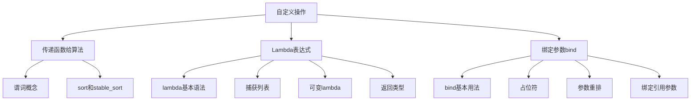

# 📘 10.3 自定义操作 (Customizing Operations)

> 来源说明：C++ Primer 第10.3节 | 本节涵盖：如何通过传递函数、lambda表达式和bind函数自定义算法行为

---

## 🗺️ 知识体系图



## 🧠 核心概念总览

* [*知识点1: 传递函数给算法*](#id1)
    * [*知识点1.1: 谓词概念*](#id2)
* [*知识点1.2: 谓词在排序算法应用*](#id3)
* [*知识点2: Lambda表达式*](#id4)
    * [*知识点2.1: Lambda基本语法*](#id5)
    * [*知识点2.2: 使用Lambda进行排序*](#id6)
    * [*知识点2.3: 捕获列表在find_if的实际使用*](#id7)
    * [*知识点2.4: 隐式捕获*](#id8)
    * [*知识点2.5: 可变Lambda*](#id9)
    * [*知识点2.6: 指定返回类型与transform里的使用*](#id10)
    * [*知识点2.7: 捕获引用参数*](#id11)
* [*知识点3: 绑定参数bind函数*](#id12)
    * [*知识点3.1: bind基本用法*](#id13)
    * [*知识点3.2: 使用占位符*](#id14)
    * [*知识点3.3: 参数重排*](#id15)
    * [*知识点3.4: 绑定引用参数*](#id16)

---

<a id="id1"></a>
## ✅ 知识点1: 传递函数给算法

**理论**
* 许多算法默认使用元素类型的`<`或`==`运算符进行比较
* 当需要不同排序方式或元素类型没有定义运算符时，可以传递自定义函数
* 这种自定义函数称为**谓词**（predicate）

**教材示例代码**
```cpp
// 比较函数：按单词长度排序
bool isShorter(const string &s1, const string &s2)
{
    return s1.size() < s2.size();
}

// 使用自定义比较函数排序
sort(words.begin(), words.end(), isShorter);
```


---

<a id="id2"></a>
### ✅ 知识点1.1: 谓词概念

**理论**
* **谓词**是可调用的表达式，返回**可以作为条件使用的值**
* **一元谓词**：接受一个参数（如`find_if`使用的谓词）
* **二元谓词**：接受两个参数（如`sort`使用的谓词）
* 谓词**必须**定义一致的顺序关系


---

<a id="id3"></a>
### ✅ 知识点1.2: 谓词在排序算法应用

**理论**
* `sort`算法默认使用`<`运算符，但可以传递二元谓词替代
* `stable_sort`是稳定排序，保持相等元素的原有的相对顺序
* 稳定排序在需要多重排序标准时非常有用
    * 例如：`stable_sort`确保相同长度的单词保持字母顺序

**教材示例代码**
```cpp
// 先按字母顺序排序并去重
elimDups(words);

// 再按长度稳定排序，保持相同长度的字母顺序
stable_sort(words.begin(), words.end(), isShorter);

// 输出结果
for (const auto &s : words)
    cout << s << " ";
cout << endl;
```

**注意点**
* ⚠️ 稳定排序性能可能略低于不稳定排序

---

<a id="id4"></a>
## ✅ 知识点2: Lambda表达式

**理论**
* 一个对象能像函数一样被调用（写成 `e(args)`），它就是 **callable object**
    * 函数,函数指针，**重载了函数调用运算符的类**和**lambda 表达式**都是可调用对象
* Lambda表达式是可调用的代码单元，可以视为**内联的匿名函数**
* 主要用途：创建简单的一次性操作，避免定义单独的函数
* Lambda可以在函数内部定义，并**能**捕获所在函数的局部变量


**教材示例代码**
```cpp
// 最简单的lambda：无参数，返回42
auto f = [] { return 42; };
cout << f() << endl;  // 输出42
```


---

<a id="id5"></a>
### ✅ 知识点2.1: Lambda基本语法

**理论**
* **Lambda表达式语法**：`[capture list] (parameter list) -> return type { function body }`
* **捕获列表**：定义lambda可以访问的外部变量
    * 很多STL算法只支持一元或二元谓词，捕获列表就能解决能传入数据不够用的问题
* **参数列表**：与普通函数参数类似
* **返回类型**：使用尾置返回类型，可省略（根据函数体推断）
* **函数体**：包含要执行的代码

**教材示例代码**
```cpp
// 完整形式的lambda
auto add = [](int a, int b) -> int { return a + b; };

// 省略返回类型的lambda（编译器推断）
auto shorter = [](const string &a, const string &b) 
               { return a.size() < b.size(); };
```

**注意点**
* ⚠️ Lambda必须包含**捕获列表**和**函数体**，参数列表和返回类型可以省略
* ⚠️ Lambda**无法**使用默认参数，所以形参数和实参数量必须相同
* ⚠️ 省略参数列表时表示空参数列表，不是可变的
* ⚠️ 当函数体包含非return语句时，默认返回类型为void
* 💡 简单lambda通常省略返回类型，让**编译器通过函数体推断**

---

<a id="id6"></a>
### ✅ 知识点2.2: 使用Lambda进行排序

**理论**
* Lambda可以直接作为算法参数，替代独立的比较函数
* 对于简单比较逻辑，使用Lambda比定义单独函数更简洁

**教材示例代码**
```cpp
// 使用lambda替代isShorter函数
stable_sort(words.begin(), words.end(),
            [](const string &a, const string &b)
            { return a.size() < b.size(); });
```


---

<a id="id7"></a>
### ✅ 知识点2.3: 捕获列表在`find_if`的实际使用

**理论**
* Lambda**只能**使用在捕获列表中明确指定的**非静态局部变量**
* `static` 局部变量以及**不属于当前函数局部作用域的变量**如`std::cout`，lambda 可以**直接使用，不需要捕获**
* 捕获方式：按值捕获`[var]`或按引用捕获`[&var]`
* `find_if`算法接受**两个迭代器**表示的输入范围，并调用第三个参数**一元谓词**
    * 对每个元素调用输入的谓词
    * 返回**第一个**调用了谓词返回为非零的元素
    * 如果没有发现就返回输入范围的**尾后迭代器**


**教材示例代码**
```cpp
// 按值捕获sz
auto wc = find_if(words.begin(), words.end(),
                  [sz](const string &a)
                  { return a.size() >= sz; });

// 错误示例：未捕获sz
auto wc = find_if(words.begin(), words.end(),
                  [](const string &a)
                  { return a.size() >= sz; }); // 错误：sz未捕获
```

**注意点**
* ⚠️ Lambda**只能捕获**所在函数的非`static`局部变量
* ⚠️ 静态局部变量和全局变量**可以**直接使用，无需捕获
* 💡 捕获发生在Lambda创建时，而不是调用时
* 🔄 按值捕获的变量在Lambda创建时复制，后续修改不影响Lambda内的值

---


<a id="id13"></a>
## ✅ 知识点3: Lambda捕获和返回

**理论**

* 每个 lambda 在定义时都会由编译器生成一个匿名的类类型（§ 14.8.1）
    * 使用或传递 lambda，**本质上就是在使用这个类的一个对象**
* lambda 捕获的变量会成为该类的**数据成员**，并在lambda对象创建时完成初始化
* 用 `auto` 接收 lambda初始化的变量或把 lambda 作为参数传给函数，都是在创建并使用这个匿名类的对象

---

<a id="id14"></a>
### ✅ 知识点3.1: 值捕获

**理论**
* 类似于参数传递，可以按值或按引用捕获变量
* 按值捕获的变量必须在捕获时可以被复制
* 与参数不同，捕获变量的值在**lambda创建时复制**，而不是在调用时复制

**lambda捕获列表：**

* `[]`：不捕获，不能用外部局部变量
* `[names]`：显式捕获，默认**按值**，`&name` 表示**按引用**
* `[&]`：用到的外部变量**全部按引用捕获**
* `[=]`：用到的外部变量**全部按值捕获**
* `[&, list]`：`list` 中的变量**按值**，其余**按引用**
* `[=, list]`：`list` 中的变量**按引用**，其余**按值**

👉 **一句话记忆：**
**`=` 控制默认按值，`&` 控制默认按引用，后面的列表是“例外规则”**


**教材示例代码**
```cpp
void fcn1()
{
    size_t v1 = 42; // 局部变量
    // 将v1复制到名为f的可调用对象中
    auto f = [v1] { return v1; };
    v1 = 0;
    auto j = f(); // j是42；f存储了我们创建它时v1的副本
}
```

**注意点**
* ⚠️ 后续对捕获变量的修改**不会**影响lambda内部的值

---

<a id="id11"></a>
### ✅ 知识点3.2: 捕获引用参数

**理论**
* 也可以定义按引用捕获变量的lambda
* 变量前的`&`表示应按引用捕获
* 按引用捕获的变量行为与其他引用相同
* 在lambda体内使用该变量时，使用的是**该引用绑定的对象**
* 为什么需要引用捕获？
    * 有些对象（如`ostream`）不能复制，只能通过引用或指针捕获
* 我们还可以从函数返回**可调用对象**或者包含**可调用对象为成员的类**
    * 返回Lambda的函数**不能**返回包含引用捕获的Lambda


**教材示例代码**
```cpp
void biggies(vector<string> &words, 
             vector<string>::size_type sz,
             ostream &os = cout, char c = ' ')
{
    // 其他处理代码...
    
    // 正确：通过引用捕获os（ostream不能复制）
    for_each(words.begin(), words.end(),
             [&os, c](const string &s) { os << s << c; });
}
```

**注意点**
* ⚠️ 引用捕获存在与引用返回相同的问题和限制（§6.3.2）：
    * 如果按引用捕获变量，必须确保被引用对象在lambda执行时**仍然存在**
    * lambda捕获的变量是局部变量，函数完成后这些变量不再存在
* ⚠️ **尽量保持lambda捕获简单**：尽量少捕获数据，能按值就按值，尽量**避免捕获指针和引用**除非真的需要

---

<a id="id8"></a>
### ✅ 知识点3.3: 隐式捕获

**理论**
* 可以让编译器从lambda体中的代码推断要使用哪些变量
* `[=]`：隐式**按值捕获**所有使用的局部变量
* `[&]`：隐式按**引用捕获**所有使用的局部变量
* 可以混合隐式和显式捕获
* `for_each`算法对由一对迭代器规定的输入范围内每个元素调用谓词

**教材示例代码**
```cpp
// 隐式按值捕获所有使用的局部变量
auto wc = find_if(words.begin(), words.end(),
                  [=](const string &s) 
                  { return s.size() >= sz; });

// 混合捕获：os隐式按引用，c显式按值
for_each(words.begin(), words.end(),
         [&, c](const string &s) { os << s << c; });

// 混合捕获：os显式按引用，c隐式按值  
for_each(words.begin(), words.end(),
         [=, &os](const string &s) { os << s << c; });
```

**注意点**
* ⚠️ 混合捕获时，捕获列表中的第一项必须是`&`或`=`
* ⚠️ 该符号将默认捕获模式设置为按引用或按值
* ⚠️ 显式捕获的变量必须使用与隐式捕获不同的方式
    * 如隐式捕获是引用，那么显式就是值


---

<a id="id9"></a>
### ✅ 知识点3.4: 可变Lambda

**理论**
* 默认情况下，lambda不能改变按值捕获的变量的值
* 如果想改变捕获变量的值，必须在参数列表后加上`mutable`关键字
    * `mutable`关键字放在参数列表后，返回类型前
* 可变lambda**不能**省略参数列表
* `mutable`关键字放在参数列表后，返回类型前

**教材示例代码**
```cpp
void fcn3()
{
    size_t v1 = 42; // 局部变量
    // f可以改变它捕获的变量的值
    auto f = [v1]() mutable { return ++v1; };
    v1 = 0;
    auto j = f(); // j是43
}
```

**注意点**
* ⚠️ 按引用捕获的变量是否可以改变，取决于该引用是指向**const还是非const**类型
* 💡 可变lambda主要用于需要维护状态的场景

---

<a id="id10"></a>
### ✅ 知识点3.5: 指定返回类型与`transform`里的使用

**理论**
* 当函数体只有return语句时，返回类型**可以**省略（编译器推断）
* 当函数体包含其他语句时，**默认返回void**，需要显式指定返回类型
* 当需要为lambda定义返回类型时，必须使用尾置返回类型（§6.3.3）
    * 尾置返回类型语法：`-> return_type`
* `transform`算法：
    * 接受两个迭代器表示输入
    * 接受第三个迭代器表示目标
    * 接受一个可调用对象，对每个输入元素进行调用，并将结果写入目标

**教材示例代码**
```cpp
// 错误：无法推断lambda的返回类型
transform(v1.begin(), v1.end(), v1.begin(),
          [](int i)
          { if (i < 0) return -i; else return i; });

// 正确：显式指定返回类型
transform(v1.begin(), v1.end(), v1.begin(),
          [](int i) -> int
          { if (i < 0) return -i; else return i; });
```

**注意点**
* ⚠️ 当lambda体复杂时，最好显式指定返回类型

---

<a id="id12"></a>
## ✅ 知识点3: 绑定参数bind函数

**理论**
* `bind`函数是通用函数适配器，生成新的可调用对象
* 主要用途：调整参数顺序、绑定固定参数值
* 当需要在多个地方使用相同操作时，bind比重复写Lambda更合适

**教材示例代码**
```cpp
// 使用bind生成调用check_size的可调用对象
auto check6 = bind(check_size, _1, 6);
bool b1 = check6("hello"); // 调用check_size("hello", 6)
```

**注意点**
* ⚠️ `bind`定义在`<functional>`头文件中
* 💡 `bind`适合将多元函数适配为一元函数，用于需要一元谓词的算法
* 🔄 `bind`返回的可调用对象可以存储和传递

---

<a id="id13"></a>
### ✅ 知识点3.1: bind基本用法

**理论**
* `bind`调用形式：`auto newCallable = bind(callable, arg_list);`
* `newCallable`是一个新的可调用对象
* `arg_list`是逗号分隔的参数列表，对应原始可调用对象的参数
* 参数可以是值、占位符或表达式

**教材示例代码**
```cpp
// 绑定check_size的第二个参数为sz
auto wc = find_if(words.begin(), words.end(),
                  bind(check_size, _1, sz));
```

**注意点**
* ⚠️ `bind`的参数在绑定时求值并存储
* 💡 `bind`可以创建满足算法参数要求的可调用对象
* 🔄 对于简单操作，Lambda通常更直观；对于复杂操作或多处复用，bind更有优势

---

<a id="id14"></a>
### ✅ 知识点3.2: 使用占位符

**理论**
* 占位符`_n`表示`newCallable`的第n个参数
* 占位符定义在`std::placeholders`命名空间中
* 每个使用的占位符都需要单独的using声明或使用整个命名空间

**教材示例代码**
```cpp
// 为占位符提供using声明
using std::placeholders::_1;

// 或者使用整个命名空间
using namespace std::placeholders;

// 使用占位符绑定参数
auto g = bind(f, a, b, _2, c, _1);
```

**注意点**
* ⚠️ 占位符需要包含`<functional>`头文件
* ⚠️ 占位符从`_1`开始，表示第一个参数
* 💡 使用`using namespace std::placeholders;`可以避免为每个占位符单独声明

---

<a id="id15"></a>
### ✅ 知识点3.3: 参数重排

**理论**
* `bind`可以重新排列参数顺序
* 通过调整占位符位置，可以改变参数传递顺序
* 这在适配不同接口时特别有用

**教材示例代码**
```cpp
// 原始调用：isShorter(a, b)返回a是否比b短
// 使用bind反转参数：实现从长到短排序
sort(words.begin(), words.end(), 
     bind(isShorter, _2, _1)); // 相当于isShorter(b, a)
```

**注意点**
* ⚠️ 参数重排需要仔细对应占位符位置
* 💡 参数重排可以复用现有函数，避免编写新函数
* 🔄 占位符的位置决定了`newCallable`参数如何映射到原始函数

---

<a id="id16"></a>
### ✅ 知识点3.4: 绑定引用参数

**理论**
* 默认情况下，`bind`的参数被复制到返回的可调用对象中
* 对于不可复制的对象（如ostream），需要使用`ref`或`cref`函数
* `ref`返回对象的引用包装，可以复制

**教材示例代码**
```cpp
// 错误：尝试复制os
for_each(words.begin(), words.end(),
         bind(print, os, _1, ' '));

// 正确：使用ref传递引用
for_each(words.begin(), words.end(),
         bind(print, ref(os), _1, ' '));
```

**注意点**
* ⚠️ `ref`和`cref`也定义在`<functional>`头文件中
* ⚠️ `ref`用于非const引用，`cref`用于const引用
* 💡 当需要绑定不能复制的对象时，必须使用`ref`或`cref`

---

## 🔑 核心要点总结

1. **谓词是自定义算法的关键**：通过传递谓词函数，可以改变算法的默认行为，实现自定义排序、查找等操作

2. **Lambda表达式提供就地定义函数的能力**：
   - 基本语法：`[捕获列表](参数列表)->返回类型{函数体}`
   - 捕获列表控制对局部变量的访问（按值/按引用）
   - 简单Lambda可省略参数列表和返回类型

3. **捕获机制区分不同使用场景**：
   - 按值捕获：创建时复制，后续修改不影响Lambda内值
   - 按引用捕获：直接引用变量，需注意生命周期
   - 隐式捕获：让编译器推断捕获的变量

4. **bind函数用于参数绑定和适配**：
   - 绑定固定参数值，减少函数参数数量
   - 使用占位符`_n`重新排列参数顺序
   - 通过`ref`/`cref`绑定不可复制的对象

5. **Lambda vs bind选择原则**：
   - 简单、一次性操作：使用Lambda
   - 复杂操作或多处复用：考虑使用bind适配现有函数
   - 需要捕获局部变量：优先使用Lambda

## 📌 考试速记版

**口诀**：Lambda就地定义，bind适配复用

**关键对比**：
| 特性 | Lambda | bind |
|------|--------|------|
| 定义位置 | 使用处就地定义 | 适配现有函数 |
| 局部变量访问 | 通过捕获列表 | 通过参数绑定 |
| 参数重排 | 直接定义参数顺序 | 使用占位符重排 |
| 典型用途 | 简单一次性操作 | 适配函数接口 |

**必记规则**：
1. Lambda捕获列表必须包含要使用的局部非static变量
2. 按值捕获在Lambda创建时复制，按引用捕获直接引用
3. bind默认复制参数，不可复制对象需用ref/cref
4. 占位符`_n`对应新可调用对象的第n个参数
5. 稳定排序保持相等元素的原始顺序